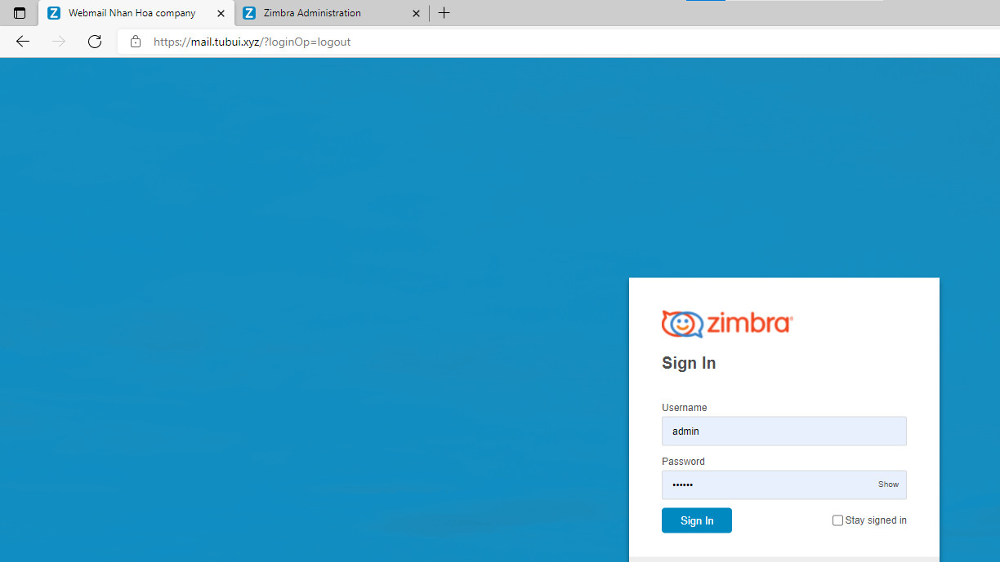
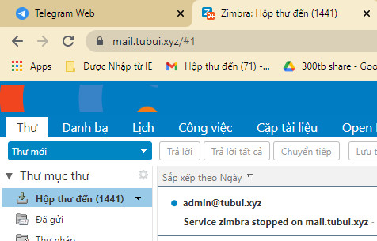

# Thay đổi tittle web Zimbra
- Mặc định khi triển khai xong hệ thống email server zimbra ở phần user login `title` trên thanh trình duyệt sẽ là `Đăng nhập ứng dụng web Zimbra`, phần admin login là `Zimbra Aministration` một số khách hàng muốn thay đổi title thành tên của đơn vị, tổ chức của mình
## 1. Thay đổi title web login client
- Title web client mặc định 


- Thay đổi title web client
	+ Chỉnh sửa file `/opt/zimbra/jetty/webapps/zimbra/WEB-INF/classes/messages/ZmMsg.properties`
	+ Tìm từ `zimbraLoginTitle` sửa giá trị thành title mong muốn (tiếng Anh hoặc tiếng Việt không dấu)

	

	+ restart service `mailboxd`
	
	```sh
	su zimbra
	zmmailboxdctl restart
	```

- Kiểm tra 



## 2. Thay đổi title web mail client
Khi login vào giao diện web để tiến hành gửi/nhận thư title trên trình duyệt sẽ hiển thị dạng `Zimbra:` bạn có thể chỉnh sửa theo ý muốn
- Title web mail client mặc định 



- Thay đổi web mail client 
	+ Chỉnh sửa file `/opt/zimbra/jetty/webapps/zimbra/WEB-INF/classes/messages/ZmMsg.properties`
	+ Tìm từ `zimbraTitle` sửa giá trị thành title mong muốn (tiếng Anh hoặc tiếng Việt không dấu)

	

	+ restart service `maildoxd` 

	```sh
	su zimbra
	zmmailboxdctl restart
	```

- Kiểm tra


## 3. Thay đổi title web administrator 
- Title web login administrator mặc định 


- Thay đổi web login administrator 
	+ Chỉnh sửa file `/opt/zimbra/jetty_base/webapps/zimbraAdmin/WEB-INF/classes/messages/ZabMsg.properties`
Tìm từ `zimbraAdminTitle` sửa giá trị thành title mong muốn


- Kiểm tra

