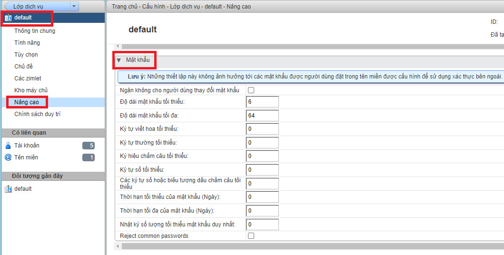
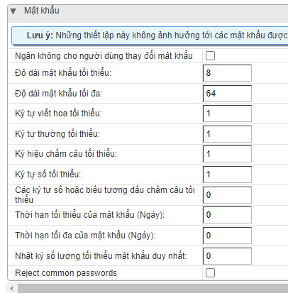

# Thiếp lập chính sách về mật khẩu cho account email
Mặc định khi cài đặt xong email server zimbra việc thiết lập chính sách về mật khẩu cho account email khi tạo mới trong hệ thống ở mức cơ bản, yếu chỉ thiết lập 2 tham số độ dài mật khẩu tối thiểu: 6, độ dài mật khẩu tối đa: 64. Việc thiết lập lại chính sách về mật khẩu là rất cần thiết giúp nâng cao độ an toàn cho các account email, tránh tình trạng scan password dẫn tới spam đựa hệ thống email vào backlist.
- Bước 1: Login và thao tác trên giao diện wed admin
- Bước 2: Thiết lập chính sách mật khẩu 
Click `Trang chủ` => `Cấu hình` => `Default`
Click `Nâng cao` => Thao tác ở phần `Mật khẩu` 



- Thiết lập chính sách mật khẩu => Lưu
```sh
Độ dài mật khẩu tối thiểu: 8
Độ dài mật khẩu tối đa: 64
Ký tự viết hoa tối thiểu: 1
Ký hiệu thường tối thiểu: 1
Ký hiệu chấm câu tối thiếu 1
Ký tự số tối thiểu: 1
```

