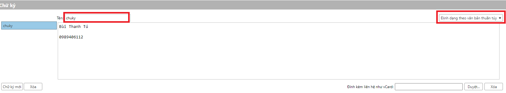
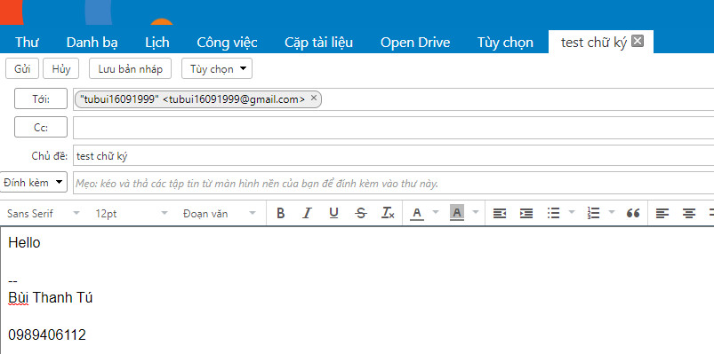

# Thiết lập chữ ký email zimbra
Mặc định khởi tạo email zimbra sẽ không thiết lập chữ ký, một số nhu cầu của cá nhân, tổ chức về việc thiết lập chữ ký cho email, yêu cầu này có thể thực hiện được với các account email zimbra
- Bước 1: Login vào user email
- Bước 2: Thiết lập chữ ký
	+ Click Tùy chọn => Chữ ký
		+ Lựa chọn định dạng văn bản
		+ Nhập tên chữ số
		+ Nhập nội dung chữ ký

- Bước 3: Thiết lập sử dụng chữ ký
Thiết lập việc sử dụng chữ ký trong các trường hợp: Trả lời thư mới, chuyển tiếp thư, hiển thị chữ ký ở vị trí trong thư => Lưu lại

- Bước 4: Kiểm tra

