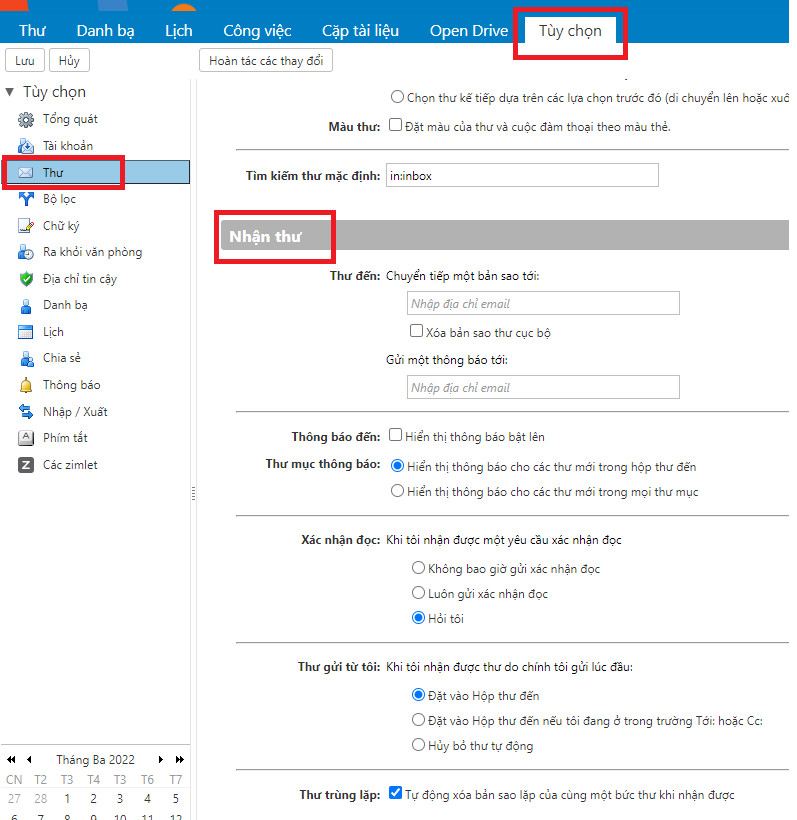
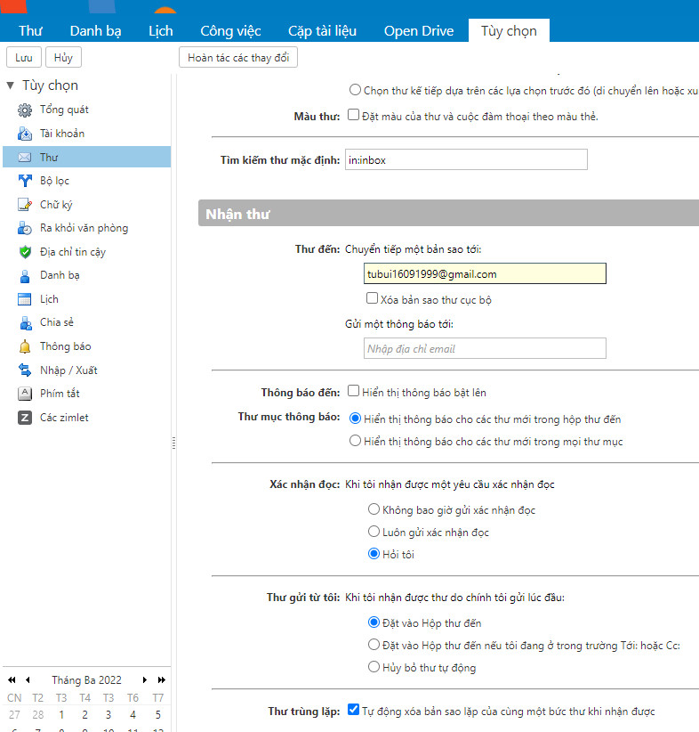
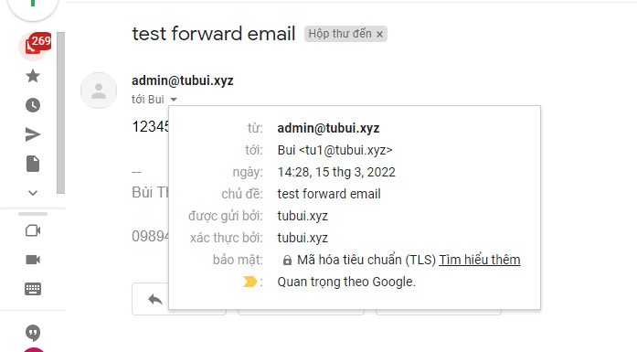

# Thiết lập forward email Zimbra
Khi tạo một account email zimbra mặc định khi không chỉnh sửa, giới hạn quyền người dùng có thể thao tác cấu hình forward (chuyển tiếp) email theo mục đích của mình.
- Bước 1: Login web mail user
- Bước 2: Thiết lập forward
Ví dụ: Cấu hình tất cả các email gửi tới tu1@tubui.xyz sẽ được forward vào địa chỉ email tubui16091999@gmail.com
	+ Click Tùy chọn => Thư => Thao tác ở mục Nhận thư

	

	+ Nhập email muốn chuyển tiếp và lưu lại 

	

- Bước 3: Kiểm tra 

