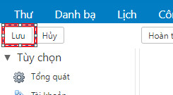

# Thêm Whitelist/Blacklist trên Zimbra Webmail 
## 1. Đăng nhập vào Webmail Zimbra
## 2. Nhấp vào Tùy chọn và nhấp vào Thư từ menu

## 3. Cuộn xuống và chọn Tùy chọn thư rác
- Để đưa miền vào Whitelist: Thêm địa chỉ email hoặc miền dưới ô 'Cho phép thư gửi từ' và click 'Thêm' để thêm và nút 'Xóa' để xóa địa chỉ email hoặc miền tương tự khỏi danh sách
- Để đưa miền vào Blacklist: Thêm tên miền hoặc địa chỉ của địa chỉ gửi thư rác vào ô 'Chặn các thư gửi từ' và chọn nút 'Thêm' để thêm và 'Xóa' để xóa địa chỉ email hoặc tên miền tương tự khởi danh sách

## 4. Nhấp lưu để lưu các thay đổi

