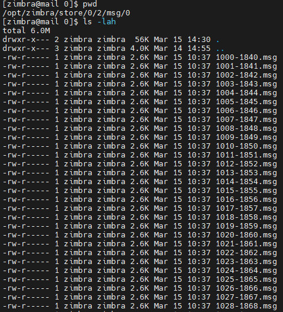
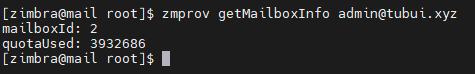

# Tìm ID mailbox account trong email zimbra
Mỗi account email trong email server zimbra được đại diện bởi một ID, tuy nhiên ID này sinh ra không theo thứ tự từ nhỏ đến lớn mà sinh ngẫu nhiên. Việc tìm được chính xác tài khoản email nào có ID mailbox là bao nhiêu có thể ứng dụng trong trường hợp restore lại mailbox của một account nào đó.

- Đường dẫn mailbox
```sh
/opt/zimbra/store/0/
```
Ở trong thư mục ở đường dẫn dưới là mailbox (email gửi, nhận) của các account.



- Tìm ID mailbox từ account email
```sh
su zimbra
zmprov getMailboxInfo admin@tubui.xyz
```

