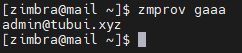
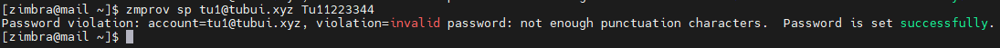

# Đổi mật khẩu account admin zimbra
Khi cài đặt email server zimbra mặc định sinh ra một account admin có toàn quyền quản trị trên hệ thống email server. Tuy nhiên trong quá trình vận hành sử dụng người quản trị không nhớ được mật khẩu admin nên phải thực hiện thao tác reset password account admin zimbra.
- Bước 1: SSH vào email server và chuyển sang thao tác với user zimbra
```sh
su zimbra
```

- Bước 2: Kiểm tra những user nào có quyền admin
```sh
zmprov gaaa
```



- Bước 3: Thay đổi mật khẩu account tu1

```sh
zmprov sp tu1@tubui.xyz Tu11223344
```

