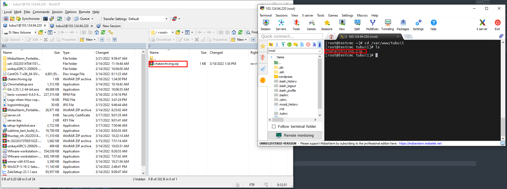
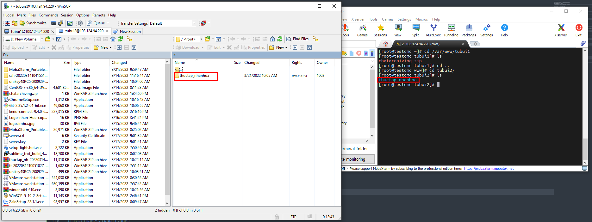

# Cài đặt FTP server trên CentOS 7
Bước 1: Cài đặt dịch vụ FTP với VSFTPD

- Cập nhật trình quản lý gói
```sh
yum update -y
```

- Cài đặt VSFTPD
```sh
yum install -y vsftpd
```

- Khởi động dịch vụ và cho phép nó khởi động cùng hệ thống
```sh
systemctl start vsftpd
systemctl enable vsftpd
```

- Cấu hình tường lửa cho dịch vụ FTP và port 21
```sh
firewall-cmd --permanent --add-port=21/tcp
firewall-cmd --permanent --add-service=ftp
firewall-cmd --reload
```

Bước 2: Cấu hình VSFTPD

- File cấu hình vsftpd nằm tại `/etc/vsftpd/vsftpd.conf`

- Copy file cấu hình để backup 
```sh
cp /etc/vsftpd/vsftp.conf /etc/vsftpd/vsftpd.conf.backup
```

- Chỉnh sửa file cấu hình `vsftpd.conf`
```sh
vi /etc/vsftpd/vsftpd.conf
```

- FTP Access: Ta không cho kết nối nặc danh, mà chỉ cho kết nối cục bộ vào FTP server
```sh
anonymous_enable=NO
local_enable=YES
```

- Cho phép người dùng nội bộ tải lên
```sh
write_enable=YES
```

- Giữ người dùng trong thư mục của họ. Tại đây ta sẽ chroot tất cả user trừ các user trong chroot_list
```sh
chroot_local_user=YES
allow_writeable_chroot=YES
chroot_list_enable=YES
chroot_list_file=/etc/vsftpd/chroot_list
```

- Banner khi người dùng login vào FTP server
```sh
ftpd_banner="Welcome FTP Server"
```

- Giới hạn khoảng các cổng cho FTP passive
```sh
pasv_min_port=30000
pasv_max_port=31000
```

- Giới hạn User được phép truy cập vào hệ thống: Nếu muốn giới hạn các User local được đăng nhập vào hệ thống FTP server. Ta thêm vào các dòng sau. Khi đó, những User có trong file `/etc/vsftpd/user_list` mới được truy cập vào hệ thống
```sh
userlist_enable=YES
userlist_file=/etc/vsftpd/user_list
userlist_deny=NO
```

- Thời gian hệ thống: Ta sử dụng thời gian local
```sh
use_localtime=YES
```

Bước 3: Khởi động lại dịch vụ và cho phép các cổng FTP passive đi qua tường lửa 
```sh
systemctl restart vsftpd
firewall-cmd --permanent --add-port=30000-31000/tcp
firewall-cmd --reload
```

# Truy cập FTP server
- Tạo 2 user là `tu1` và `tu2`
```sh
useradd tubui1
useradd tubui2
passwd tubui1
passwd tubui2
```

Sau khi tạo user thì thư mục mặc định của tài khoản này sẽ ở `/home/tubui1` `/home/tubui2`

- Cấp quyền truy cập đến FTP server
	+ Tạo file `chroot_list` trong `/etc/vsftpd`
	+ Thêm user `tubui1`, `tubui2` vào file `/etc/vsftpd/chroot_list` để có thể truy cập vào server
	
	
	
- Chỉ định thư mục home khi người dùng đăng nhập vào hệ thống
	+ Tạo thư mục `user_conf`
	```sh
	mkdir /etc/vsftpd/user_conf
	```
	+ Chỉ định thư mục home cho user `tubui1` và `tubui2` và thêm các dòng lệnh tương ứng với mỗi file
	```sh
	vi /etc/vsftpd/user_conf/tubui1
	local_root=/var/www/tubui1

	vi /etc/vsftpd/user_conf/tubui2
	local_root=/var/www/tubui2
	```

- Sau đó restart lại dịch vụ `vsftpd`
```sh
systemctl restart vsftpd
```

- Mở WinSCP đăng nhập vào user `tubui1` và `tubui2`, chọn giao thức FTP, port 21, Nhập user và password


- Sau khi đăng nhập thành công user `tubui1` chỉ có thể vào được thư mục chỉ định local_root `/var/www/tubui1`, user `tubui2` chỉ có thể vào được thư mục chỉ định local_root `/var/www/tubui2`





