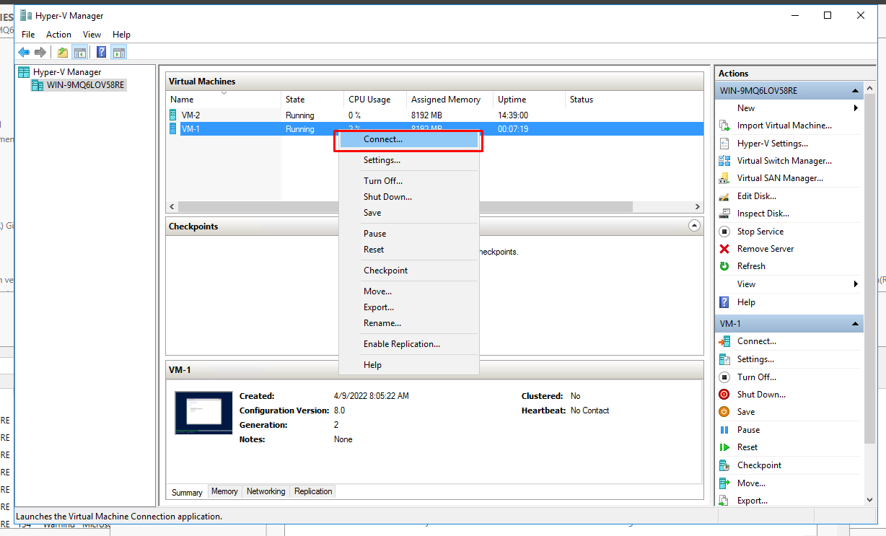
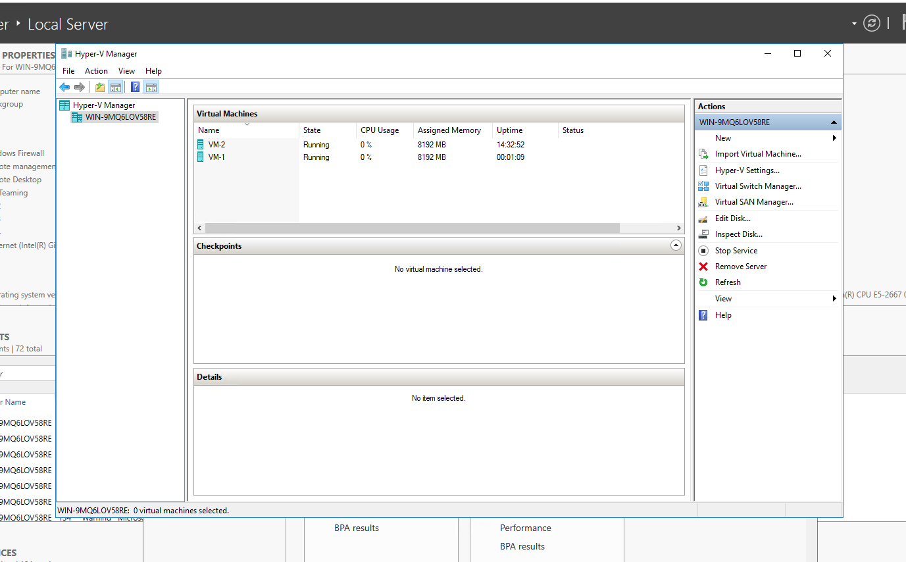
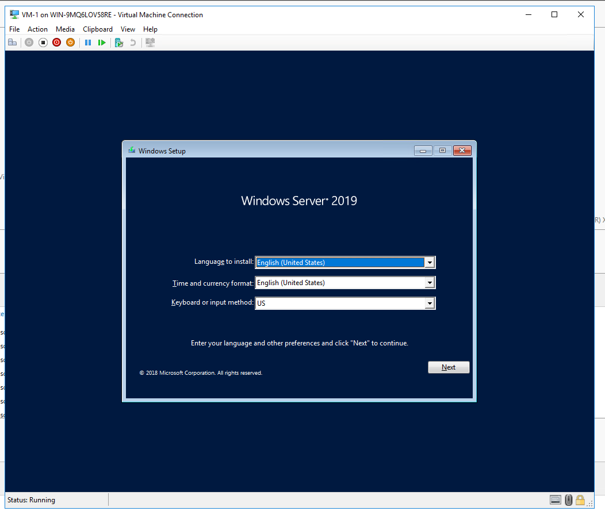
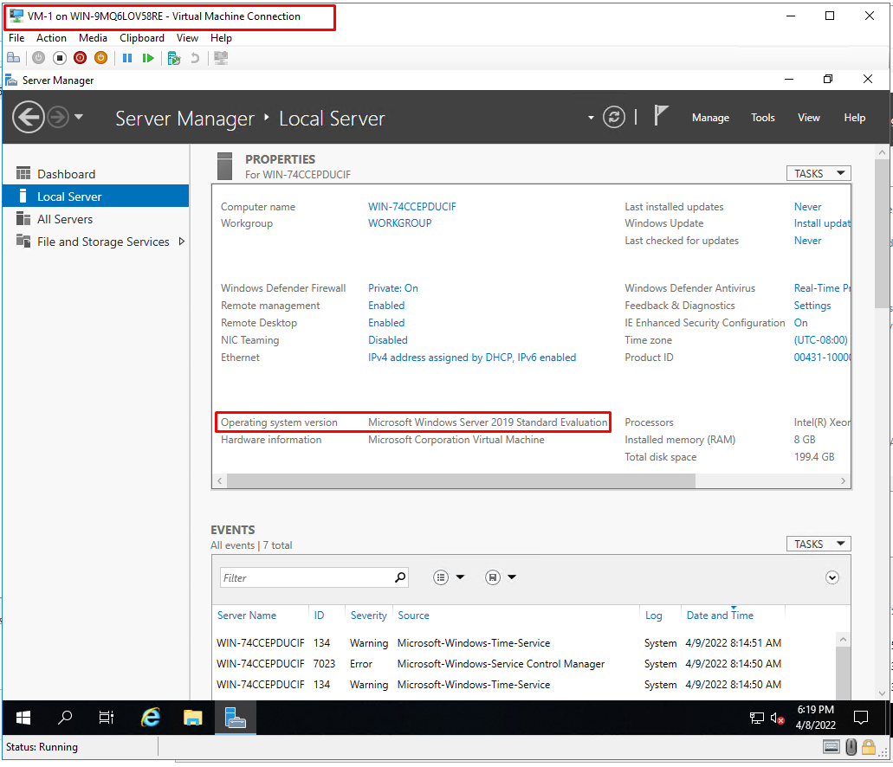
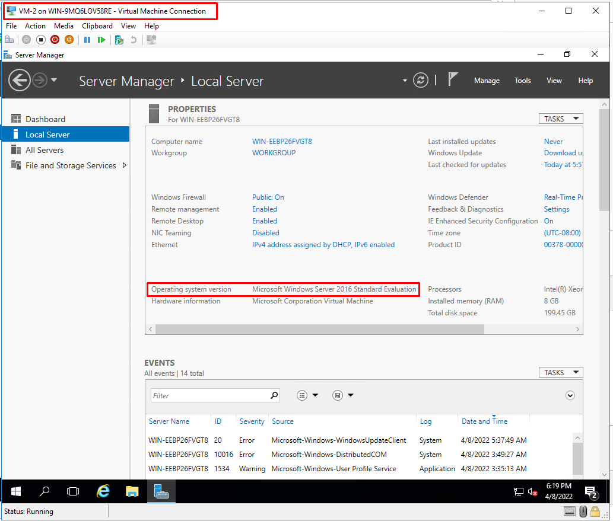
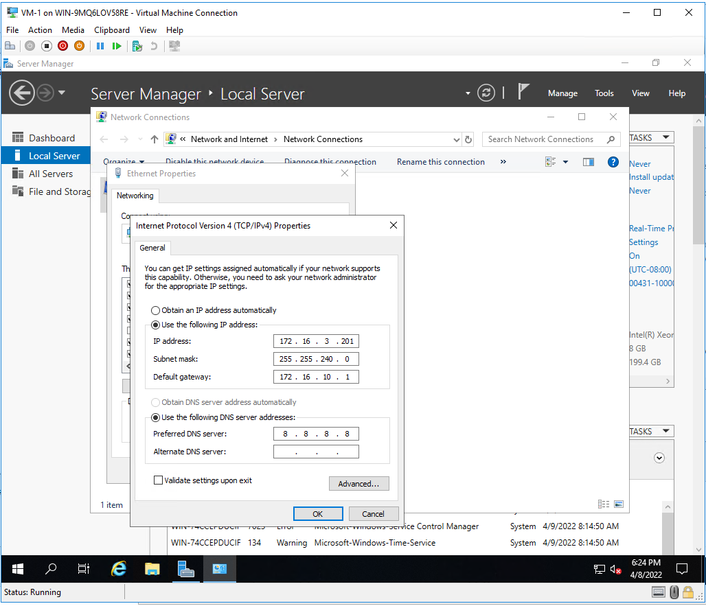
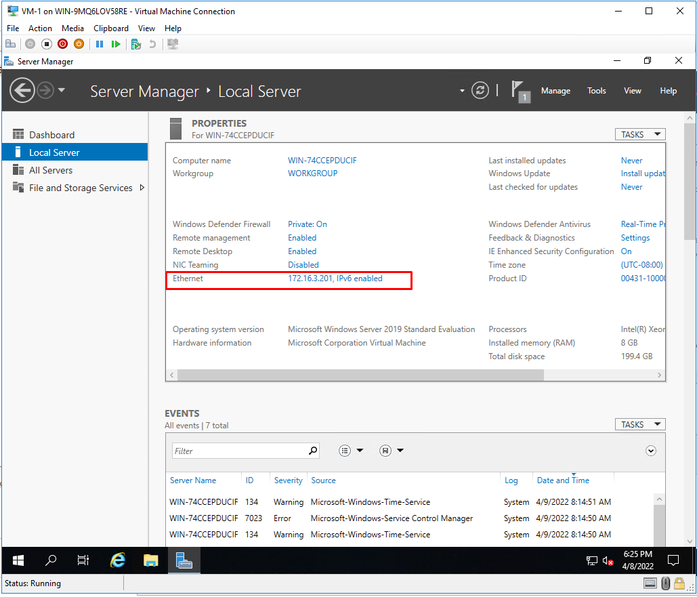
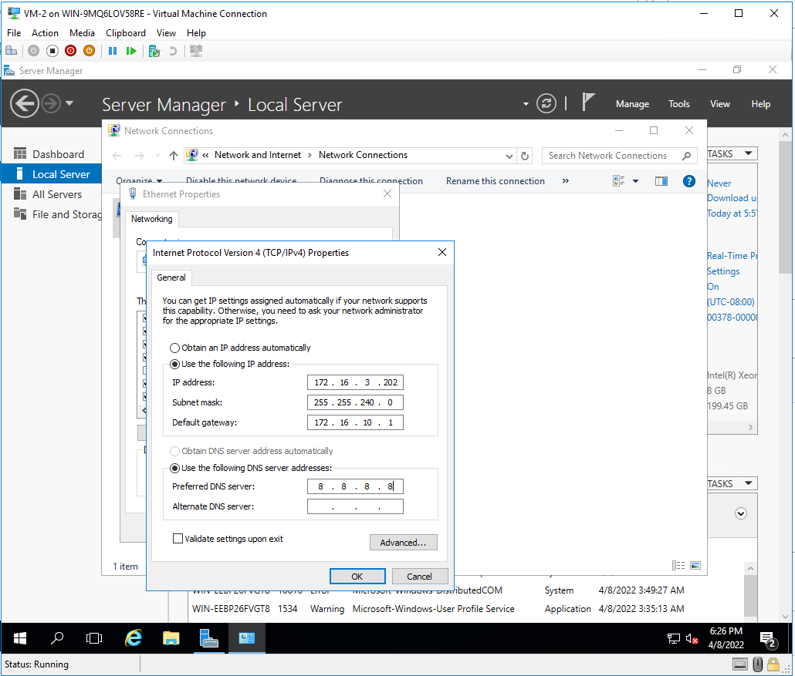
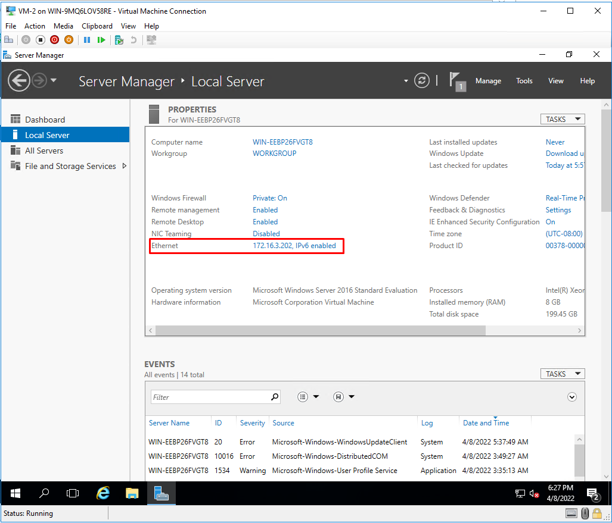
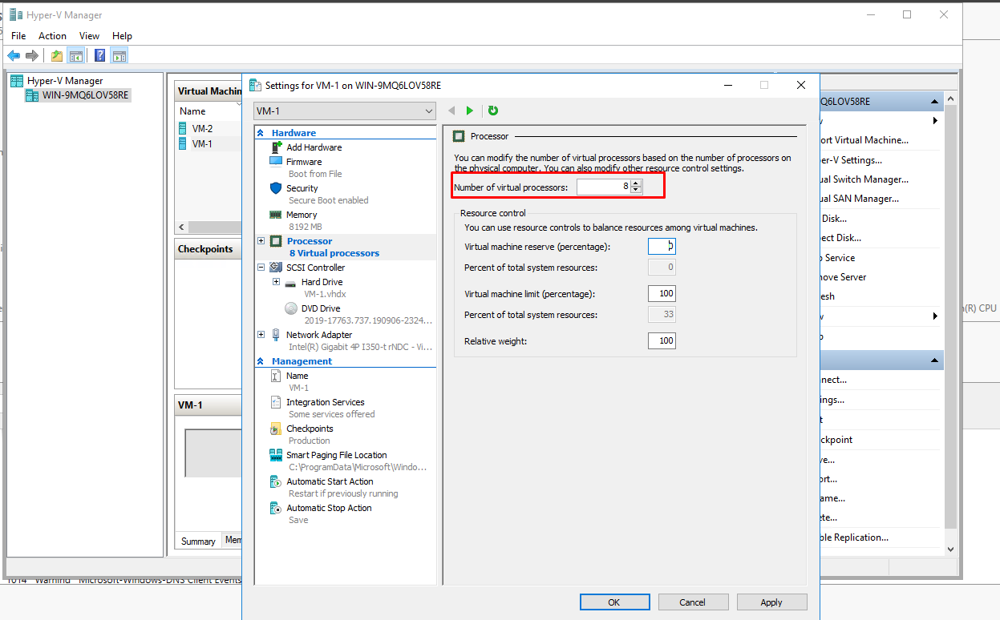

# Hyper-V là gì

**Yêu cầu**
- Cài đặt Hyper-V để tạo 2 VM: mỗi VM cấu hình 8 RAM + 8 core + 200Gb Disk lấy ở Data 500GB, IP 172.16.3.201/20 172.16.3.202/20 Gateway 172.16.10.1

- Hyper-V là công nghệ ảo hóa thể hệ mới của Microsoft, dựa trên nền tảng hypervisor. Mang đến cho người dùng (chủ yếu là doanh nghiệp) một nền tảng ảo hóa mạnh và linh hoạt, có khả năng mở rộng, tính tin cậy và sẵn sàng cao

- Đặc biệt ảo hóa Hyper-V giúp đáp ứng nhu cầu ảo hóa mọi cấp độ cho môi trường doanh nghiệp. Ngoài ra, người dùng không cần phải mua thêm bất cứ phần mềm nào khi muốn nâng cấp hoặc khai thác csac tính năng ảo hóa của server

# Hyper-V mang lại lợi ích gì?
- Hyper-V cung cấp cơ sở hạ tầng phần mềm và các công cụ quản lý cơ bản mà doanh nghiệp có thể sử dụng để tạo ra và quản lý một môi trường điện toán máy chủ ảo hóa. Một môi trường máy chủ ảo hóa với các tính năng nổi bật sau:
	+ Ảo hóa linh hoạt
	+ Nền tảng ảo hóa mạnh
	+ Tăng cường bảo mật
	+ Trung tâm dữ liệu động 
	+ Hợp nhất server
 
# Cài đặt Hyper-V
- Chạy `Server Manager` và nhấp vào `Add roles and features`

- Nhấp vào `Next`

- Chọn `Role-based or feature-based installation` -> Nhấn `Next`

- Chọn host muốn thêm vào các service

- Tích vào `Hyper-V` -> `Add Features` -> `Next`

- Nhấp vào nút `Next`

- Tiếp tục chọn `Next`

- Tại phần `Virtual Switches` chọn 1 network adapter cho nó

- Phần `Virtual Machines Migration`, giữ nguyên tùy chọn mặc định và tiếp tục nhấn `Next`

- Phần chỉ định vị trí cấu hình của máy ảo. Trong phần này ta giữ nguyên tùy chọn mặc định và tiếp tục nhấn `Next`

- Nhấp vào nút `Install` để bắt đầu cài đặt

- Sau khi kết thúc quá trình cài đặt, nhấp vào nút `Close` và khởi động lại máy tính

## Tạo máy ảo 
- Chạy `Server Manager` và mở `Tools` -> `Hyper-V Manager` 

- Chọn Hostname ở bên trái và nhấp chuột phải vào nó để mở menu, sau đó chọn `New` -> `Virtual Machine`

- Nhấp vào nút `Next`

- Nhập tên máy ảo

- Chỉ định thế hệ máy ảo. Chọn `Generation 2`

- Chỉ định bộ nhớ cho máy ảo (8 GB RAM)

- Chọn Virtual Switch để sử dụng kết nối mạng của máy ảo

- Cấu hình ổ cứng ảo. Đặt giá trị theo yêu cầu (200 GB từ Data)

- Cài OS cho máy ảo hoặc có thể để sau

- Nhấp vào `Finish` để hoàn tất

- Máy ảo vừa được tạo. Để bắt đầu, hãy nhấp chuột phải vào nó và chọn `Start`

- Để kết nối bảng điều khiển của máy ảo, hãy nhấp chuột phải vào nó và chọn `Connect`

- Làm tương tự với VM-2

- Cài OS cho máy ảo để tiến hành đặt địa chỉ IP

- Tiến hành đặt địa chỉ IP cho 2 máy ảo 

- VM-1 IP: 172.16.3.201/20 Gateway: 172.16.10.1

- VM-2 IP: 172.16.3.202/20 Gateway: 172.16.10.1

- Chỉnh thông số `Number of virtual processors` (8 core)

