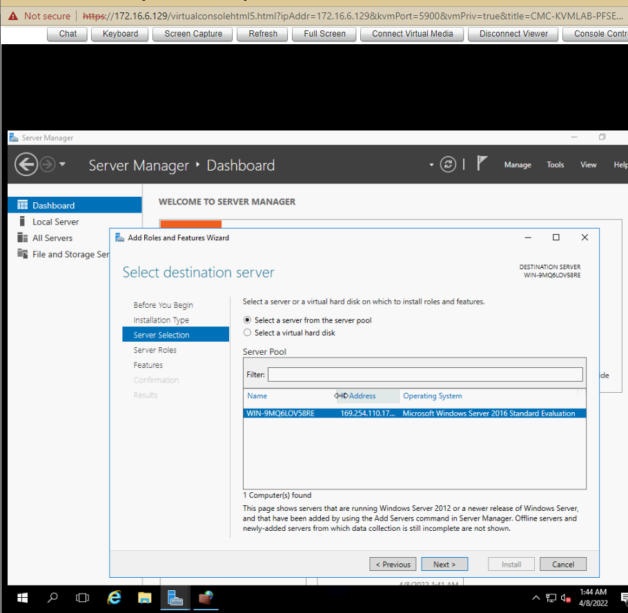
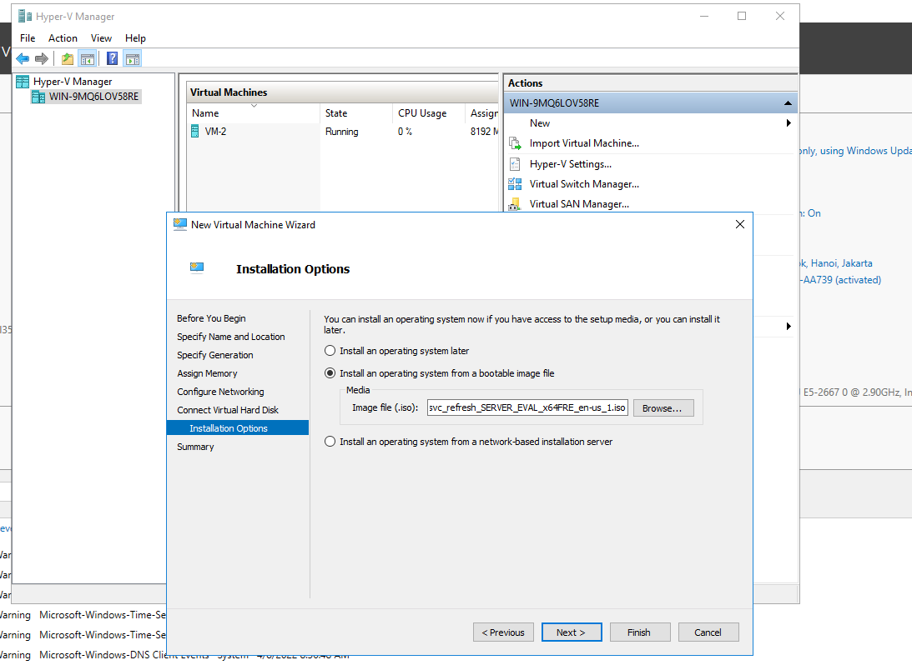

# Cài đặt Hyper-V

**Yêu cầu**
- Cài đặt Hyper-V để tạo 2 VM: mỗi VM cấu hình 8 RAM + 8 core + 200Gb Disk lấy ở Data 500GB, IP 172.16.3.201/20 172.16.3.202/20 Gateway 172.16.10.1

# Cài đặt Hyper-V
- Chạy `Server Manager` và nhấp vào `Add roles and features`

- Nhấp vào `Next`

- Chọn `Role-based or feature-based installation` -> Nhấn `Next`

- Chọn host muốn thêm vào các service

- Tích vào `Hyper-V` -> `Add Features` -> `Next`

- Nhấp vào nút `Next`

- Tiếp tục chọn `Next`

- Tại phần `Virtual Switches` chọn 1 network adapter cho nó

- Phần `Virtual Machines Migration`, giữ nguyên tùy chọn mặc định và tiếp tục nhấn `Next`

- Phần chỉ định vị trí cấu hình của máy ảo. Trong phần này ta giữ nguyên tùy chọn mặc định và tiếp tục nhấn `Next`

- Nhấp vào nút `Install` để bắt đầu cài đặt

- Sau khi kết thúc quá trình cài đặt, nhấp vào nút `Close` và khởi động lại máy tính

## Tạo máy ảo 
- Chạy `Server Manager` và mở `Tools` -> `Hyper-V Manager` 

- Chọn Hostname ở bên trái và nhấp chuột phải vào nó để mở menu, sau đó chọn `New` -> `Virtual Machine`

- Nhấp vào nút `Next`

- Nhập tên máy ảo

- Chỉ định thế hệ máy ảo. Chọn `Generation 2`

- Chỉ định bộ nhớ cho máy ảo

- Chọn Virtual Switch để sử dụng kết nối mạng của máy ảo

- Cấu hình ổ cứng ảo. Đặt giá trị theo yêu cầu (200 GB từ Data)

- Cài OS cho máy ảo hoặc có thể để sau

- Nhấp vào `Finish` để hoàn tất

- Máy ảo vừa được tạo. Để bắt đầu, hãy nhấp chuột phải vào nó và chọn `Start`

- Để kết nối bảng điều khiển của máy ảo, hãy nhấp chuột phải vào nó và chọn `Connect`

