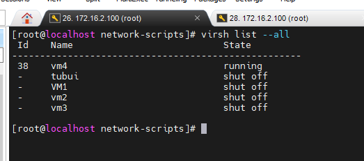

# Libvirt và virsh
- `Libvirt`: Là một bộ các phần mềm cung cấp các cách thuận tiện để quản lý máy ảo và các chức năng của ảo hóa. Phần mềm này bao gồm một thư viện API daemon (libvirtd) và các gói tiện ích giao diện dòng lệnh (virsh)
- `virsh`: là một tools kiểm soát và thực hiện hành động với các máy ảo .

# Các lệnh cơ bản với virsh
- Show tất cả các máy ảo đã được cài đặt
```sh
virsh list --all
```



- Hiển thị các máy ảo đang hoạt động
```sh
virsh list
```


- Khởi động máy ảo (Ví dụ với máy ảo VM1)

```sh
virsh start VM1
```


- Tắt máy ảo:

```sh
virsh shutdown VM1
```


- Khởi động lại máy ảo
```sh
virsh reboot VM1
```


- Suspend máy ảo
```sh
virsh suspend VM1
```

- Resume lại máy ảo sau khi suspend
```sh
virsh resume VM1
```


- Chỉnh sửa thông số máy ảo
```sh
virsh edit VM1
```


- Sau khi chỉnh sửa, cập nhật lại cấu hình
```sh
virsh define /etc/libvirt/qemu/VM1.xml
```


- Xóa máy ảo
```sh
virsh destroy vm4
virsh undefine /etc/libvirt/qemu/vm4.xml
```

## Các lệnh kiểm tra thông tin
- Xem file .xml của máy ảo
```sh
virsh dumpxml VM1
```


- Xem thông tin máy ảo 
```sh
virsh dominfo VM1
```


## Các thao tác Clone
- Trước khi clone cần Shutdown máy ảo trước 
- Clone tự động 
```sh
virt-clone --original=VM1 --auto-clone
```


- Clone custom tên máy clone

```sh
virt-clone --original=VM1 --name=VM10 --auto-clone
```


- Clone custom tên máy clone và disk image
```sh
virt-clone --original=VM1 --name=VMcustom --file=/var/lib/libvirt/images/VMcustom.qcow2
```


## Các thao tác Snapshot
- Tạo snapshot:
```sh
virsh snapshot-create-as --domain VM1 --name "Begin" --description "khoi tao"
```

- Show các bản snapshot đã tạo
```sh
virsh snapshot-list VM1
```

- Xem thông tin chi tiết bản snapshot đã tạo 
```sh
virsh snapshot-info VM1 --snapshotname "Begin"
```

- Reverse lại 1 bản snapshot đã tạo
```sh
virsh snapshot-revert VM1 --snapshotname "Begin"
```

- Xóa một bản snapshot đã tạo
```sh
virsh snapshot-delete VM1 --snapshotname "Begin"
```

## Console máy ảo
Bước 1: Khởi động dịch vụ trên các máy ảo để cho phép máy chủ KVM console không cần mật khẩu
```sh
systemctl start serial-getty@ttyS0.service
systemctl enable serial-getty@ttyS0.service
```

Bước 2: Trên host KVM, thực hiện lệnh
```sh
virsh console VM1
```

