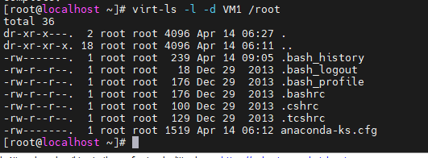
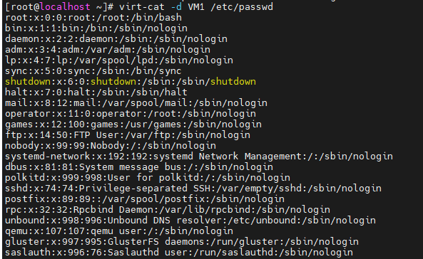
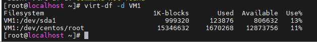
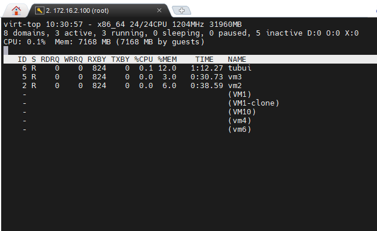

# Tìm hiểu một số lệnh cơ bản với virt-tools
- Cài đặt virt-tool
```sh
yum -y install libguestfs-tools virt-top
```

## Một số lệnh cơ bản
- Hiển thị cấu trúc một thư mục nào đó trong một vm
```sh
virt-ls -l -d <tên_máy_ảo> /root 
```



- Xem nội dung file trong vm
```sh
virt-cat -d <tên_máy_ảo> /etc/passwd 
```



- Edit file trong vm
```sh
virt-edit -d <tên_máy_ảo> /etc/fstab
```

- Hiển thị dung lượng disk vm
```sh
virt-df -d <tên_máy_ảo>
```



- Hiển thị trạng thái của các máy ảo
```sh
virt-top
```


