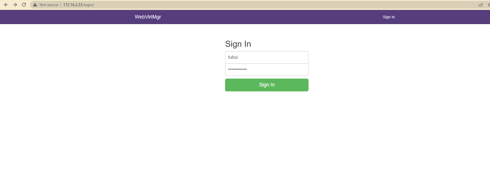

# Tổng quan 
- Webvirtmgr là một trong những công cụ quản lý máy ảo KVM. Nó có chức năng gần giống với virt-manager khi có thể kết nối đến nhiều host KVM để có thể quản lý tập trung các VM trên các máy đó. Nhưng nó có một ưu điểm đặc biệt hơn so với virt-manager đó là ta có thể làm việc với các VM ở bất kỳ đâu có internet

# Chuẩn bị 
- Một máy cài đặt hệ điều hành CentOS 7 có cấu hình tối thiểu 1 CPU, 1 GB RAM và có 1 card mạng
- Ít nhất một máy cài CentOS 7 đã cài đặt KVM để kiểm tra lại webvirtmgr đã hoạt động

# Mô hình


- Tiến hành tắt firewall và selinux trên server cài Webvirtmgr
```sh
systemctl stop firewalld
setenforce 0
```

# Server cài Webvirtmgr
Bước 1: Cài một số gói cần thiết
```sh
yum -y install epel-release
yum -y install git python-pip libvirt-python libxml2-python python-websockify supervisor nginx cyrus-sasl-md5
yum -y install gcc python-devel
pip install --upgrade pip
pip install numpy
```

Bước 2: Clone Webvirtmgr từ GitHub và cài đặt
```sh
git clone https://github.com/retspen/webvirtmgr.git
cd webvirtmgr
pip install -r requirements.txt
```

- Sau đó ta chạy lệnh để thiết lập môi trường Django và tạo ra một tài khoản để đăng nhập Webvirtmgr
```sh
./manage.py syncdb
```

- Nó sẽ hiển thị để cho ta nhập một số thông số cần thiết như username, địa chỉ E-mail, và password


- Sau đó tiếp tục chạy lệnh
```sh
./manage.py collectstatic
```

- Move thư mục `webvirtmgr` vào trong thư mục `/var/www`
```sh
mkdir /var/www
cd
mv webvirtmgr /var/www/
```

Bước 3: Cài đặt nginx
- Mở file `webvirtmgr` (ban đầu file này chưa tồn tại, câu lệnh bên dưới mở file và tiến hành tạo file)
```sh
vi /etc/nginx/conf.d/webvirtmgr.conf
```

- Thêm vào file những dòng sau
```sh
server {
listen 80 default_server;
 
server_name $hostname;
access_log /var/log/nginx/webvirtmgr_access_log;
 
location /static/ {
root /var/www/webvirtmgr/webvirtmgr; # or /srv instead of /var
expires max;
}
 
location / {
proxy_pass http://127.0.0.1:8000;
proxy_set_header X-Real-IP $remote_addr;
proxy_set_header X-Forwarded-for $proxy_add_x_forwarded_for;
proxy_set_header Host $host:$server_port;
proxy_set_header X-Forwarded-Proto $scheme;
proxy_connect_timeout 600;
proxy_read_timeout 600;
proxy_send_timeout 600;
client_max_body_size 1024M; # Set higher depending on your needs
}
}
```


- Vào file /etc/nginx/nginx.conf
```sh
vi /etc/nginx/nginx.conf
```

- Comment những dòng sau
```sh
#    server {
#        listen       80;
#        listen       [::]:80;
#        server_name  _;
#        root         /usr/share/nginx/html;
#
#        # Load configuration files for the default server block.
#        include /etc/nginx/default.d/*.conf;
#
#        error_page 404 /404.html;
#        location = /404.html {
#        }
#
#        error_page 500 502 503 504 /50x.html;
#        location = /50x.html {
#        }
#    }
```

- Restart và enable nginx
```sh
service nginx restart
systemctl enable nginx
```

- Cho phép Webvirtmgr khởi động cùng hệ thống
```sh
/usr/sbin/setsebool httpd_can_network_connect true
chkconfig supervisord on
```

Bước 4: Setup Supervisor
- Cấp quyền cho người dùng 
```sh
chown -R nginx:nginx /var/www/webvirtmgr
```

- Mở file webvirtmgr.ini (file này ban đầu cũng chưa tồn tại)
```sh
vi /etc/supervisord.d/webvirtmgr.ini
```

- Thêm vào những dòng sau
```sh
[program:webvirtmgr]
command=/usr/bin/python /var/www/webvirtmgr/manage.py run_gunicorn -c /var/www/webvirtmgr/conf/gunicorn.conf.py
directory=/var/www/webvirtmgr
autostart=true
autorestart=true
logfile=/var/log/supervisor/webvirtmgr.log
log_stderr=true
user=nginx
 
[program:webvirtmgr-console]
command=/usr/bin/python /var/www/webvirtmgr/console/webvirtmgr-console
directory=/var/www/webvirtmgr
autostart=true
autorestart=true
stdout_logfile=/var/log/supervisor/webvirtmgr-console.log
redirect_stderr=true
user=nginx
```


- Restart supervisord
```sh
systemctl restart supervisord
```

- Đến đây ta đã cài đặt xong Webvirtmgr. Ta mở trình duyệt và truy cập vào địa chỉ của server cài webvirtmgr. Kết quả như sau



# Cài đặt trên host KVM
- Để Webvirtmgr có thể kết nối đến Host KVM và quản lý được các VM trong host KVM ta cần cấu hình một số thông tin sau trên host KVM

- Tiến hành tắt firewalld
```sh
systemctl stop firewalld
```

- Nếu không muốn tắt firewalld, ta có thể mở port 16509 để webvirtmgr có thể kết nối đến 

- Trước tiên cài gói `libvirt`
```sh
yum install libvirt
```

- Thực hiện lần lượt các lệnh sau
```sh
sed -i 's/#listen_tls = 0/listen_tls = 0/g' /etc/libvirt/libvirtd.conf 
sed -i 's/#listen_tcp = 1/listen_tcp = 1/g' /etc/libvirt/libvirtd.conf
sed -i 's/#tcp_port = "16509"/tcp_port = "16509"/g' /etc/libvirt/libvirtd.conf
sed -i 's/#listen_addr = "192.168.0.1"/listen_addr = "0.0.0.0"/g' /etc/libvirt/libvirtd.conf
```

- Lưu ý nếu ta không muốn xác thực trong quá trình kết nối qemu+tcp ta thực hiện lệnh sau (chỉ nên dùng trong môi trường lab)
```sh
sed -i 's/#auth_tcp = "sasl"/auth_tcp = "none"/g' /etc/libvirt/libvirtd.conf
```

- Còn nếu bạn muốn xác thực để tiến hành kết nối qemu+tcp ta thực hiện câu lệnh sau
```sh
sed -i 's/#auth_tcp = "sasl"/auth_tcp = "sasl"/g' /etc/libvirt/libvirtd.conf
```

- Tiếp tục thực hiện các lệnh sau
```sh
sed -i 's/#user = "root"/user = "root"/g' /etc/libvirt/qemu.conf 
sed -i 's/#group = "root"/group = "root"/g' /etc/libvirt/qemu.conf
sed -i 's/#LIBVIRTD_ARGS="--listen"/LIBVIRTD_ARGS="--listen"/g' /etc/sysconfig/libvirtd
```

- Restart lại libvirtd
```sh
systemctl restart libvirtd
```


- Nếu bên trên bạn để xác thực kết nối qemu+tcp thì bạn cần thực hiện thêm một lệnh sau
- Tiến hành cài đặt gói `cyrus-sasl-md5`
```sh
yum install -y cyrus-sasl-md5
sed -i 's/mech_list: gssapi/#mech_list: gssapi/g' /etc/sasl2/libvirt.conf
sed -i 's/#sasldb_path: /etc/libvirt/passwd.db/#sasldb_path: /etc/libvirt/passwd.db/g' /etc/sasl2/libvirt.conf
```

- Sau đó tiến hành restart lại libvirtd
```sh
systemctl restart libvirtd
```

# Sử dụng Webvirt
- Truy cập vào địa chỉ của server cài webvirt ta có giao diện như sau


- Để kết nối đến máy KVM click `Add connection`


- Nhập thông tin và chọn `Add`


- Kết nối thành công sẽ hiện lên giao diện như sau


# Tạo máy ảo trên giao diện Webvirt
- Tại tab `Storage` chọn `default`


- Click vào nút `Add image`, tạo image của hệ điều hành, thiết lập tên, định dạng và kích thước phù hợp


- Tạo instance (máy ảo) mới


- Tùy chỉnh các thông số của máy ảo


- Nhấn `Connect` để chọn file `.iso` để cài đặt hệ điều hành


- Bật máy ảo


