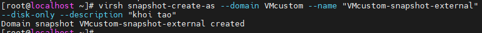

# Template
## Giới thiệu về Template trong KVM
- Template là một dạng file image pre-configured của hệ điều hành được dùng để tạo nhanh các máy ảo. Sử dụng template sẽ khiến ta tránh khỏi những bước cài đặt lặp đi lặp lại và tiết kiệm thời gian rất nhiều so với cài đặt bằng tay từng bước một
- Giả sử ta có 4 máy chạy web server apache. Thông thường, ta sẽ phải cài 4 máy ảo rồi lần lượt cài hệ điều hành cho từng máy, sau đó lại tiếp tục tiến hành cài đặt dịch vụ hoặc phần mềm. Điều này tốn rất nhiều thời gian và template sẽ giúp ta giải quyết vấn đề này
- Hình dưới đây mô tả các bước mà bạn phải thực hiện theo ví dụ trên nếu bạn cài bằng tay. Rõ ràng từ bước 2-5 chỉ là những tasks lặp đi lặp lại và nó sẽ tiêu tốn rất nhiều thời gian không cần thiết


- Với việc sử dụng template, số bước mà người dùng phải thực hiện sẽ được rút ngắn đi rất nhiều, chỉ cần thực hiện 1 lần các bước từ 1 đến 5 rồi tạo template là ta đã có thể triển khai 4 web server còn lại một cách dễ dàng. Điều này sẽ giúp người dùng tiết kiệm rất nhiều thời gian


## Tạo và quản lý Template
- Có hai khái niệm mà người dùng cần phải phân biệt là `clone` và `template`. Nếu `clone` đơn thuần chỉ là một bản sao của máy ảo thì `template` được coi là master copy của VM, nó được dùng để tạo ra rất nhiều clone khác nữa 
- Có hai phương thức để triển khai máy ảo từ template là `Thin` và `Clone`
	+ Thin: Máy ảo được tạo ra theo phương thức này sẽ sử dụng template như một base image, lúc này nó sẽ được chuyển sang trạng thái read only. Cùng với đó, sẽ có một ổ "copy on write" được thêm vào để lưu trữ dữ liệu mới. Phương thức này tốn ít dung lượng hơn tuy nhiên các VM được tạo ra sẽ phụ thuộc vào base image, chúng sẽ không chạy được nếu không có base image
	+ Clone: Máy ảo được tạo ra làm một bản sao hoàn chỉnh và hoàn toàn không phụ thuộc vào template cũng như máy ảo ban đầu. Tuy nhiên nó sẽ chiếm dung lượng giống như máy ảo ban đầu

### Tạo Template
- Template thực chất là máy ảo được chuyển đổi sang. Quá trình này gồm 3 bước
	+ Bước 1: Cài đặt máy ảo với đầy đủ các phần mềm cần thiết để biến nó thành template
	+ Bước 2: Loại bỏ tất cả những cài đặt cụ thể ví dụ như password SSH, địa chỉ MAC... để đảm bảo rằng nó không được áp dụng giống nhau tới tất cả các máy ảo được tạo ra sau này
	+ Bước 3: Đánh dấu máy ảo là template bằng việc đổi tên

- Trước khi tạo template ta cần shutdown máy ảo muốn tạo bằng câu lệnh
```sh
virsh shutdown VMcustom
```
- Sử dụng `virt-sysgrep` để niêm phong máy ảo:
	+ "virt-sysprep" là một tiện ích nằm trong gói "libguestfs-tools-c" được sử dụng để loại bỏ những thông tin cụ thể của hệ thống đồng thời niêm phong và biến máy ảo trở thành template
	+ Có 2 options để dùng "virt-sysprep" đó là "-a" và "-d". Tùy chọn "-d" được sử dụng với tên hoặc UUID của máy ảo, tùy chọn "-a" được sử dụng với đường dẫn tới ổ đĩa máy ảo.
```sh
virt-sysprep -d VMcustom
```


#### Triển khai máy ảo từ Template sử dụng phương thức `Clone`
- Tạo một máy ảo từ Template với tên máy là VMtemplate1 và định dạng file `qcow2`

```sh
virt-clone --original=VMcustom --name=VMtemplate1 --file=/var/lib/libvirt/images/VMtemplate1.qcow2
```


- Sau khi hoàn tất, máy ảo đã sẵn sàng để sử dụng


>> Lưu ý rằng máy ảo khi tạo ra với phương thức `Clone` sẽ hoàn toàn độc lập với template, nó vẫn có thể chạy khi ta bỏ đi template

# Snapshot
- Snapshot là trạng thái của hệ thống ở một thời điểm nhất định, nó sẽ lưu lại cả những cài đặt và dữ liệu. Với snapshot, ta có thể quay trở lại trạng thái của máy ảo ở một thời điểm nào đó rất dễ dàng
- Libvirt hỗ trợ việc tạo snapshot khi máy ảo đang chạy .Mặc dù vậy, nếu máy ảo của ta đang chạy ứng dụng thì tốt hơn hết hãy tắt hoặc suspend trước khi tiến hành tạo snapshot
- Có 2 loại snapshot được hỗ trợ bởi libvirt:
	+ Internal: Trước và sau khi tạo snapshot, dữ liệu chỉ được lưu trên một ổ đĩa duy nhất. Người dùng có thể tạo internal snapshot bằng công cụ virt-manager. Tuy nhiên nó có một vài hạn chế:
		+ Chỉ hỗ trợ duy nhất định dạng qcow2
		+ VM sẽ bị ngưng lại khi tiến hành snapshot
		+ Không hoạt động với LVM storage pools

	+ External: Dựa theo cơ chế copy-on-write. Khi snapshot được tạo, ổ đĩa ban đầu sẽ có trạng thái "read-only" và có một ổ đĩa khác chồng lên để lưu dữ liệu mới

	
	
	+ Ổ đĩa được chồng lên được tạo ra có định dạng qcow2, hoàn toàn trống và nó có thể chứa lượng dữ diệu giống như ổ đĩa ban đầu. External snapshot có thể được tạo với bất kì định dạng ổ đĩa nào mà libvirt hỗ trợ

## Tạo và quản lý Internal Snapshot
- Internal snapshot chỉ hỗ trợ định dạng `qcow2` vì thế hãy xem rằng ổ đĩa của máy ảo thuộc định dạng nào bằng câu lệnh `qemu-img info <Đường_dẫn_chứa_file_disk>` . Nếu định dạng ổ đĩa không phải là `qcow2`, hãy chuyển nó sang định dạng này bằng câu lệnh `qemu-img convert`

- Một vài câu lệnh `virsh` liên quan tới việc tạo và quản lý máy ảo:
	+ `snapshot-create`: Tạo snapshot từ file XML
	+ `snapshot-create-as`: Tạo snapshot với những tùy chọn
	+ `snapshot-current`: Thiết lập hoặc lấy thông tin của snapshot hiện tại
	+ `snapshot-delete`: Xóa một snapshot
	+ `snapshot-dumpxml`: Tạo ra thêm 1 file XML cho một snapshot
	+ `snapshot-edit`: Chỉnh sửa file XML của snapshot
	+ `snapshot-info`: Lấy thông tin của snapshot
	+ `snapshot-list`: Lấy danh sách các snapshots
	+ `snapshot-parent`: Lấy tên của snapshot "cha" của một snapshot nào đó
	+ `snapshot-revert`: Quay trở về trạng thái khi tạo snapshot

- Để tạo mới một internal snapshot, thông thường ta hay sử dụng câu lệnh 
```sh
virsh snapshot-create-as --domain kvm1 --name "kvm1-snapshot" --description "khoi tao"
```


- Để xem thông tin về bản Snapshot đã tạo
```sh
virsh snapshot-list kvm1
```


- Để xem thông tin chi tiết của bản Snapshot đã tạo
```sh
virsh snapshot-info kvm1 --snapshotname "kvm1-snapshot"
```


### Để Reverse lại 1 bản snapshot đã tạo
- Để quay trở lại trạng thái của một internal snapshot, dùng câu lệnh: `virsh snapshot-revert <vm_name> --snapshotname "<snapshot_name>"`

```sh
virsh snapshot-revert kvm1 --snapshotname "kvm1-snapshot"
```

- Người dùng có thể tạo ra nhiều các snapshot, thêm tùy chọn `--parent` vào `snapshot-list` để hiển thị ra danh sách snapshots theo mối quan hệ cha con
- Để xóa một internal snapshot, dùng câu lệnh: `virsh snapshot-delete <vm_name> --snapshotname "<snapshot_name>"`

```sh
virsh snapshot-delete kvm1 --snapshotname "kvm1-snapshot"
```

## Tạo và quản lý External Snapshot
- Tiến hành kiểm tra ổ đĩa mà máy ảo muốn tạo snapshot đang sử dụng bằng câu lệnh `virsh domblklist <vm_name> --details`

- Tiến hành tạo snapshot bằng câu lệnh `virsh snapshot-create-as <vm_name> snapshot1 "<external_snapshot>" --disk-only --atomic`

```sh
virsh snapshot-create-as --domain VMcustom --name "VMcustom-snapshot-external" --disk-only --description "khoi tao"
```




- Trong đó `--disk only` dùng để tạo snapshot cho riêng ổ đĩa


- Check lại danh sách bằng câu lệnh `virsh snapshot-list <vm_name> --snapshotname "<snapshot_name>"`
```sh
virsh snapshot-info VMcustom --snapshotname "VMcustom-snapshot-external"
```


- Lúc này ổ đĩa cũ đã biến thành trạng thái `read-only`, VM dùng ổ đĩa mới để lưu dữ liệu và `backingfile` sẽ là ổ đĩa ban đầu


### Để Reverse trạng thái Snapshot
- Để revert lại trạng thái của external snapshot, ta phải cấu hình file XML bằng tay bởi libvirt vẫn chưa hỗ trợ cho việc này

- Lấy đường dẫn tới ổ đĩa được tạo ra khi snapshot
```sh
virsh snapshot-dumpxml VMcustom --snapshotname "VMcustom-snapshot-external" | grep 'source file' | head -1
```


- Kiểm tra để đảm bảo nó còn nguyên vẹn và được kết nối với backing file
```sh
qemu-img info /var/lib/libvirt/images/VMcustom.VMcustom-snapshot-external | grep backing
```


- Chỉnh sửa bằng tay file XML, bỏ ổ đĩa hiện tại và thay thế ở trạng thái snapshot1


- Kiểm tra xem máy ảo đã sử dụng đúng ổ chưa
```sh
virsh domblklist VMcustom
```


