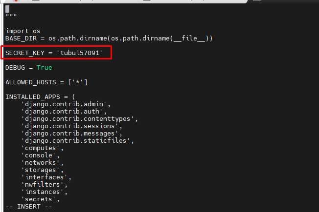
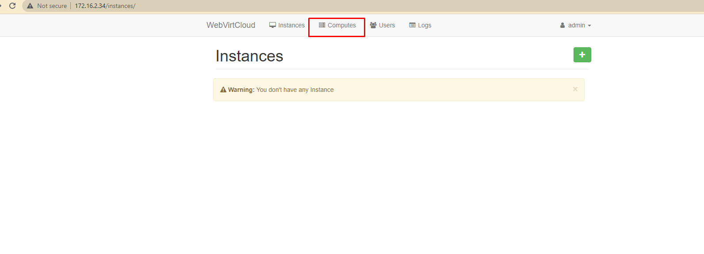

# Cài đặt WebVirtCloud quản lý hạ tầng KVM
- Sử dụng WebVirtCloud giúp ta quản lý tập trung hạ tầng KVM một cách hiệu quả hơn
- Trước đây chúng ta thường sử dụng các công cụ như virt-manager, webvirt, kimchi hay virsh... để quản trị các máy chủ KVM. Nhưng mỗi phần mềm đều tồn tại những điểm yếu nhất định, WebVirtCloud có thể sẽ giải quyết các vấn đề còn tồn đọng đó

## Tại server cài KVM
- Để có thể kết nối KVM đến WebVirtCloud, cần thêm một số bước sau:
	+ Chỉnh sửa file cấu hình libvirt như sau
	```sh
	vi /etc/libvirt/libvirtd.conf
	```
	```sh
	listen_tls = 0
	listen_tcp = 1
	tcp_port = "16509"
	listen_addr = "0.0.0.0"
	auth_tcp = "none"  
	```

	+ Chỉnh sửa file  `/etc/sysconfig/libvirtd`: bỏ dấu # ở dòng sau
	```sh
	LIBVIRTD_ARGS="--listen"
	```

	+ Cho phép port 16509 của libvirt và dải port 5900-5999 của VNC đi qua firewalld
	```sh
	firewall-cmd --permanent --add-port=16509/tcp
	firewall-cmd --permanent --add-port=5900-5999/tcp
	firewall-cmd --reload
	```

	+ Restart lại dịch vụ `libvirt`
	```sh
	systemctl restart libvirtd
	```

## Server cài WebVirtCloud
Thực hiện cài đặt WebVirtCloud

Bước 1: Cài đặt các packages cần thiết
```sh
yum install epel-release -y
yum -y install python-virtualenv python-devel libvirt-devel glibc gcc nginx supervisor python-lxml git python-libguestfs
```

Bước 2: Tạo thư mục và clone source code từ trang chủ về 
```sh
cd /srv
git clone https://github.com/retspen/webvirtcloud && cd webvirtcloud
git checkout 1e2fbc8
cp webvirtcloud/settings.py.template webvirtcloud/settings.py
```

Bước 3: Thay thế secret key 
	+ Thay đổi chuỗi secret key trong file settings.py bằng một đoạn string ngẫu nhiên mà chỉ có bạn là người sở hữu
	```sh
	vi webvirtcloud/settings.py
	```

	+ Tìm đến dòng `SECRET_KEY` và sửa như sau
	```sh
	SECRET_KEY = 'tubui57091'
	```



Bước 4: Cài đặt WebVirtCloud
```sh
virtualenv venv
source venv/bin/activate
venv/bin/pip install -r conf/requirements.txt
cp conf/nginx/webvirtcloud.conf /etc/nginx/conf.d/
venv/bin/python manage.py migrate
```

Bước 5: Cấu hình Supervisor
- Thêm các cấu hình sau vào cuối file `/etc/supervisord.conf`
```sh
[program:webvirtcloud]
command=/srv/webvirtcloud/venv/bin/gunicorn webvirtcloud.wsgi:application -c /srv/webvirtcloud/gunicorn.conf.py
directory=/srv/webvirtcloud
user=nginx
autostart=true
autorestart=true
redirect_stderr=true

[program:novncd]
command=/srv/webvirtcloud/venv/bin/python /srv/webvirtcloud/console/novncd
directory=/srv/webvirtcloud
user=nginx
autostart=true
autorestart=true
redirect_stderr=true
```

Bước 6: Cấu hình nginx
- Comment lại các dòng trong file `/etc/nginx/nginx.conf`
```sh
#    server {
#        listen       80;
#        listen       [::]:80;
#        server_name  _;
#        root         /usr/share/nginx/html;
#
#        # Load configuration files for the default server block.
#        include /etc/nginx/default.d/*.conf;
#
#        error_page 404 /404.html;
#        location = /404.html {
#        }
#
#        error_page 500 502 503 504 /50x.html;
#        location = /50x.html {
#        }
#    }
```

- Sau đó chỉnh sửa file `/etc/nginx/conf.d/webvirtcloud.conf`
```sh
upstream gunicorn_server {
    #server unix:/srv/webvirtcloud/venv/wvcloud.socket fail_timeout=0;
    server 127.0.0.1:8000 fail_timeout=0;
}
server {
    listen 80;

    server_name servername.domain.com;
    access_log /var/log/nginx/webvirtcloud-access_log; 

    location /static/ {
        root /srv/webvirtcloud;
        expires max;
    }

    location / {
        proxy_pass http://gunicorn_server;
        proxy_set_header X-Real-IP $remote_addr;
        proxy_set_header X-Forwarded-for $proxy_add_x_forwarded_for;
        proxy_set_header Host $host:$server_port;
        proxy_set_header X-Forwarded-Proto $remote_addr;
        proxy_connect_timeout 600;
        proxy_read_timeout 600;
        proxy_send_timeout 600;
        client_max_body_size 1024M;
    }
}
```

Bước 7: Phân quyền cho các thư mục
- Phân quyền cho user nginx có thể đọc được file trong thư mục chứa code
```sh
chown -R nginx:nginx /srv/webvirtcloud\
```

- Phần quyền cho selinux
```sh
yum install policycoreutils-python -y
setenforce 0
semanage fcontext -a -t httpd_sys_content_t "/srv/webvirtcloud(/.*)"
```

Bước 8: Cấu hình firewalld
```sh
firewall-cmd --permanent --add-port=80/tcp
firewall-cmd --permanent --add-port=6080/tcp
firewall-cmd --reload
```

Bước 9: Restart và Enable các services
```sh
systemctl restart nginx && systemctl restart supervisord
systemctl enable nginx && systemctl enable supervisord
```

Bước 10: Truy cập web sau đó add các nodes KVM

- Login với user và password mặc định là
	+ user: admin
	+ password: admin


- Để add note KVM ta chọn Computes




- Khai báo thông tin TCP connect tới libvirt


- Sau khi connect thành công 


- Click vào Instances để quản lý các VM 


