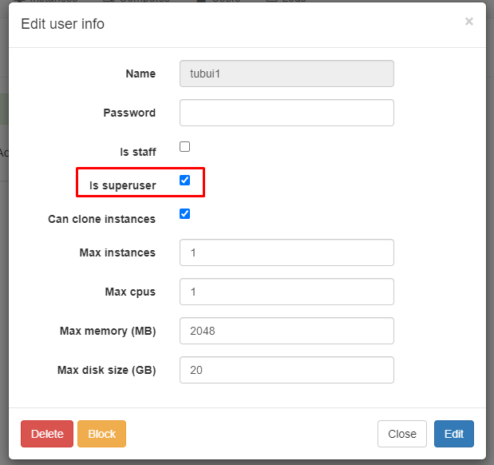
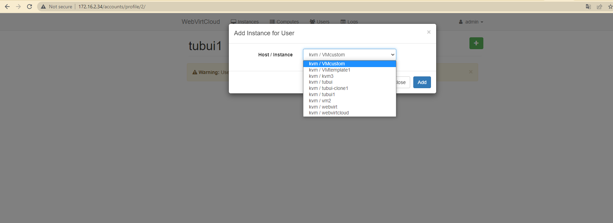

# Các thao tác cơ bản trên WebVirtCloud
## Thay đổi password admin
- Tài khoản và Mật khẩu mặc định là admin/admin, vì vậy bước đầu tiên ta cần phải đổi ngay mật khẩu

## Tạo user
- Click vào `+`

- Nhập thông tin và chọn `Create`

- Nhấp vào biểu tượng bánh răng để phân quyền cho user vừa tạo
- Ở đây ta có thể phân quyền cho user là một user thường (is staff) hoặc một superuser (is superuser)

## Tạo Storage Pool 

- Vào tab `Computes` chọn compute mà ta muốn tạo pools

- Chọn `Storages`

- Tạo một pool mới

- Sau khi tạo xong các pool

## Tạo network 

- Chọn name và mode network mà ta muốn thiết lập

## Gán VM cho user thường 
- Nếu là user admin, ta có toàn quyền nhưng nếu ta là một user thường thì chỉ có thể sử dụng VM do superuser hay còn gọi là admin gán quyền. Và ta chỉ có thể thao tác với chính con VM đó chứ không phải là các computes chứa các VM

- Chọn User thường (tubui1)

- Click `+`

- Chọn VM thuộc compute sau đó click `Add`

- Chọn edit nếu muốn thay đổi quyền quản trị của user đối với VM đó
- Ở đây ta không cho phép User tubui1 delete VM

- Đăng nhập vào user `tubui1`

- User `tubui1` có quyền Resize

- User `tubui1` không có quyền Destroy

## Tạo VM
- Để thực hiện tạo VM, user ta thực hiện phải là user có quyền admin

- Lựa chọn `compute`

- Có thể tạo VM từ `Flavor` có sẵn hoặc `Custom`

- Nếu tạo từ `Flavor`

- Chọn các thông số cần thiết để tạo máy ảo

- Chọn các chế độ boot sau đó apply

- Power On

- Tiến hành cài đặt như bình thường

## Một số tính năng hữu ích
Resize CPUs, RAM và dung lượng của ổ cứng 

- Nếu muốn resize dung lượng của ổ cứng, ta cần phải xóa các snapshot đi

- Add thêm ổ cứng

- Add thêm card mạng 

- Phân quyền quản lyus VM cho user 

- Xem log 

