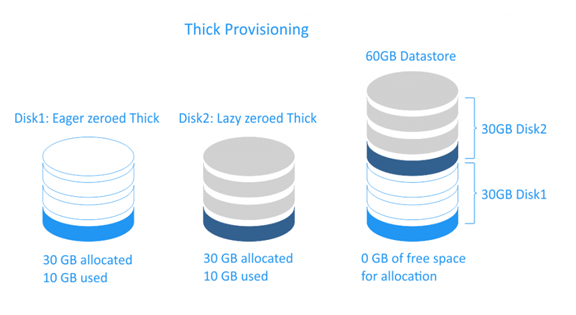
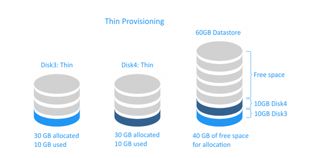

# Phân biệt Thick Provisioning và Thin Provisioning 
- Khi khởi tạo VM (Virtual Machine) có bước lựa chọn định dạng phân vùng lưu trữ cho VM như: Thin Provisioned, Thick Provisioned Lazy Zeroe & Thick Provisioned Eager Zeroed. Để VM đặt được hiệu năng tốt nhất ta phải hiểu và chọn định dạng phân vùng phù hợp
- Điểm khác nhau rõ ràng nhất là sự chiếm dụng tài nguyên của lưu trữ của server
- Ví dụ: Giả sử ta tạo VM 100 Gb, chọn định dạng Thick thì VM sẽ chiếm dụng đúng 100 Gb của server, chọn Thin thì VM chỉ chiếm dụng đúng dung lượng mà nó đang lưu trữ
- Hiệu suất thì Thick Provisioned Eager Zeroed sẽ có hiệu suất tốt nhất, sau đó đến Thick Provisioned Lazy Zeroe và sau cùng là Thin Provisioned.

## Thick Provisioning

- Với Thick Provisioning, dung lượng lưu trữ đĩa ảo hoàn chỉnh được phân bổ trước trên bộ nhớ vật lý khi đĩa ảo được tạo. Đĩa ảo được cấp Thick Provisioning tiêu thụ tất cả không gian được phân bổ cho nó trong kho dữ liệu ngay từ đầu, do đó không gian không có sẵn để sử dụng bởi các máy ảo khác
	+ Có 2 kiểu của thick-provisioned virtual disks
		+ Lazy zeroed disk: Là một đĩa ảo dùng tất cả không gian của nó tại thời điểm tạo, nhưng không gian này có thể chứa một số dữ liệu cũ trên phương tiện vật lý. Dữ liệu cũ này không bị xóa hoặc ghi đè lên, do đó, nó cần phải được "zeroed out" trước khi dữ liệu mới có thể được ghi vào các khối. Loại disk này có thể được tạo nhanh hơn nhưng hiệu suất của nó sẽ thấp hơn
		+ Eager zeroed disk: Là một đĩa ảo có được tất cả các không gian cần thiết vẫn còn tại thời điểm tạo ra nó, và không gian bị xóa sạch mọi dữ liệu trước đó trên phương tiện vật lý. Việc tạo đĩa không mong muốn mất nhiều thời gian hơn vì các số 0 được ghi vào toàn bộ đĩa, nhưng hiệu suất của chúng nhanh hơn trong lần viết đầu tiên

	+ Thick Provisioned Eager Zeroed cũng giống như Full Format, định dạng này thực hiện việc ghi giá trị 0 lên tất cả các sector, đồng nghĩa với việc sao chép dữ liệu vào sẽ chỉ việc ghi thêm giá trị 1 lên. Thick Provisioned Lazy Zeroed thì như Quick Format, sao chép dữ liệu đến đâu sẽ ghi đến đó

## Thin Provisioning 

- Đĩa ảo được tạo ra kiểu thin provisioning chỉ tiêu thụ không gian cần thiết ban đầu và tăng theo thời gian, theo nhu cầu. Ví dụ cấp 100 GB cho máy ảo, máy ảo sẽ sử dụng đến đâu thì chiếm phần đó, giả sử chỉ cài OS chiếm 10 GB, thì tổng dung lượng của máy ảo chỉ là 10 GB, 90 GB vẫn được giải phóng để làm việc khác

- Lưu ý rằng khi xóa dữ liệu của mình khỏi ổ đĩa ảo được cấp thin provisioning, kích thước đĩa sẽ không tự động giảm. Điều này là do hệ điều hành chỉ xóa các chỉ mục từ bảng tệp tham chiếu đến phần thân tệp trong hệ thống tệp; nó đánh dấu các khối thuộc về các tệp "đã xóa" là free và có thể truy cập được để ghi dữ liệu mới.

## So sánh ưu nhược điểm
- Thick provision: Tốc độ đọc ghi của VM có phần nhanh hơn, do được cấp phát cố định 1 khoản trên ổ cứng, quản lý dễ dàng 
- Thin provision: Tốc độ đọc ghi VM có phần chậm hơn Thick provision. Quản lý có phần phức tạp hơn. Nhưng ưu điểm: Linh động trong quản lý ổ đĩa, phần dung lượng giải phóng có thể dễ dàng chia sẻ giữa các VM. Đặc biệt nếu phải backup restore với trường hợp backup và restore sẽ nhanh hơn rất nhiều