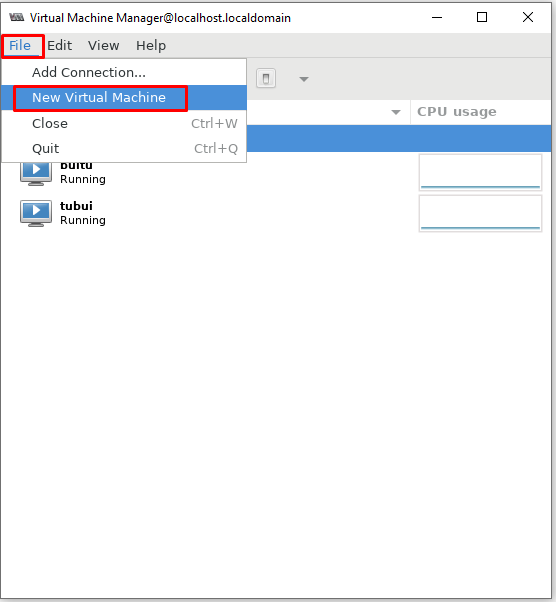

# Tổng quan 
- KVM (Kernel-based Virtual Machine) được biết đến là một cơ sở hạ tầng ảo hóa cho nhân Linux dành cho những CPU hỗ trợ công nghệ ảo hóa như Intel VT hoặc ADM-V

## Chuẩn bị 
- Một máy chạy hệ điều hành CentOS 7 với cấu hình tối thiểu 2 CPU, 2 GB RAM và 10 GB disk
- Một file ISO của một hệ điều hành khác để cài máy ảo

- Lưu ý để cài được KVM thì cần phải được CPU hỗ trợ. Để kiểm tra xem CPU có hỗ trợ hay không sử dụng lệnh
```sh
lscpu | grep Virtualization
```
```sh
egrep -c "svm|vmx" /proc/cpuinfo	// Nếu kết quả trả về khác 0 thì CPU có hỗ trợ
```


## Cài đặt KVM
- Cài KVM và các gói phụ trợ liên quan 
```sh
yum install -y qemu-kvm libvirt bridge-utils virt-manager
```

- Trong đó:
	+ qemu-kvm: Phần phụ trợ cho KVM
	+ libvirt-bin: Cung cấp libvirt mà bạn cần quản lý qemu và KVM bằng libvirt
	+ bridge-utils: Chứa một tiện ích cần thiết để tạo và quản lý các thiết bị bridge
	+ virt-manager: Cung cấp giao diện đồ họa để quản lý máy ảo

- Kiểm tra để chắc chắn rằng KVM đã được cài đặt


- Đối với bản Minimal để dùng được công cụ đồ họa `virt-manager` người dùng phải cài đặt gói x-window bằng câu lệnh
```sh
yum install "@X Window System" xorg-x11-xauth xorg-x11-fonts-* xorg-x11-utils -y
```

- Start dịch vụ libvirt và cho nó khởi động cùng hệ thống
```sh
systemctl start libvirtd
systemctl enable libvirtd
```

## Tạo máy ảo bằng GUI (virt-manager)
- Có rất nhiều công cụ để tạo và quản lý máy ảo KVM. Ở đây ta sử dụng công cụ đồ họa `virt-manager` đã cài bên trên

1. Download file iso
- Download hoặc sử dụng WinSCP để truyền file iso vào thư mục `/var/lib/libvirt/file-iso/`
```sh
cd /var/lib/libvirt
mkdir file-iso
cd file-iso

wget https://mirrors.nhanhoa.com/centos/7.9.2009/isos/x86_64/CentOS-7-x86_64-Minimal-2009.iso
```

2. Truy cập Virt-manager để cấu hình VM

```sh
virt-manager
```


- Tạo máy ảo



- Chọn kiểu cài đặt hệ điều hành -> `Forward`


- Chọn đường dẫn file ISO ta đã tải ở trên


- Chỉ định thông số RAM và CPU cho máy ảo


- Chỉ định số lượng đĩa và đường dẫn của máy ảo nếu ta đặt đường dẫn tùy chỉnh (Mặc định đường dẫn sẽ là `/var/lib/libvirt/images`)


- Chỉ định thông tin máy, netword


- Nhấn `Finish` sau đó chọn `Begin Installation` để hoàn tất quá trình cài đặt máy ảo


- Sau đó ta tiến thành cài OS như bình thường


## Tạo máy ảo bằng CLI (virt-install)
### Tạo máy ảo từ file ISO
Bước 1: Tạo thư mục chứa máy ảo
```sh
mkdir -p /var/kvm/images
```

Bước 2: Sử dụng lệnh `virt-install` với các tham số, giá trị truyền vào để tạo máy ảo với thông tin cấu hình mong muốn. Hầu hết các options là không bắt buộc, virt-install chỉ yêu cầu 1 số thông tin tối thiểu sau
```sh
--name
--ram
--disk
--filesystem or --nodisks
```
- Các tham số đối với `virt-install`
`--name`: Đặt tên cho máy ảo
`--ram`: Set dung lượng RAM cho máy ảo (MB)
`--disk path=xx, size =xx`: Đường dẫn lưu trữ file .img máy ảo và dung lượng disk mount
`--vspus`: Set giá trị số vCPU
`--os-type`: kiểu hệ điều hành (linux, windows)
`--os-variant`: Kiểu của GuestOS
`--network`: Dải network mà máy ảo tạo ra sẽ cắm vào
`--graphics`: Set chế độ đồ họa, đặt là none -> không sử dụng chế độ đồ họa
`--console`: Lựa chọn kiểu console
`--location`: Đường dẫn tới file cài đặt
`--extra-args`: Set tham số cho kernel

- Tiến hành tạo máy ảo với `virt-install`
```sh
virt-install \
--name vm2 \
--ram 2048 \
--disk path=/var/kvm/images/vm2.img,size=30 \
--network bridge=br0 \
--graphics vnc,listen=0.0.0.0 \
--noautoconsole \
--os-type=linux \
--os-variant=rhel7 \
--location=/var/lib/libvirt/images/CentOS-7-x86_64-Minimal-2009.iso
```


>> Tiến hành cài đặt như bình thường


### Tạo máy ảo từ image có sẵn 

```sh
virt-install \
--name vm3 \
--ram 1024 \
--vcpus 1 \
--os-variant=rhel7 \
--disk path=/var/lib/libvirt/images/vm3.img,format=qcow2,bus=virtio,cache=none \
--network bridge=br0 \
--hvm --virt-type kvm \
--vnc --noautoconsole \
--import
```

>> Tiến hành cài đặt như bình thường


## Tạo máy ảo từ Internet

```sh
virt-install \
--name vm4 \
--ram 2048 \
--disk path=/var/kvm/images/vm4.img,size=30 \
--vcpus 2 \
--os-type linux \
--os-variant rhel7  \
--network bridge=br0 \
--graphics none \
--console pty,target_type=serial \
--location 'http://ftp.iij.ad.jp/pub/linux/centos/7/os/x86_64/' \
--extra-args 'console=ttyS0,115200n8 serial'
```

