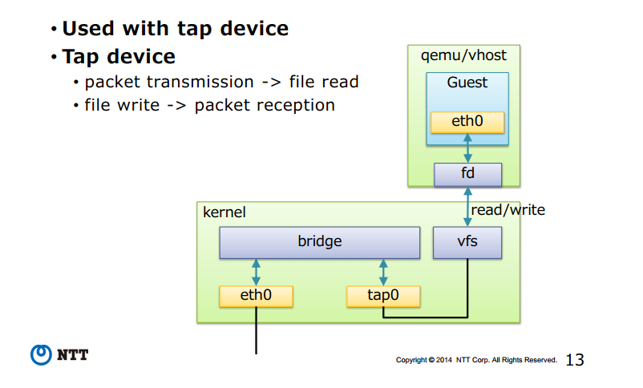

# Linux Bridge
## Khái niệm - ứng dụng 
- Linux bridge là một phần mềm được tích hợp sẵn vào trong nhân Linux để giải quyết vấn đề ảo hóa phần network trong các máy vật lý. Về mặt logic Linux bridge sẽ tạo ra một con switch ảo để cho các VM kết nối được vào và có thể nói chuyện được với nhau cũng như sử dụng để ra mạng ngoài
- Ngoài ra khi tìm hiểu Linux bridge còn có một số thuật ngữ như:
	+ Port: Tương tự như cổng của một con switch thật
	+ Bridge: Ở đây là switch ảo
	+ Tap: Hay còn gọi là tap interface, là giao diện mạng để các VM kết nối với switch do Linux bridge tạo ra (nó hoạt động ở lớp 2 của mô hình OSI)
	+ fd: Forward data có nhiệm vụ chuyển dữ liệu từ VM tới switch

> Switch ảo do Linux bridge tạo ra có chức năng tương tự với 1 con switch vật lý

## Kiến trúc
Kiến trúc của Linux bridge như hình sau



## Chức năng của một switch ảo do Linux bridge tạo ra
- STP: Là giao thức chống loop gói tin trong switch
- Vlan: Là tính năng rất quan trọng trong một switch
- FDB: Là tính năng chuyển gói tin theo database được xây dựng giúp tăng tốc độ của switch 

## Công cụ và lệnh làm việc với Linux Bridge
- Linux bridge được hỗ trợ từ version nhân kernel từ 2.4 trở lên. Để sử dụng và quản lý các tính năng của Linux bridge, cần cài đặt gói bridge-utilities
```sh
- Ubuntu
sudo apt-get install bridge-ultils -y
- CentOS
sudo yum install bridge-ultils -y
```

### Bridge management commandline

|ACTION|BRCTL|BRIDGE|
|---|---|---|
|Tạo một bridge|`brctl addbr <bridge>`| |
|Xóa đi một bridge|`brctl delbr <bridge>`| |
|Thêm một interface (port) vào bridge|`brctl addif <bridge> <ifname>`| |
|Xóa đi một interface (port) trên bridge|`brctl delbr <bridge>`| |

### FDB management commandline

|ACTION|BRCTL|BRIDGE|
|---|---|---|
|Hiển thị danh sách địa chỉ MAC trong FDB|`brctl showmacs <bridge>`|`bridge fdb show`|
|Sets FDB entries ageing time|`brctl setageingtime <bridge> <time>`| |
|Sets FDB garbage collector interval|`brctl setgcint <brname> <time>`| |
|Adds FDB entry||`bridge fdb add dev <interface> [dst, vni, port, via]`|
|Appends FDB entry| |`bridge fdb append` (parameters same as for fdb add)
|Deletes FDB entry| |`bridge fdb delete` (parameters same as for fdb add)

### STP management commandline
|ACTION	|BRCTL|BRIDGE|
|---|---|---|
|Turning STP on/off	|`brctl stp <bridge> <state>`| |	
|Setting bridge priority|`brctl setbridgeprio <bridge> <priority>`| |
|Setting bridge forward delay|`brctl setfd <bridge> <time>`| |
|Setting bridge 'hello' time|`brctl sethello <bridge> <time>`| |	
|Setting bridge maximum message age|`brctl setmaxage <bridge> <time>`| |
|Setting cost of the port on bridge|`brctl setpathcost <bridge> <port> <cost>`|`bridge link set dev <port> cost <cost>`|
|Setting bridge port priority	|`brctl setportprio <bridge> <port> <priority>`|`bridge link set dev <port> priority <priority>`|
|Should port proccess STP BDPUs	| |`bridge link set dev <port > guard [on, off]`|
|Should bridge might send traffic on the port it was received| |`bridge link set dev <port> hairpin [on,off]`|
|Enabling/disabling fastleave options on port| |`bridge link set dev <port> fastleave [on,off]`|
|Setting STP port state	| |`bridge link set dev <port> state <state>`|

### VLAN management commandline

|ACTION|BRCTL|BRIDGE|
|---|---|---|
|Creating new VLAN filter entry| |`bridge vlan add dev <dev> [vid, pvid, untagged, self, master]`|
|Delete VLAN filter entry| |`bridge vlan delete dev <dev>` (parameters same as for vlan add)|
|List VLAN configuration| |`bridge vlan show`|