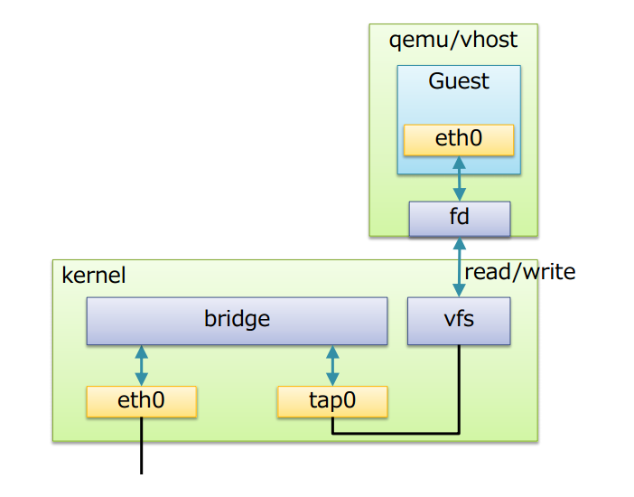

# Công nghệ ảo hóa
## Giới thiệu về ảo hóa
- Ngày nay, việc quản lí và sử dụng hạ tầng CNTT là điều rất cần thiết với bất kỳ một doanh nghiệp nào. Tuy nhiên vẫn còn những hạn chế trong việc quản lý và sử dụng tài nguyên theo phương pháp truyền thống:
	+ Mỗi máy chủ vật lý chỉ cài đặt tương ứng 1 hệ điều hành, từ đó chỉ thiết lập được 1 môi trường hoạt động, dẫn đến thiếu linh hoạt về các loại ứng dụng có thể cài đặt phục vụ cho mục đích doanh nghiệp
	+ Việc đầu từ nhiều máy chủ nhưng không sử dụng hết năng lực của máy chủ dẫn đến phí phạm tài nguyên và quản lý tài nguyên trở nên khó khăn 
	+ Các máy chủ vật lý được cài đặt trực tiếp hệ điều hành và ứng dụng gặp khó khăn trong việc sao lưu và phục hồi (backup và restore), một số máy chủ vật lý đang hoạt động có những cơ chế đặc thù riêng và gần như rất khó hoặc “không thể” thực hiện sao lưu và phục hồi
	+ Thời gian downtime của máy chủ vật lý thường rất lâu và dễ gặp trục trặc trong quá trình khởi động lại
	+ Khó khăn trong việc quản trị và giám sát tập trung khi số lượng máy chủ vật lý tăng lên 

>> Vì vậy ảo hóa được đưa ra nhằm tối ưu hóa việc sử dụng và khai thác tài nguyên vật lý

- Công nghệ ảo hóa là một công nghệ được ra đời nhằm khai thác triệt để khả năng làm việc của một máy chủ vật lý. Ảo hóa cho phép vận hành nhiều máy chủ ảo trên cùng một máy chủ vật lý, dùng chung các tài nguyên của một máy chủ vật lý như CPU, Ram, ổ cứng... và các tài nguyên khác. Các máy ảo khác nhau có thể vận hành hệ điều hành và ứng dụng trên cùng một máy chủ vật lý
- Công nghệ ảo hóa cho phép hợp nhất và chạy nhiều khối lượng công việc như các máy ảo trên một máy tính duy nhất. Một máy ảo là một máy tính được tạo ra bởi phần mềm, giống như một máy tính vật lý, chạy một hệ điều hành và các ứng dụng. Mỗi máy ảo có phần cứng ảo riêng của nó, bao gồm một CPU, bộ nhớ, đĩa cứng và card mạng ảo, giống như phần cứng cho hệ điều hành và ứng dụng 

## Chức năng của ảo hóa
- Phân chia: Với công nghệ ảo hóa, chúng ta có thể chạy nhiều máy ảo trên một máy thật với nhiều hệ điều hành khác nhau, nhờ thế mà ta cũng có thể tách từng dịch vụ ra để cài trên từng máy ảo
- Cô lập: Khi mỗi dịch vụ quan trọng được cài trên một máy ảo khác nhau thì nếu có sự cố, các dịch vụ khác cũng không bị ảnh hưởng gì
- Đóng gói: Với công nghệ ảo hóa, các máy ảo được đóng gói thành các file riêng biệt, nhờ vậy mà nó có thể dễ dàng được sao chép để backup và di chuyển sang hệ thống khác để chạy

## Lợi ích của ảo hóa
- Tiết kiệm chi phí trong khi đó lại tăng hiệu quả, hiệu năng và tính linh động cho hạ tầng hiện hữu
- Giảm số lượng máy chủ vật lý, giảm lượng điện năng tiêu thụ, tiết kiệm được chi phí cho việc bảo trì phần cứng, nâng cao hiệu quả công việc
- Dễ ràng mở rộng khi có nhu cầu
- Khai thác triệt để các tài nguyên của phần cứng vật lý bằng cách chạy nhiều hệ điều hành trên mạng một chủ vật lý
- Tăng tính linh hoạt của hệ thống, cho phép di chuyển máy chủ mà không gây ảnh hưởng đến các ứng dụng và dịch vụ đang chạy trên các máy chủ. Cung cấp các ứng dụng và tài nguyên nhanh hơn

## Phân loại
- Trong ảo hóa, người ta có thể ảo hóa:
	+ RAM virtualization
	+ CPU virtualization
	+ Network virtualization
	+ Device I/O virtualization

- Ảo hóa có 2 loại chính đó là:
	+ Dedicated virtualization (Bare-Metal Hypervisor): Hypervisor tương tác trực tiếp với phần cứng của máy chủ để quản lý, phân phối và cấp phát tài nguyên. Loại ảo hóa này bao gồm các giải pháp như VMware ESXi, Microsoft Hyper-V, Xen Server, KVM
	+ Hosted Architecture: Đây là loại ảo hóa Hypervisor giao tiếp với phần cứng thông qua hệ điều hành. Hypervisor lúc này được xem như một ứng dụng của hệ điều hành và các phương thức quản lý, cấp phát tài nguyên đều phải thông qua hệ điều hành. Loại ảo hóa này bao gồm các giải pháp như: VMware WorkStation, Oracle VirtualBox, Microsoft Virtual PC...

- Ở loại thứ 1, Hypervisor tương tác trược tiếp với phần cứng nên việc quản lý và phân phối tài nguyên được tối ưu và hiệu quả hơn so với loại 2, vì vậy khi triển khai trong thực tế, ảo hóa loại 1 (Bare-Metal Hypervisor) được sử dụng trong các trường hợp thử nghiệm, hoặc mục đích học tập

# Công nghệ KVM

## KVM là gì?
- KVM là viết tắt của Kernel Virtualization Machine, là giải pháp ảo hóa cho hệ thống Linux trên nền tảng phần cứng x86 có các module mở rộng hỗ trợ ảo hóa(Intel VTx hoặc AMD-V). KVM là một module của kernel linux hỗ trợ cơ chế mapping các chỉ dẫn trên CPU ảo (của guest VM) sang chỉ dẫn trên CPU vật lý (của máy chủ chứa VM). Ảo hóa KVM có cách hoạt động giống như người quản lý, chia sẻ các nguồn tài nguyên ổ đĩa, network, CPU một cách công bằng.

## Đặc điểm
- Công nghệ ảo hóa KVM cho phép có thể chuyển Linux thành ảo hóa để máy chủ chạy trên nhiều môi trường ảo bị cô lập gọi là máy khách hoặc máy ảo VM
- Ảo hóa KVM không có tài nguyên dùng chung, chúng được mặc định sẵn. Như vậy RAM của mỗi KVM được định sẵn cho từng gói VPS, tận dụng triệt để 100% và không bị chia sẻ. Điều này sẽ giúp cho chúng hoạt động ổn định hơn, không bị ảnh hưởng bởi các VPS khác trong hệ thống. Tương tự, tài nguyên của ổ cứng được định sẵn phân chia như RAM

## Kiến trức của hệ thống KVM
- Trong kiến trúc KVM, máy ảo là một tiến trình Linux, được lập lịch bởi chuẩn Linux scheduler. Trong thực tế mỗi CPU ảo xuất hiện như là một tiến trình Linux. Điều này cho phép KVM sử dụng tất cả tính năng của Linux kernel
- Kiến trúc tổng quan

- Linux có tất cả các cơ chế của một VMM cần thiết để vận hành (chạy) các máy ảo. Chính vì vậy các nhà phát triển không xây dựng lại mà chỉ thêm vào đó một vài thành phần để hỗ trợ ảo hóa. KVM được triển khai như một module hạt nhân có thể được nạp vào để mở rộng Linux bởi những khả năng này

- Trong một môi trường Linux thông thường mỗi process chạy hoặc sử dụng user-mode hoặc kernel-mode. KVM đưa ra một chế độ thứ 3 đó là guest-mode. Nó dựa trên CPU có khả năng ảo hóa với kiến trúc Intel VT hoặc AMD SVM, một process trong guest-mode bao gồm cả kernel-mode và user-mode

**Kiến trúc của KVM bao gồm 3 thành phần chính**
- KVM kernel module: 
	+ Là một phần trong dòng chính của Linux kernel 
	+ Cung cấp giao diện chung cho Intel VMX và AMD SVM (Thành phần hỗ trợ ảo hóa phần cứng)
	+ Chứa những mô phỏng cho các instructions và CPU modes không được hỗ trợ bởi Intel VMX và AMD SVM
- Quemu-kvm: Là chương trình dòng lệnh để tạo ra các máy ảo, thường được vận chuyển dưới dạng các package `kvm` hoặc `quemu-kvm`. Có 3 chức năng chính:
	+ Thiết lập VM và các thiết bị ra vào (input/output)
	+ Thực thi mã khách thông qua KVM kernal module 
	+ Mô phỏng các thiết bị ra vào (I/O) và di chuyển các guest từ host này sang host khác
- Libvirt management stack:
	+ Cung cấp API để các tool như virsh có thể giao tiếp và quản lý các VM 
	+ Cung cấp chế độ quản lý từ xa an toàn

## Cơ chế hoạt động
- Để các máy ảo giap tiếp được với nhau, KVM sử dụng Linux Bridge và OpenVSwitch, đây là 2 phần mềm cung cấp các giải pháp ảo hóa network
- Linux Bridge là một phần mềm được tích hợp và trong nhân Linux để giải quyết vấn đề ảo hóa phần network trong các máy vật lý. Về mặt logic Linux bridge sẽ tạo ra một con switch ảo để cho các VM kết nối được vào và có thể nói chuyện được với nhau cũng như sử dụng để kết nối ra mạng ngoài
- Cấu trúc của Linux Bridge khi kết hợp với KVM-QEMU

- Ở đây:
	+ Bridge: Tương đương với switch layer 2
	+ Port: Tương đương với port của switch thật
	+ Tap (tap interface): Có thể hiểu là giao diện mạng để các VM kết nối với bridge cho linux bridge tạo ra 
	+ fd (forward data): Chuyển tiếp dữ liệu từ máy ảo tới bridge

- Các tính năng chính:
	+ STP: Spanning Tree Protocol - giao thức chống lặp gói tin trong mạng 
	+ VLAN: Chia switch (do Linux bridge tạo ra) thành các mạng LAN ảo, cô lập traffic giữa các VM trên các VLAN khác nhau của cùng một switch
	+ FDB (Forwarding database): Chuyển tiếp các gói tin theo database để nâng cao hiệu năng switch. Database lưu các địa chỉ MAC mà nó học được. Khi gói tin Ethernet đến, bridge sẽ tìm kiếm trong database có chứa MAC address không. Nếu không, nó sẽ gửi gói tin đến tất cả các cổng
