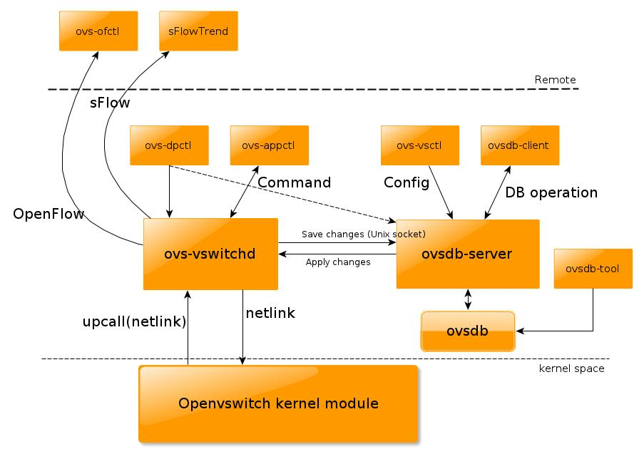
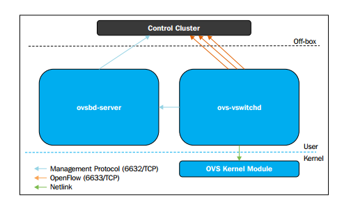

# Open vSwitch là gì?
- Open vSwitch là switch ảo mã nguồn mở theo giao thức OpenFlow. Nó là một multilayer software được viết bằng ngôn ngữ C cung cấp cho người dùng các chức năng quản lí network interface
- Open vSwitch rất phù hợp với chức năng là một switch ảo trong môi trường ảo hóa. Nó hỗ trợ rất nhiều nền tảng như Xen/XenServer, KVM, và VirtualBox

- Tính năng:
	+ Hỗ trợ VLAN tagging và chuẩn 802.1q trunking
	+ Hỗ trợ STP (Spanning tree protocol 802.1D)
	+ Hỗ trợ LACP (Link Aggregation Control Protocol)
	+ Hỗ trợ port mirroring (SPAN/RSPAN)
	+ Hỗ trợ Flow export (Sử dụng các giao thức sflow, netflow)
	+ Hỗ trợ các giao thức đường hầm (GRE, VXLAN, IPSEC tunneling)
	+ Hỗ trợ kiểm soát QoS

# Những hạn chế khi sử dụng Linux Bridge - So sánh OpenvSwitch và Linux Bridge
## Hạn chế của Linux Bridge
	+ Linux Bridge (LB) là cơ chế ảo hóa mặc định được sử dụng trong KVM. Nó rất dễ dàng để cấu hình và quản lí tuy nhiên nó vốn không được dùng cho mục đích ảo hóa vì thế bị hạn chế một số các chức năng
	+ LB không hỗ trợ tunneling và OpenFlow protocols. Điều này khiến nó bị hạn chế trong việc mở rộng các chức năng. Đó cũng là lí do vì sao Open vSwitch xuất hiện
- Dưới đây là bảng so sánh giữa hai công nghệ này

| Open vSwitch | Linux bridge |
|--------------|--------------|
| Được thiết kế cho môi trường mạng ảo hóa | Mục đích ban đầu không phải dành cho môi trường ảo hóa |
| Có các chức năng của layer 2-4 | Chỉ có chức năng của layer 2 |
| Có khả năng mở rộng | Bị hạn chế về quy mô |
| ACLs, QoS, Bonding | Chỉ có chức năng forwarding |
| Có OpenFlow Controller | Không phù hợp với môi trường cloud |
| Hỗ trợ netflow và sflow | Không hỗ trợ tunneling |

## OVS
- Ưu điểm: Các tính năng tích hợp nhiều và đa dạng, kế thừa từ Linux bridge. OVS hỗ trợ ảo hóa lên tới layer 4. Được sự hỗ trợ mạnh mẽ từ cộng đồng. Hỗ trợ xây dựng overlay network
- Nhược điểm: Phức tạp, gây ra xung đột luồng dữ liệu

## LB 
- Ưu điểm: Các tính năng chính của switch layer được tích hợp sẵn trong nhân. Có được sự ổn định và tin cậy, dễ dàng trong việc troubleshoot Less moving parts: Được hiểu như DB hoạt động 1 cách đơn giản, các gói tin được forward nhanh chóng
- Nhược điểm: Để sử dụng ở mức user space phải cài đặt thêm các gói. VD: vlan, ifenslave. Không hỗ trợ openflow và các giao thức điều khiển khác, không có được sự linh hoạt 

# Các thành phần và kiến trúc của Open vSwitch
- Các thành phần chính của Open vSwitch
	+ ovs-vswitchd : daemon tạo ra switch, nó được đi kèm với Linux kernel module
	+ ovsdb-server : Một máy chủ cơ sở dữ liệu nơi ovs-vswitchd truy vấn để có được cấu hình
	+ ovs-dpctl : công cụ để cấu hình switch kernel module
	+ ovs-vsctl : Dùng để truy vấn và cập nhật cấu hình cho ovs-vswitchd
	+ ovs-appctl : Dùng để gửi câu lệnh chạy Open vSwitch daemons

# Cơ chế hoạt động 
- Open vSwitch được chia làm 2 phần, Open vSwitch kernel module (Data Plane) và user space tools (Control Plane)
- OVS kernel module sẽ dùng netlink socket để tương tác với vswitchd daemon để tạo và quản lí số lượng OVS switches trên hệ thống local. SDN Controller sẽ tương tác với vswitchd sử dụng giao thức OpenFlow. ovsdb-server chứa bảng dữ liệu. Các clients từ bên ngoài cũng có thể tương tác với ovsdb-server sử dụng json rpc với dữ liệu theo dạng file JSON
- Open vSwitch có 2 modes, normal và flow:
	+ Normal Mode: Ở mode này, Open vSwitch tự quản lý tất cả các công việc switching/forwarding. Nó hoạt động như một switch layer 2
	+ Flow Mode: Ở mode này, Open vSwitch dùng flow table để quyết định xem port nào sẽ nhận packets. Flow table được quản lý bởi SDN controller nằm bên ngoài

# Một vài câu lệnh với Open vSwitch 
- `ovs-` : Ta chỉ cần nhập vào `ovs` rồi ấn `tab` 2 lần là có thể xem tất cả các câu lệnh đối với Open vSwitch
- `ovs-vsctl`: Là câu lệnh để cài đặt và thay đổi một số cấu hình ovs. Nó cung cấp interface cho phép người dùng tương tác với Database để truy vấn và thay đổi dữ liệu
	+ `ovs-vsctl show`: Hiển thị cấu hình hiện tại của switch
	+ ovs-vsctl list-br: Hiển thị tên của tất cả các bridges
	+ ovs-vsctl list-ports : Hiển thị tên của tất cả các port trên bridge
	+ ovs-vsctl list interface : Hiển thị tên của tất cả các interface trên bridge
	+ ovs-vsctl add-br : Tạo bridge mới trong database
	+ ovs-vsctl add-port : : Gán interface (card ảo hoặc card vật lý) vào Open vSwitch bridge

- `ovs-ofctl` và `ovs-dpctl` : Dùng để quản lí và kiểm soát các flow entries. OVS quản lý 2 loại flow:
	+ OpenFlows : flow quản lí control plane
	+ Datapath : là kernel flow
	+ `ovs-ofctl` giao tiếp với OpenFlow module, `ovs-dpctl` giao tiếp với Kernel module.

- `ovs-ofctl show` : hiển thị thông tin ngắn gọn về switch bao gồm port number và port mapping

- `ovs-ofctl dump-flows` : Dữ liệu trong OpenFlow tables

- `ovs-dpctl show` : Thông tin cơ bản về logical datapaths (các bridges) trên switch

- `ovs-dpctl dump-flows` : Hiển thị flow cached trong datapath

- `ovs-appctl bridge/dumpflows`: thông tin trong flow tables và offers kết nối trực tiếp cho VMs trên cùng hosts.

- `ovs-appctl fdb/show`: Hiển thị các cặp mac/vlan.