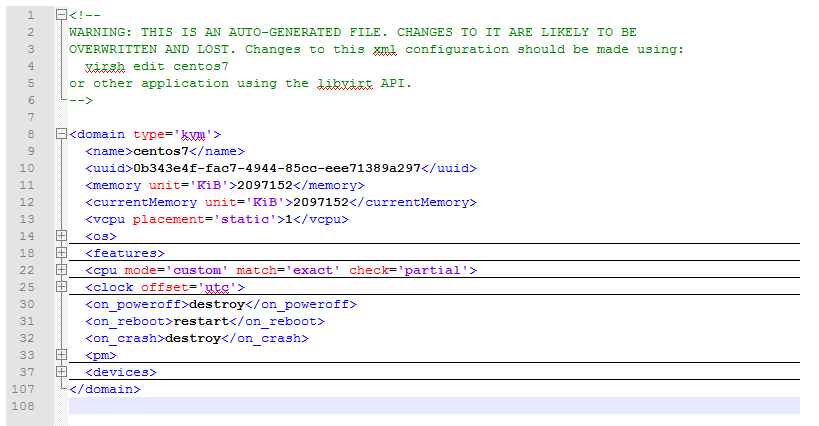

# Tổng quan về file XML
- VM trong KVM có 2 thành phần chính đó là VM's definition được lưu dưới dạng file XML mặc định ở thư mục `/etc/libvirt/qemu` và VM's storage lưu dưới dạng file image
- File domain XML chứa những thông tin về thành phần của máy ảo (số CPU, RAM, các thiết lập của I/O devices...)
- Libvirt dùng những thông tin này để tiến hành khởi chạy tiến trình QEMU-KVM tạo máy ảo
- KVM cũng có các file XML khác để lưu các thông tin liên quan tới network, storage...
- Mục đích chính của XML là đơn giản hóa việc chia sẻ dữ liệu giữa các hệ thống khác nhau, đặc biệt là các hệ thống được kết nối với Internet
## Các thành phần của file XML
- File XML tổ chức theo khối lệnh, có nhiều khối lệnh cùng trong 1 khối lệnh tổng quan, cú pháp giống HTML có thẻ đóng, thẻ mở 

- Thẻ quan trọng không thể thiếu trong file domain xml là `domain`
	+ Tham số `type` cho biết hypervisor đang sử dụng của VM 
	+ Các tham số bên trong có ý nghĩa như sau:
		+ `name`: Thông tin về VM
		+ `uuid`: Mã nhận dạng quốc tế duy nhất cho máy ảo. Format theo RFC 4122. Nếu thiếu trường `uuid` khi khởi tạo, mã này sẽ được tự động generate
	+ Một số thẻ khác có thêm thông tin về các tham số như sau:
		+ `title`: Tiêu đề của máy ảo
		+ `description`: Đoạn mô tả của máy ảo
		+ `metadata`: Chứa những thông tin về file xml
		+ `memory`: Dung lượng RAM của máy ảo được cấp khi khởi tạo máy
		+ `unit`: Đơn vị, mặc định là KiB
		+ `currentMemory`: Dung lượng RAM đang được sử dụng tại thời điểm trích xuất file XML
		+ `maxMemory`: Dung lượng RAM tối đa có thể sử dụng 
		+ `vcpu`: Tổng số vcpu máy ảo được cấp khi khởi tạo

	+ `vcpu` có một số tham số:
		+ `cpuset`: Danh sách các cpu vật lý mà máy ảo sử dụng
		+ `current`: Chỉ định cho phép kích hoạt nhiều hơn số CPU đang sử dụng 
		+ `placement`: Vị trí của cpu, giá trị bao gồm static và dynamic 
	+ Block OS: Chứa các thông tin về hệ điều hành của máy ảo
		+ `arch`: Hệ điều hành thuộc kiến trúc 32 hay 64 bit 
		+ `machine`: Thông tin về kernel của hệ điều hành
		+ `loader`: Readonly có giá trị yes hoặc no chỉ ra file image writable hay readonly, type có giá trị rom hoặc pflash chỉ ra nơi guest memory được kết nối
		+ `kernel`: Đường dẫn tới kernel image trên hệ điều hành máy chủ