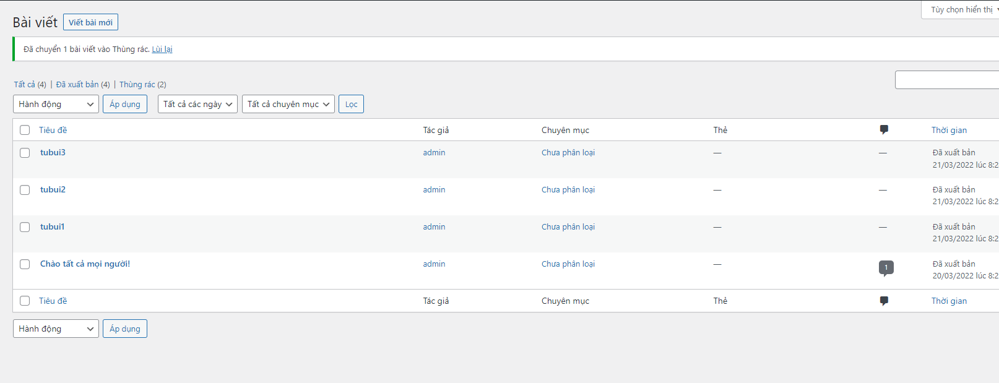
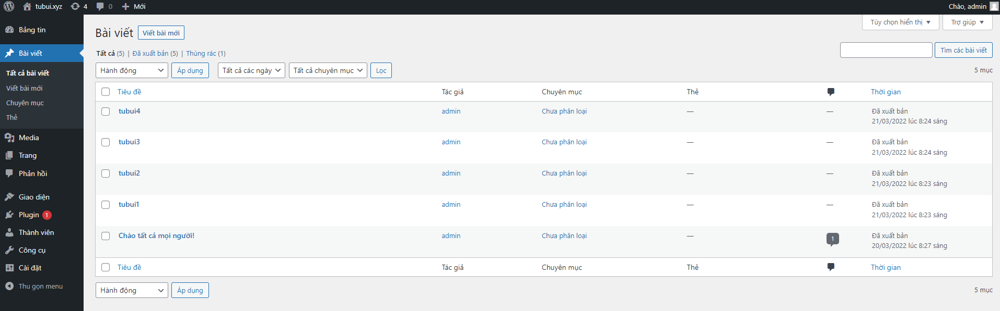

# Backup database with MySQL/MariaDB commands
- PhpMyAdmin không thể xử lý cơ sở dữ liệu lớn nên việc sử dụng MySQL/MariaDB sẽ hữu ích
- Để sao lưu ta làm như sau
- Tạo thư mục muốn lưu trữ file backup
```sh
mkdir /mnt/backup_db
cd /mnt/backup_db
```

- Tiến hành sao lưu database `wordpress` thành file sao lưu `backup.sql` tại thư mục `/mnt/backup_db` và nhập mật khẩu root

```sh
mysqldump -u root -p wordpress > backup.sql
```

# Restore database with MySQL/MariaDB commands
- Xóa 1 bài viết trước khi `Restore`



- Restore bằng câu lệnh và nhập mật khẩu của root

```sh
mysql -u root -p -D wordpress < backup.sql
```

