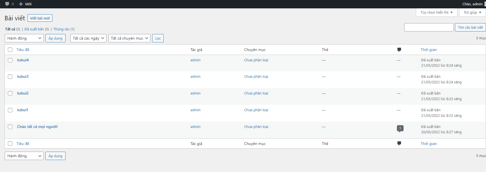
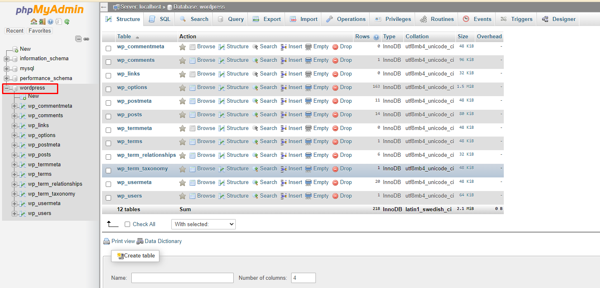
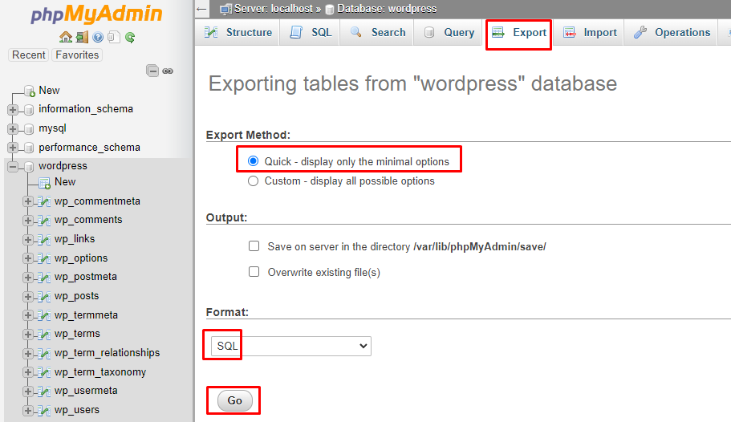
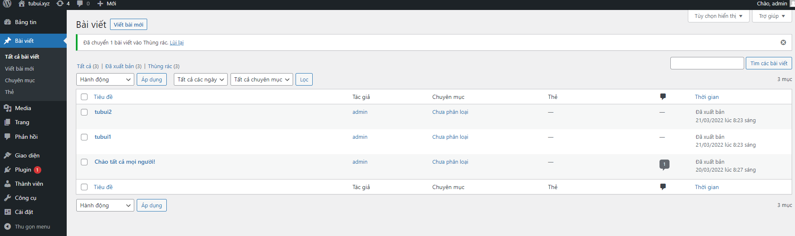
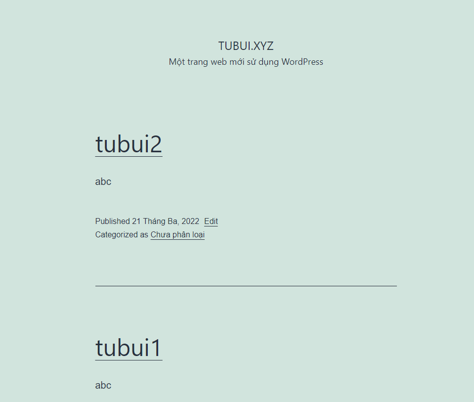
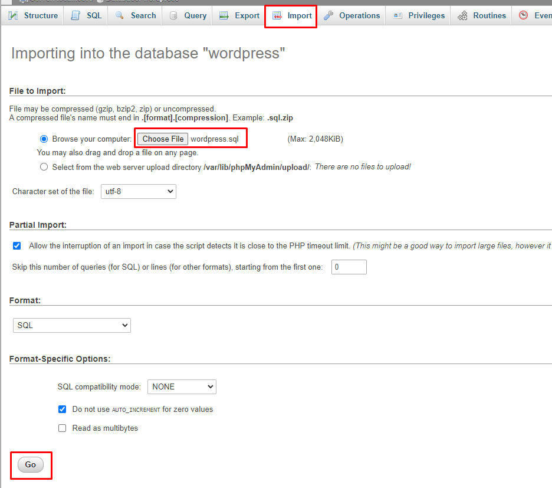
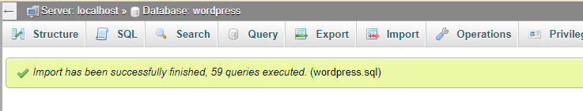
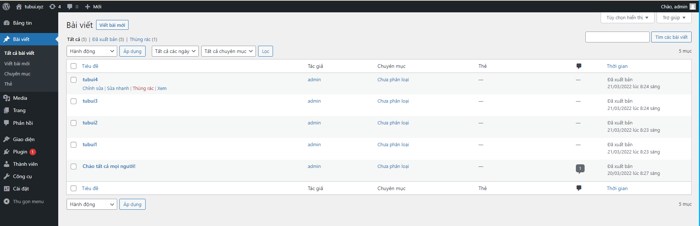

# Backup database with phpMyAdmin
- Tạo 4 bài viết trên trang quản trị trước khi Backup dữ liệu

- Đăng nhập vào phpMyAdmin trên máy 
- Từ cửa sổ bên trái chọn database. Ở đây là ta muốn backup database `wordpress`

- Chọn `Export` để xuất file database về máy. Ở tab `Export Method`, ta có thể lựa chọn 2 option là `Quick` và `Custom`
	+ `Quick` để sao lưu toàn bộ 
	+ `Custom` để sao lưu tùy chọn các bảng trong database

- Chọn định dang file `SQL`

- Chọn `Go` để down file `.sql` về

# Restore database with phpMyAdmin
- Trước khi Restore, ta thực hiện xóa 2 bài viết trong 4 bài viết đã tạo trước đó

- Chọn database `wordpress` -> `Check All` -> `Drop` để xóa tất cả table trong database `wordpress`

- Tiếp đến vào phần `Import` để upload database trước đó đã backup

- Tích vào `Browse your computer` chọn `Choose File` và chọn file đã tải về trước đó

- Cuối cùng chọn `Go` để hoàn tất quá trình `Restore`

- Đăng nhập vào trang quản trị để kiểm tra

