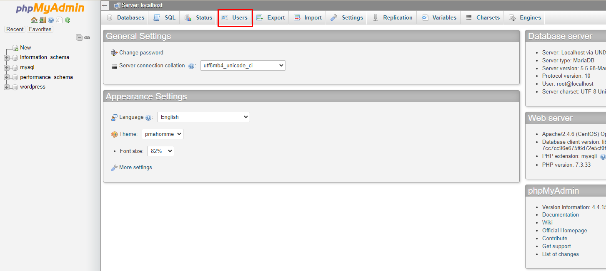
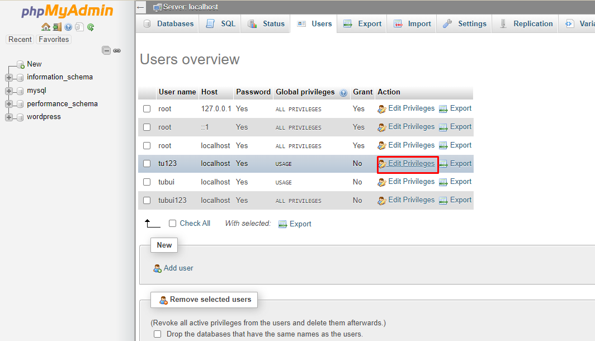
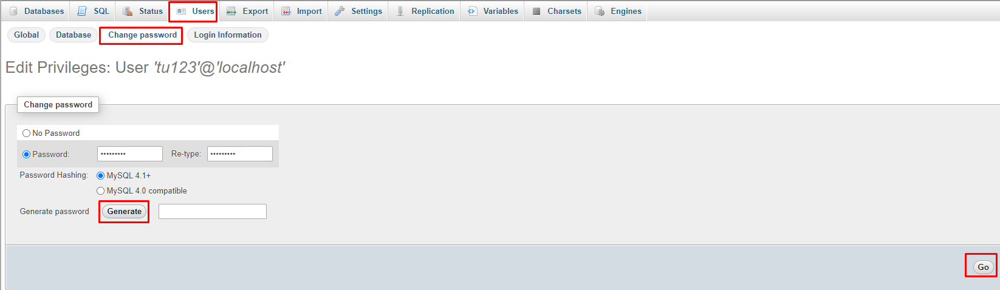

# Đổi mật khẩu của các user trên phpmyadmin
- Đăng nhập vào trang quản trị database phpmyadmin với user root

- Tại trang quản trị chọn `Users`

- Tại đây ta có thể nhìn thấy các user trên phpmyadmin. Chọn `Edit Privileges` tại user muốn đổi mật khẩu

- Tiếp đến chọn `Change password` 

- Nhập pass muốn thiết lập cho user hoặc ta có thể chọn `Generate password` để tạo ra một mật khẩu khó. Sau đó click `Go` để hoàn thành thiết lập

