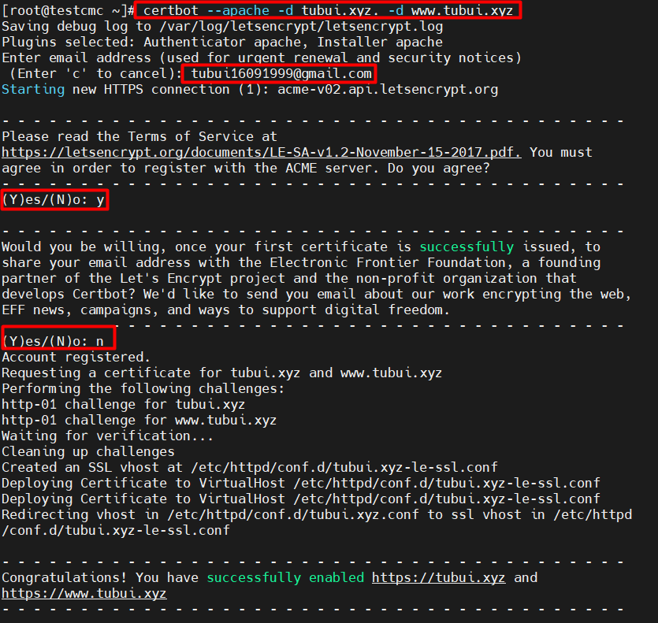
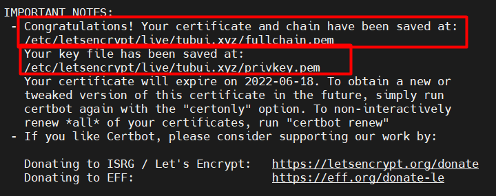
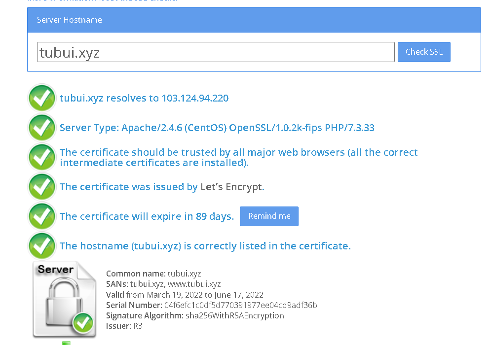
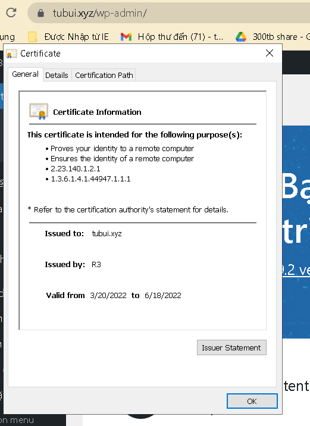

# Cài đặt SSL Let's Encrypt cho web server apache
Bước 1: Cài đặt EPEL reppsitory
```sh
yum install -y epel-release
```

Cài đặt certbot-apache
```sh
yum -y install certbot python2-certbot-apache mod_ssl
```

Bước 2: Cài đặt SSL Let's Encrypt 
- Để cài đặt SSL cho website, ta sử dụng câu lệnh sau
```sh
certbot --apache -d tubui.xyz -d www.tubui.xyz
```
- Sau đó ta nhập email, chọn 'Y' để điều đồng ý với điều khoản, chọn 'N' để từ chối nhận thông tin, tin tức từ Let's Encrypt và Certbot



>> Như vậy đã thành công SSL thông qua Certbot, đường dẫn lưu file chứng chỉ của Web sẽ nằm tại đường dẫn tương ứng
- Certificate: `/etc/letsencrypt/live/tubui.xyz/fullchain.pem`
- Private Key: `/etc/letsencrypt/live/tubui.xyz/privkey.pem `



- Kiểm tra




