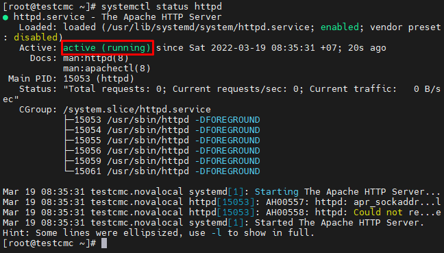

# LAMP
LAMP là viết tắt của Linux, Apache, MySQL và PHP. Nó là một chồng các ứng dụng hoạt động cùng nhau trên một máy chủ web để lưu trữ một trang web. Mỗi chương trình riêng lẻ phục vụ một mục đích khác nhau, được kết hợp lại để tạo thành một giải pháp máy chủ web linh hoạt.
- Trong LAMP, Linux đóng vai trò là hệ điều hành của máy chủ xử lý tất cả các lệnh trên máy
- Apache là một phần mềm máy chủ web quản lý các yêu cầu HTTP để cung cấp nội dung cho trang web
- MySQL là một hệ quản trị cơ sở dữ liệu có chức năng duy trì dữ liệu của người dùng trên máy chủ
- PHP là một ngôn ngữ lập kịch bản cho phép giao tiếp phía máy chủ

## 1.Cài đặt LAMP trên CentOS 7
### 1.1 Cài đặt Apache
Bước 1: Xóa bộ nhớ cache và cập nhật
```sh
yum clean all
yum update
```

Bước 2: Cài đặt Apache
```sh
yum -y install httpd
```

Bước 3: Khởi động và cho phép Apache khởi động cùng hệ thống
```sh
systemctl start httpd
systemctl enable httpd
```

Bước 4: Kiểm tra dịch vụ đã hoạt động chưa bằng cách nhập lệnh
```sh
systemctl status httpd
```



>> Khi quá trình cài đặt thành công, ta sẽ nhận được kết quả như sau khi truy cập địa chỉ IP của máy chủ


#### Thêm domain vào Apache
Bước 1: Tạo thư mục chứa website
```sh
mkdir -p /var/www/html/tubui.xyz
```

Bước 2: Gán quyền
```sh
chown -R apache:apache /var/www/html/tubui.xyz/
```

Bước 3: Tạo file `index.html` và thêm vào nội dung muốn hiển thị trên trang web
```sh
vi /var/www/html/tubui.xyz/index.html
```


Bước 4: Cài đặt Virtual Hosts

Virtual Host là file cấu hình trong Apache để cho phép nhiều domain cùng chạy trên một máy chủ. Ta có thể thêm domain vào máy chủ và cấu hình chúng riêng rẽ. Mỗi cấu hình đó được gọi là Virtual host. Mỗi Virtual host sẽ quy định cho mỗi tên miền riêng. Ta có thể tạo ra nhiều Vhost để thêm domain vào VPS và chạy nhiều web trên 1 server

- Tạo file vhost 
```sh
vi /etc/httpd/conf.d/tubui.xyz.conf
```
- Thêm nội dung vào file
```sh
<VirtualHost *:80>
     DocumentRoot /var/www/html/tubui.xyz/
     ServerName www.tubui.xyz
     ServerAlias tubui.xyz
     ErrorLog /var/www/html/tubui.xyz/error.log
     CustomLog /var/www/html/tubui.xyz/requests.log common
</VirtualHost>
```


- Truy cập tubui.xyz để kiểm tra


### 1.2 Cài đặt MySQL (MariaDB) 

Để cài đặt MariaDB cần thực hiện như sau:
Bước 1: Cài đặt mariadb và mariadb server
```sh
yum -y install mariadb mariadb-server
```

Bước 2: Khởi động dịch vụ
```sh
systemctl start mariadb
systemctl enable mariadb
```


Bước 3: Cấu hình bảo mật MariaDB
```sh
mysql_secure_installation
```

- Khi được nhắc nhập mật khẩu, ta có thể nhấn `Enter` để trống hoặc cập nhật mật khẩu mới
- Sau đó làm các bước để thiết lập mật khẩu. Cuối cùng, tập lệnh sẽ yêu cầu định cấu hình một số biện pháp bảo mật, bao gồm:
	+ Xóa người dùng ẩn danh?
	+ Không cho phép đăng nhập từ xa?
	+ Xóa cơ sở dữ liệu thử nghiệm và truy cập vào nó?
	+ Tải lại bảng đặc quyền ngay bây giờ


### 1.3 Cài đặt PHP
Bước 1: Cài đặt Remi Repository
```sh
yum -y install http://rpms.remirepo.net/enterprise/remi-release-7.rpm
```

Bước 2: Cài đặt  và yum-utils kích hoạt kho lưu trữ EPEL repository
```sh
yum -y install epel-release yum-utils
```

Bước 3: Disable php 5.4 và enable php 7.3
```sh
yum-config-manager --disable remi-php54 
yum-config-manager --enable remi-php73
```

Bước 4: Cài đặt php 7.3
```sh
yum -y install php php-cli php-mysqlnd php-zip php-devel php-gd php-mcrypt php-mbstring php-curl php-xml php-pear php-bcmath php-json
```

Bước 5: Sau khi cài đặt thành công ta có thể kiểm tra phiên bản php bằng lệnh 
```sh
php -v
```


Bước 6: Khởi động lại Apache để đảm bảo rằng nó hoạt động với PHP mới được cài đặt
```sh
systemctl restart httpd
```

Bước 7: Kiểm tra xử lý PHP
Tạo file `php.info` tại thư mục `/var/www/html` thêm các dòng lệnh sau
```sh
vi /var/www/html/info.php

<?php
phpinfo();
?>
```

Bước 8: Cấu hình firewall cho phép truy cập dịch vụ web 
```sh
firewall-cmd --zone=public --add-service=http --permanant
firewall-cmd --reload
```

Ta kiểm tra kết quả với đường dẫn http://103.124.94.220/info.php


## 2. Cài đặt Wordpress
Bước 1: Đăng nhập vào mysql
```sh
mysql -u root -p
```

- Nhập password đã tạo cho MariaDB server đã tạo trước đó


Bước 2: Tạo cơ sở dữ liệu
```sh
CREATE DATABASE wordpress;
```

- Sau khi tạo xong cơ sở dữ liệu, ta cần tạo người dùng cho cơ sở dữ liệu đó.
```sh
CREATE USER tubui@localhost IDENTIFIED BY 'ptit57091';
```

- Tại thời điểm này, ta đã tạo một người dùng cơ sở dữ liệu, tuy nhiên ta vẫn chưa cấp cho người dùng đó quyền truy cập vào cơ sở dữ liệu. Có thể thêm các quyền đó bằng lệnh sau:
```sh
GRANT ALL PRIVILEGES ON wordpress.* TO tubui@localhost IDENTIFIED BY 'ptit57091';
```

- Bây giờ người dùng có quyền truy cập vào cơ sở dữ liệu, ta cần xóa các đặc quyền để MySQL biết về những thay đổi đặc quyền gần đây mà ta đã thực hiện
```sh
FLUSH PRIVILEGES;
exit
```


Bước 3: Cài đặt WordPress
```sh
yum install wget
```
```sh
wget http://wordpress.org/latest.tar.gz
```

- Giải nén tệp vừa tải xuống
```sh
tar -xzvf latest.tar.gz
```

- Sau khi giải nén sẽ tạo ra một tệp có tên `WordPress`. Tiếp theo cần di chuyển tệp đó và nội dung của nó vào thư mục `/var/www/html/tubui.xyz` để nó có thể cung cấp nội dung cho trang web
```sh
rsync -avP ~/wordpress/ /var/www/html/tubui.xyz/
```

- Cập nhật các quyền apache cho các tệp wordpress
```sh
chown -R apache:apache /var/www/html/tubui.xyz/*
```

Bước 4: Định cấu hình WordPress
- Tạo tệp `wp-config.php` bằng cách sao chép tệp mẫu `wp-config-sample.php` mà WordPress đã cung cấp
```sh
cp wp-config-sample.php wp-config.php
```

- Chỉnh sửa tệp wp-config.php mới với thông tin cơ sở dữ liệu chính xác mà ta đã tạo ở Bước 2 
```sh
vi wp-config.php
```

- Thay đổi các giá trị `DB_NAME`, `DB_USER`, `DB_PASSWORD` thành các giá trị đã thiết lập ở Bước 2


- Khởi động lại Apache
```sh
systemctl reload httpd
```

- Truy cập vào trang quản trị WordPress bằng cách thêm hậu tố `/wp-admin` vào sau tên miền http://tubui.xyz/wp-admin/


- Chọn ngôn ngữ muốn thiết lập và click `Tiếp tục`

- Thiết lập các thông tin để cài đặt WordPress


- Đăng nhập với thông tin vừa thiết lập trước đó


- Đăng nhập thành công trang quản trị WordPress


