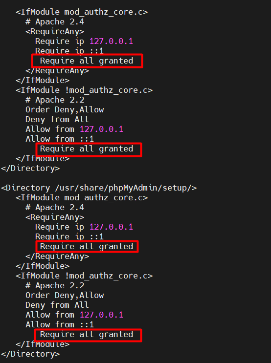
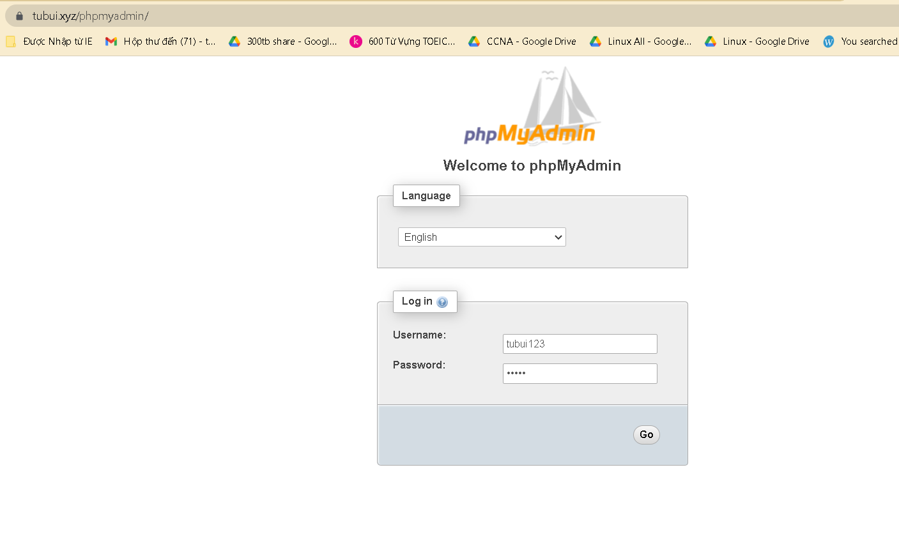
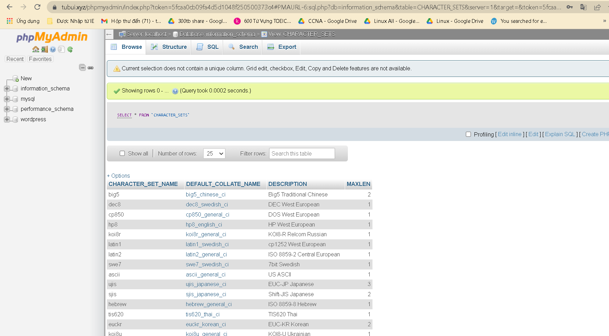

# Cài đặt phpMyadmin trên CentOS 7
Bước 1: Cài đặt kho lưu trữ EPEL
```sh
yum install epel-release
```

Bước 2: Cài đặt phpMyadmin trên CentOS 7
```sh
yum install -y phpmyadmin
```
- Sau khi cài đặt hoàn tất cần phải chỉnh sửa tệp cấu hình phpMyadmin

Bước 3: Chỉnh sửa tệp `phpMyadmin.conf`

- Chỉnh sửa để cho phép các máy có thể truy cập phpMyadmin từ xa
```sh
vi /etc/httpd/conf.d/phpMyAdmin.conf
```



- Thêm các dòng `Require all granted` để cho phép mọi máy có thể vào `phpMyAdmin`

Bước 4: Khởi động lại Web server Apache
```sh
systemctl restart httpd
```

Bước 5: Kiểm tra 
- Ta có thể vào phpMyAdmin bằng cách nhập `ten_mien/phpmyadmin`



- Nhập `user` và `password` của database `wordpress`


