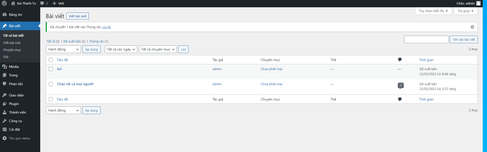
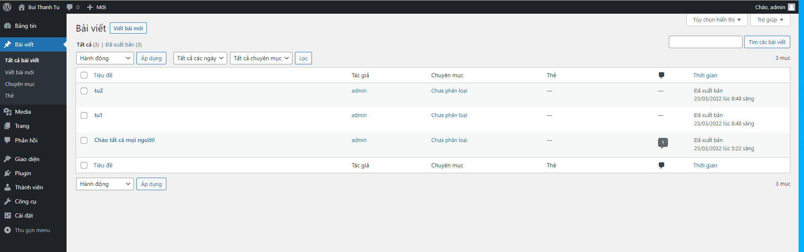

# Backup database
- Tạo thư mục muốn lưu trữ file backup
```sh
mkdir /mnt/backup
cd /mnt/backup
```

- Tiến hành sao lưu database `wordpress123` thành file sao lưu `backup.sql` tại thư mục `/mnt/backup`
```sh
mysqldump -u root -p wordpress123 > backup.sql
```

# Restore database
- Xóa 1 bài viết trước khi `Restore`



- `Restore` bằng lệnh sau và nhập mật khẩu root
```sh
mysql -u root -p -D wordpress123 < backup.sql
```

