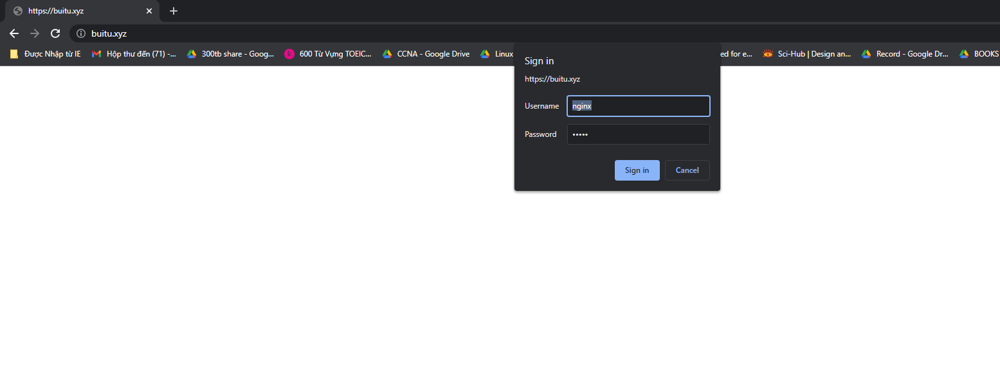

# Basic Authen Nginx
Bước 1: Cài đặt công cụ HTTPD
```sh
yum install -y httpd-tools
```

Bước 2: Thiết lập thông tin xác thực HTTP cơ bản
- Trong bước này ta sẽ tạo mật khẩu cho người dùng đang chạy trên trang web
- Mật khẩu đó và tên người dùng được liên kết sẽ được lưu trữ trong 1 tệp mà ta chỉ định. Mật khẩu sẽ được mã hóa. Ở đây ta dùng tệp `/etc/nginx/.htpasswd` và tên người dùng là tu123
- Để tạo mật khẩu, ta chạy lệnh sau
```sh
htpasswd -c /etc/nginx/.htpasswd tu123
```

- Để xem tên người dùng và mật khẩu được băm ta vào thực mục sau
```sh
cat /etc/nginx/.htpasswd
```

Bước 3: Cấu hình Nginx
- Mở file cấu hình Nginx 
```sh
vi /etc/nginx/nginx.conf
```

- Thêm 2 câu lệnh trong phần `server`
```sh
auth_basic "Private Property";
auth_basic_user_file /etc/nginx/.htpasswd;
```

Bước 4: Tải lại Nginx
```sh
systemctl reload nginx
```

- Kiểm tra

