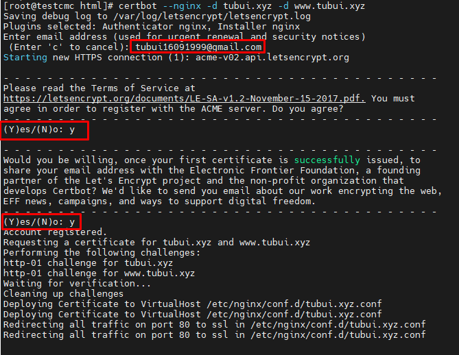
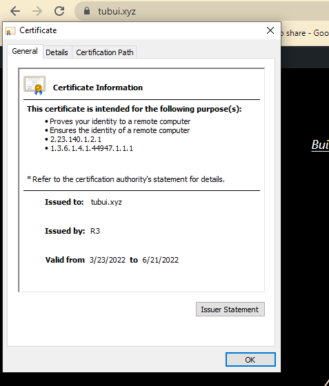

# Cài đặt SSL Let's Encrypt cho web server nginx
Bước 1: Cài đặt EPEL reppsitory
```sh
yum install -y epel-release
```

- Cài đặt Certbot-nginx
```sh
yum install -y certbot-nginx
```

Bước 2: Cài đặt SSL Let's Encrypt 
```sh
certbot --nginx -d tubui.xyz -d www.tubui.xyz
```

- Sau đó nhập email, chọn `y` để đồng ý với điều khoản và chọn `n` để từ nhận thông tin, tin tức từ Let's Encrypt và Certbot



>> Như vậy đã thành công SSL thông qua Certbot, đường dẫn lưu file chứng chỉ của Web sẽ nằm tại đường dẫn tương ứng

- Certificate: `/etc/letsencrypt/live/tubui.xyz/fullchain.pem`
- Private Key: `/etc/letsencrypt/live/tubui.xyz/privkey.pem`

- Kiểm tra
