# LEMP
- Thuật ngữ LEMP là một nhóm phần mềm nguồn mở thường được cài đặt cùng nhau để cho phép máy chủ lưu trữ các trang web động và ứng dụng web. LEMP được viết tắt từ 4 thành phần của nó:
	+ L - Hệ điều hành Linux
	+ E - Nginx (Engine x) một máy chủ web
	+ M - Hệ quản trị cơ sở dữ liệu MySQL hoặc MariaDB
	+ P - Ngôn ngữ lập trình PHP

## Cài đặt LEMP trên CentOS 7
### Cài đặt Nginx
- Bước 1: Cài đặt EPEL repository
```sh
yum install epel-release -y
```

Bước 2: Cài đặt Nginx
```sh
yum install nginx -y
```

- Sau khi hoàn tất ta có thể sử dụng các lệnh sau để quản lý Nginx
```sh
systemctl start nginx      // Khởi động dịch vụ Nginx
systemctl stop nginx       // Dừng dịch vụ Nginx
systemctl reload nginx     // Tải lại dịch vụ Nginx
systemctl restart nginx    // Khởi động lại dịch vụ Nginx
systemctl enable nginx     // Thiết lập Nginx khởi động cùng hệ thống
systemctl disable nginx    // Vô hiệu hoá Nginx khởi động cùng hệ thống
systemctl status nginx     // Xem trạng thái dịch vụ Nginx
```

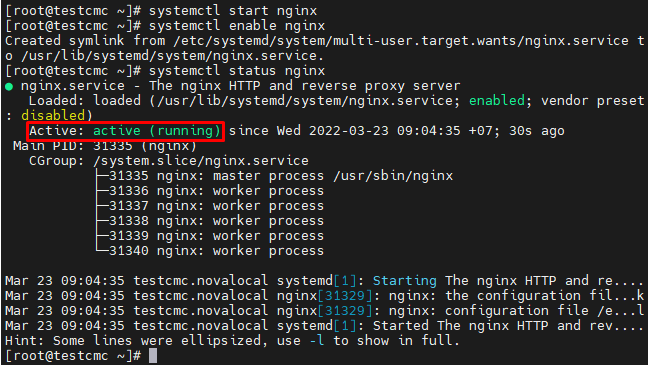


- Bước 3: Khởi động dịch vụ
```sh
systemctl start httpd
systemctl enable httpd
```

- Bước 4: Mở dịch vụ trên Firewalld
```sh
firewall-cmd --permanent --add=service=http
firewall-cmd --permanent --add=service=https
firewall-cmd --reload
```

- Kiểm tra

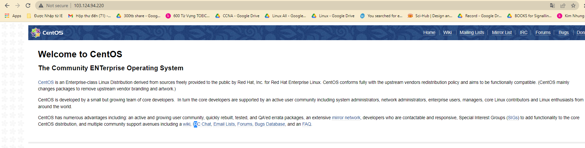

- Cấu hình file Vhost: Để duy trì quản lý dễ dàng, ta nên tạo một file cấu hình riêng cho mỗi miền. Các file cấu hình phải kết thúc bằng `.conf` và được lưu trữ tại `/etc/nginx/conf.d/`
```sh
vi /etc/nginx/conf.d/tubui.xyz.conf
```
- Thêm vào file `tubui.xyz.conf` nội dung sau
```
server {
    listen 80;
    server_name www.tubui.xyz tubui.xyz;
    access_log /usr/share/nginx/html/access.log;
    error_log /usr/share/nginx/html/error.log;
    root /usr/share/nginx/html;
    index index.php index.html index.htm;
}
```

### Cài đặt MariaDB
Bước 1: Cài đặt mariadb và mariadb server
```sh
yum install mariadb mariadb-server -y
```

- Sau khi hoàn tất, ta có thể sử dụng các lệnh sau để quản lý MariaDB
```sh
systemctl start mariadb      // Khởi động dịch vụ mariadb
systemctl stop mariadb       // Dừng dịch vụ mariadb
systemctl restart mariadb    // Khởi động lại dịch vụ mariadb
systemctl enable mariadb     // Thiết lập mariadb khởi động cùng hệ thống
systemctl disable mariadb    // Vô hiệu hoá mariadb khởi động cùng hệ thống
systemctl status mariadb     // Xem trạng thái dịch vụ mariadb
```

Bước 2: Khởi động dịch vụ
```sh
systemctl start mariadb
systemctl enable mariadb
```

Bước 3: Cấu hình bảo mật MariaDB
```sh
mysql_secure_installation
```

- Khi được nhắc nhập mật khẩu, ta có thể nhấn `Enter` để trống hoặc cập nhật mật khẩu mới
- Sau đó làm các bước để thiết lập mật khẩu. Cuối cùng, tập lệnh sẽ yêu cầu định cấu hình một số biện pháp bảo mật, bao gồm:
	+ Xóa người dùng ẩn danh?
	+ Không cho phép đăng nhập từ xa?
	+ Xóa cơ sở dữ liệu thử nghiệm và truy cập vào nó?
	+ Tải lại bảng đặc quyền ngay bây giờ

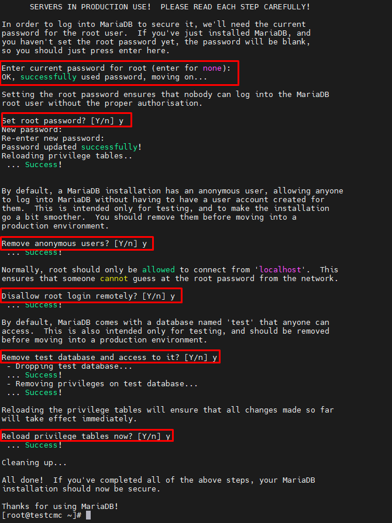

### Cài đặt PHP
- Cài đặt kho lưu trữ Remi để có thể sử dụng các phiên bản PHP mới nhất
- Bước 1: Cài đặt kho Remi
```sh
yum -y install yum-utils
rpm -Uvh http://rpms.remirepo.net/enterprise/remi-release-7.rpm
```

- Bước 2: Sau khi cài đặt gói Remi xong, cần chọn phiên bản PHP mà mình cần cài đặt và kích hoạt gói chứa phiên bản PHP đó
```sh
yum-config-manager --enable remi-php80
```

- Bước 3: Cài đặt các module của PHP 8.0
```sh
yum install -y php php-fpm php-ldap php-zip php-embedded php-cli php-mysql php-common php-gd php-xml php-mbstring php-mcrypt php-pdo php-soap php-json php-simplexml php-process php-curl php-bcmath php-snmp php-pspell php-gmp php-intl php-imap perl-LWP-Protocol-https php-pear-Net-SMTP php-enchant php-pear php-devel php-zlib php-xmlrpc php-tidy php-opcache php-cli php-pecl-zip unzip gcc
```

- Bước 4: Sau khi cài đặt thành công ta có thể kiểm tra phiên bản PHP bằng lệnh 
```sh
php -v
```

- Bước 5: Khởi động lại Nginx để đảm bảo rằng nó hoạt động với PHP mới được cài đặt
```sh
systemctl restart httpd
```

- Mặc định PHP sẽ thực thi file PHP gần nhất nếu không tìm thấy file PHP được request. Để ngăn chặn việc thực thi PHP không mong muốn ta làm như sau
```sh
vi /etc/php.ini
```
- Tìm dòng và thay thế bằng dòng sau 
```sh
cgi.fix_pathinfo=1  =>  cgi.fix_pathinfo=0
```

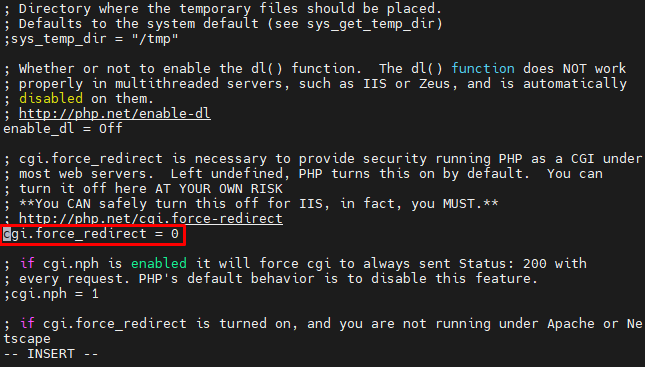


- Điều chỉnh lại file cấu hình `/etc/php-fpm.d/www.conf`. Tìm các dòng sau và sửa lại
```sh
;listen = 127.0.0.1:9000   => listen = /var/run/php_fpm.sock
;listen.owner = nobody     => listen.owner = nginx
;listen.group = nobody     => listen.group = nginx
user = apache              => user = nginx
group = apache             => group = nginx
```

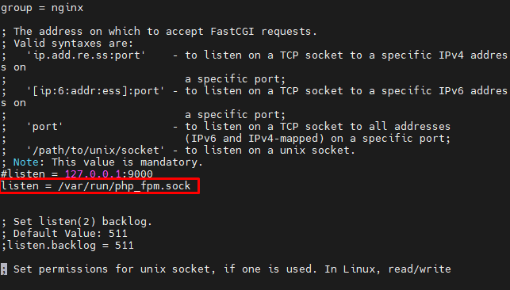

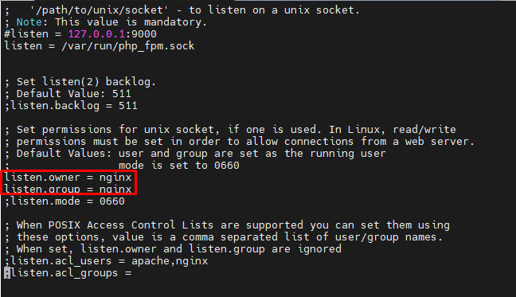

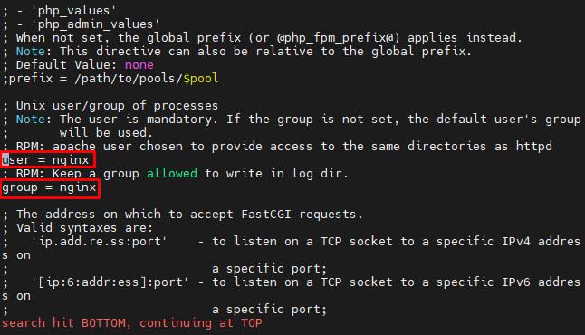

- Phần quyền cho `php_fpm.sock`
```sh
chmod 666 /var/run/php_fpm.sock
chown nginx:nginx /var/run/php_fpm.sock
```

- Khởi động PHP-FPM
```sh
systemctl start php-fpm
systemctl enable php-fpm
```

# Cài đặt WordPress
Bước 1: Đăng nhập vào MySQL 
```sh
mysql -u root -p
```

- Nhập password đã tạo cho MariaDB server đã tạo trước đó
Bước 2: Tạo cơ sở dữ liệu 
```sh
CREATE DATABASE wordpress;
```

- Sau khi tạo xong cơ sở dữ liệu, ta cần tạo người dùng cho cơ sở dữ liệu đó
```sh
CREATE USER tu99@localhost IDENTIFIED BY 'ptit57091';
```

- Tại thời điểm này, ta đã tạo một người dùng cơ sở dữ liệu, tuy nhiên ta vẫn chưa cấp cho người dùng đó quyền truy cập vào cơ sở dữ liệu. Có thể thêm các quyền đó bằng lệnh sau:
```sh
GRANT ALL PRIVILEGES ON wordpress123.* TO tu99@localhost IDENTIFIED BY 'ptit57091';
```

- Bây giờ người dùng có quyền truy cập vào cơ sở dữ liệu, ta cần xóa các đặc quyền để MySQL biết về những thay đổi đặc quyền gần đây mà ta đã thực hiện
```sh
FLUSH PRIVILEGES;
exit
```

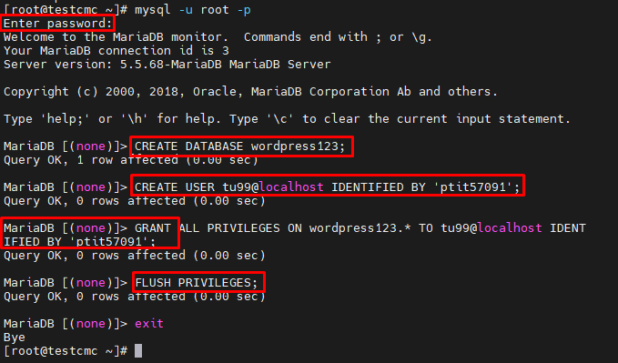

Bước 3: Cài đặt WordPress
```sh
yum install wget -y
```
```sh
wget http://wordpress.org/latest.tar.gz
```

- Sau khi giải nén sẽ tạo ra một tệp có tên `WordPress`. Tiếp theo cần di chuyển tệp đó và nội dung của nó vào thư mục `/usr/share/nginx/html` để nó có thể cung cấp nội dung cho trang web
```sh
rsync -avP /usr/share/nginx/html/wordpress/ /usr/share/nginx/html/
```

- Cập nhật các quyền nginx cho tệp wordpress
```sh
chown -R nginx:nginx /usr/share/nginx/html/
```

Bước 4: Định cấu hình WordPresss
- Tạo tệp `wp-config.php` bằng cách sao chép tệp mẫu `wp-config-sample.php` mà WordPress đã cung cấp
```sh
cp wp-config-sample.php wp-config.php
```

- Chỉnh sửa tệp wp-config.php mới với thông tin cơ sở dữ liệu chính xác mà ta đã tạo ở Bước 2
```sh
vi wp-config.php
```

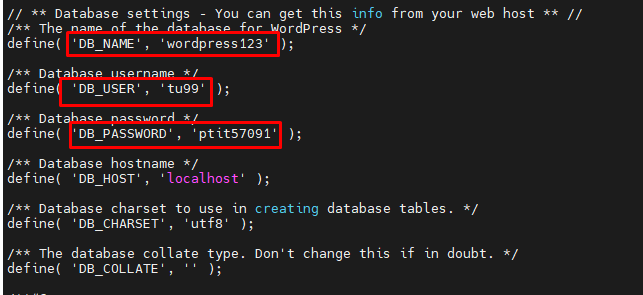

- Khởi động lại Nginx
```sh
systemctl restart nginx
```

- Truy cập vào trang quản trị WordPress bằng cách thêm hậu tố /wp-admin vào sau tên miền http://tubui.xyz/wp-admin/

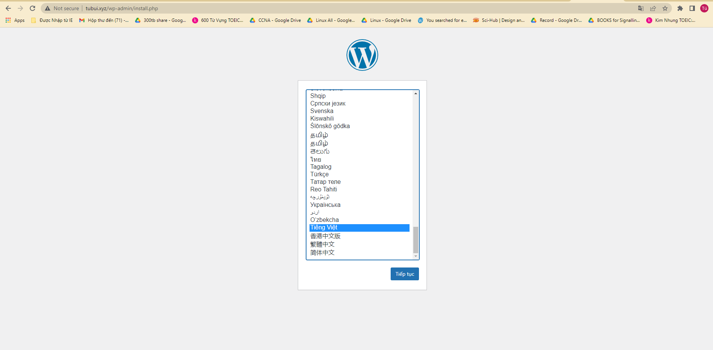

- Tiến hành thiết lập thông tin để cài đặt wordpress

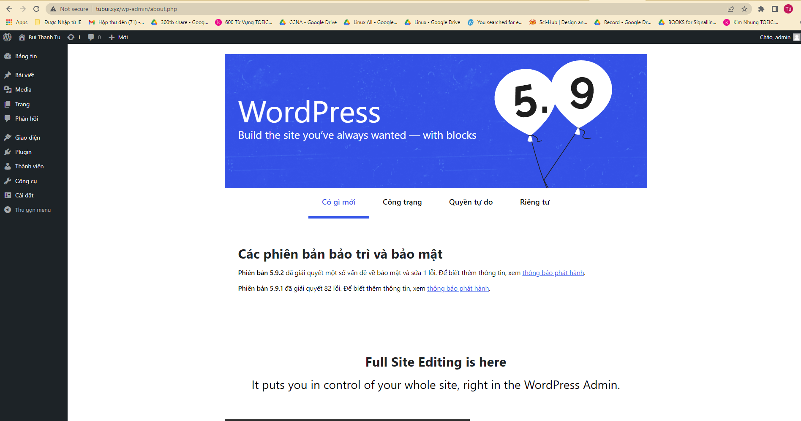
