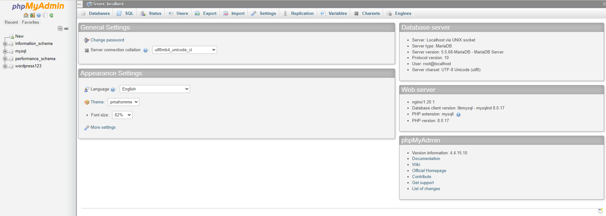

# PhpMyAdmin 
- phpMyAdmin được sử dụng để quản lý cơ sở dữ liệu MySQL thông qua giao diện đồ họa dựa trên web. Nó có thể được cấu hình để quản lý cơ sở dữ liệu cục bộ (trên cùng một hệ thống) hoặc cơ sở dữ liệu từ xa (qua mạng)

# Cài đặt phpMyAdmin
Bước 1: Cài đặt kho lưu trữ EPEL release
```sh
yum install epel-release 
```

Bước 2: Cài đặt phpMyAdmin 
```sh
yum install phpmyadmin
```

Bước 3: Để máy chủ nginx tìm và gọi đến các tệp phpMyAdmin một cách chính xác, ta cần tạo một liên kết từ các tệp đến thư mục gốc Nginx 
```sh
ln -s /usr/share/phpMyAdmin /usr/share/nginx/html
```

Bước 4: Vào thư mục `/var/lib/php` chỉnh lại quyền cho thư mục `session`
```sh
chown -R root:nginx session
```

Bước 5: Khởi động lại bộ xử lý PHP-FPM
```sh
systemctl restart php-fpm
```

- Truy cập vào phpMyAdmin bằng cách vào trình duyệt web nhập https://tubui.xyz/phpMyAdmin và đăng nhập



web1: https://www.tubui.xyz/
user: admin
pass: ptit57091
phpmyadmin: https://www.tubui.xyz/phpMyAdmin/
user: root
pass: ptit57091

web2: https://buitu.xyz/
user: admin
pass: ptit57091
phpmyadmin: https://buitu.xyz/phpMyAdmin/
user: root
pass: ptit57091