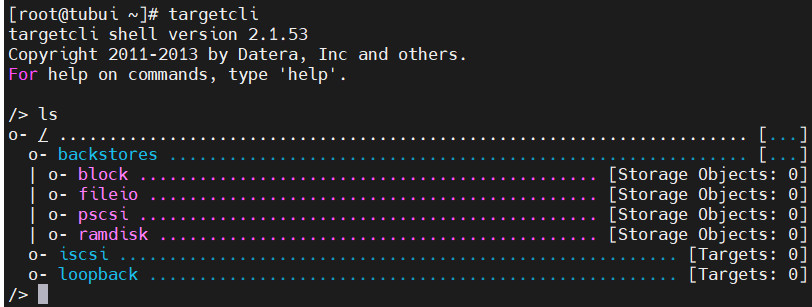

# iSCSI
## Khái niệm
- iSCSI là Internet SCSI (Small Computer System interface): Là một giao thức cho phép truyền tải các lệnh SCSI qua mạng IP bằng cách sử dụng giao thức TCP/IP. Nó truy cập thiết bị lưu trữ theo dạng block-level (truy cập theo từng khối)
- Lệnh iSCSI được đóng gói trong lớp TCP/IP và truyền qua mạng nội bộ LAN hoặc cả qua mạng Internet Public
## Thành phần của iSCSI
- iSCSI Inititor: Là thiết bị client trong kiến trúc hệ thống lưu trữ qua mạng
- iSCSI Target: Thường là một máy chủ lưu trữ
## Cài đặt 
```sh
yum -y install targetcli
```
- Để khởi động ta dùng lệnh `# targetcli`, sau đó `# ls` để được bố cục giao diện dạng cây


