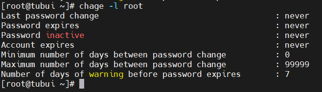
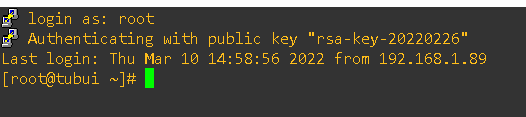

# Basic Security
## Tiến trình độc lập (The process isolation)
- Linux được cho là nền tảng bảo mật hơn các hệ điều hành khác bởi các tiến trình luôn chạy độc lập với nhau. Một tiến trình không thể truy cập vào tài nguyên của người khác kể cả khi nó đang chạy với cùng 1 phiên của người dùng. Các cơ chế bảo mật bổ sung đã được giới thiệu để giảm thiểu rủi ro gây ra
	+ Control Groups: Cho phép người dùng quản trị phân nhóm các tiến trình và cấp tài nguyên hữu hạn cho mỗi nhóm
	+ Linux Containers: Cho phép chạy nhiều phiên bản Linux trên cùng một hệ thống 
	+ Virtualization: Phần cứng tách biệt với các tiến trình đồng thời tách biệt với phần cứng mà các máy ảo sử dụng trên cùng một host vật lý
## Mã hóa mật khẩu
- Hầu hết các phiên bản của Linux đều sử dụng cơ chế mã hóa mật khẩu bằng thuật toán "SHA-512"
- SHA-512 được sử dụng rộng rãi để bảo vệ các ứng dụng và giao thức như TLS, SSL, PHP, S/MINE và IPsec
## Vòng đời password (Password Aging)
- Password Aging là 1 phương pháp để nhắc nhở người dùng tạo mật khẩu mới sau 1 khoảng thời gian dài sử dụng nhằm nâng cao tính bảo mật 
- Sử dụng lệnh `chage -l <user>` để xem thông tin mật khẩu của người dùng muốn xem
```sh
chage -l root
```



## Xác thực với Public/Private Keys
- Sử dụng Encrypt keys để xác thực sẽ có lợi ích sau:
	+ Không phải nhập mật khẩu nếu sử dụng Public/Private Keys
	+ Khi đã xác thực sử dụng Public/Private Keys được thiết lập trên máy chủ, ta có thể vô hiệu hóa xác thực mật khẩu, có nghĩa là không có khóa ủy quyền thì sẽ không có quyền truy cập

