# Text Commands
- Linux cung cấp các tiện ích cho thao tác tập tin và văn bản như sau

|Tiện ích|Lệnh|
|---|---|
|Hiển thị nội dung|`cat` và `echo`|
|Chỉnh sửa nội dung|`sed` và `awk`|
|Tìm theo mẫu|`grep`|

## Hiển thị nội dung
- Lệnh `# cat` được sử dụng để đọc và in ra nội dung của file `# tac` là ngược lại của `# cat` có chức năng đọc và in ra nội dung file theo chiều ngược lại

- Lệnh `# echo` là lệnh hiển thị text lên màn hình, Ngoài ra, ta có thể in ra giá trị của biến: `# echo $<bien>`

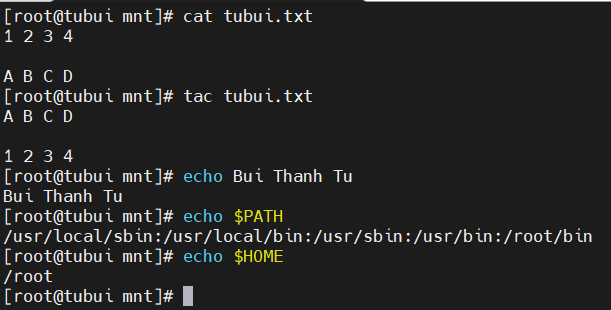

## Chỉnh sửa nội dung
### Lệnh `# sed`
- Là một công cụ lọc văn bản cũng như thực hiện thay thế trong luồng dữ liệu. Dữ liệu từ nguồn được lấy ra và di chuyển vào không gian xử lý. Toàn bộ danh sách, thao tác sửa đổi được áp dụng lên dữ liệu trong không gian xử lý, nội dung cuối cùng được chuyển đến không gian đầu ra
- Ví dụ: Thay đổi nội dung file

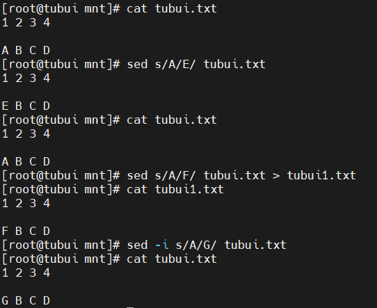

- Xóa 1 dòng

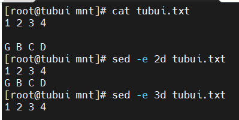

### Lệnh `# awk`
- Được sử dụng để trích xuất và sau đó in nội dung cụ thể của tệp. Được sử dụng để thao tác với tệp dữ liệu, truy xuất và xử lý văn bản

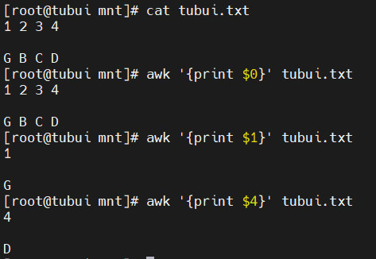

### Lệnh `# sort`
- Được sử dụng để sắp xếp lại các dòng của tệp văn bản theo thứ tự tăng dần hoặc giảm dần, theo 1 chuẩn nào đó

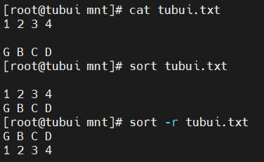

### Lệnh `# uniq`
- Dùng để xóa các dòng trùng lặp trong tệp văn bản. Các đòng trùng lặp nối tiếp bị loại bỏ

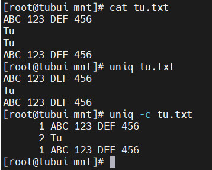

### Lệnh `# paste`
- Dùng để kết hợp các trường (fields) từ các file khác nhau.

### Lệnh `# join`
- Dùng để kết hợp 2 file với nhau theo 1 trường chung

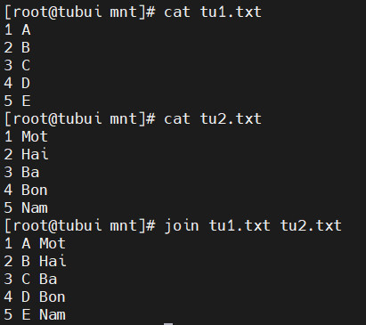

## Tìm theo mẫu
### Lệnh `# grep`
- Được sử dụng để quét các tập cho các mẫu chỉ định và có thể được sử dụng với các biểu thức thông thường

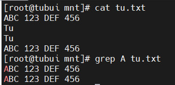

### Lệnh `# tr`
- Được sử dụng để dịch các kí tự được chỉ định sang ký tự khác hoặc xóa chúng đi

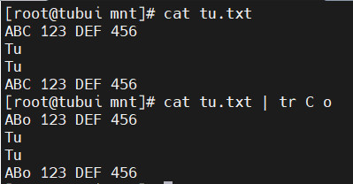

### Lệnh `# tee`
- Lệnh này sẽ lấy đầu ra của bất kỳ lệnh nào và trong lúc gửi ra đầu ra tiêu chuẩn, nó sẽ lưu vào 1 file

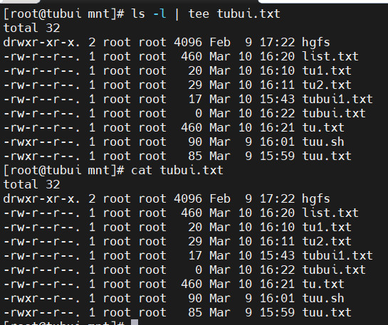

## Lệnh `# wc`
- Lệnh này đếm số lượng dòng `-l`, số lượng từ `-w`, số lượng ký tự `-c` trong một tệp hoặc một danh sách tệp

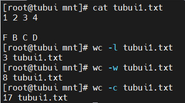

## Lệnh `# cut`
- Sử dụng để trích xuất các cột trong tệp. Dấu phân cách cột mặc định sẽ là kí tự `tab`

## Lệnh head
- In ra vài dòng đầu tiên của file (mặc định là 10). Có thể thay đổi qua option `-n <so_dong>`

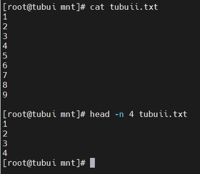

## Lệnh tail
- In ra vài dòng cuối của file (mặc định là 10). Có thể thay đổi qua option `-n <so_dong>`

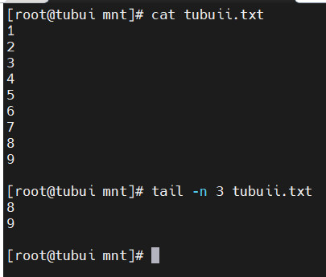