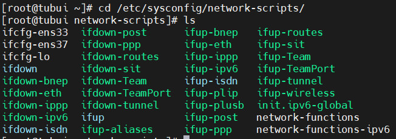
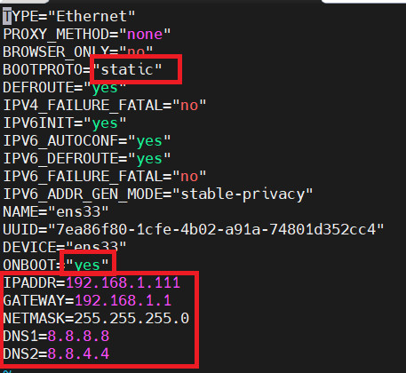

# Đặt IP tĩnh trên CentOS-7
- Vào thư mục `/etc/sysconfig/network-scripts`



- Chọn card muốn set ip tĩnh. Ở đây em chọn ens33
```sh
vi ifcfg-ens33
```



- Thoát và lưu lại
- Khởi động lại card mạng bằng lệnh 
```sh
systemctl restart network.service
```
- Kiểm tra lại IP được cài đặt

