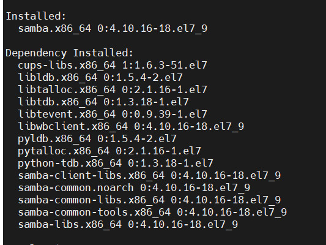
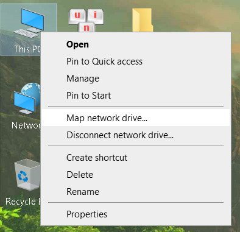
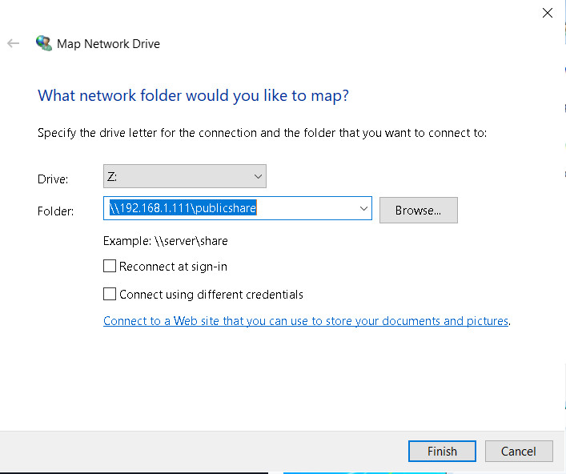
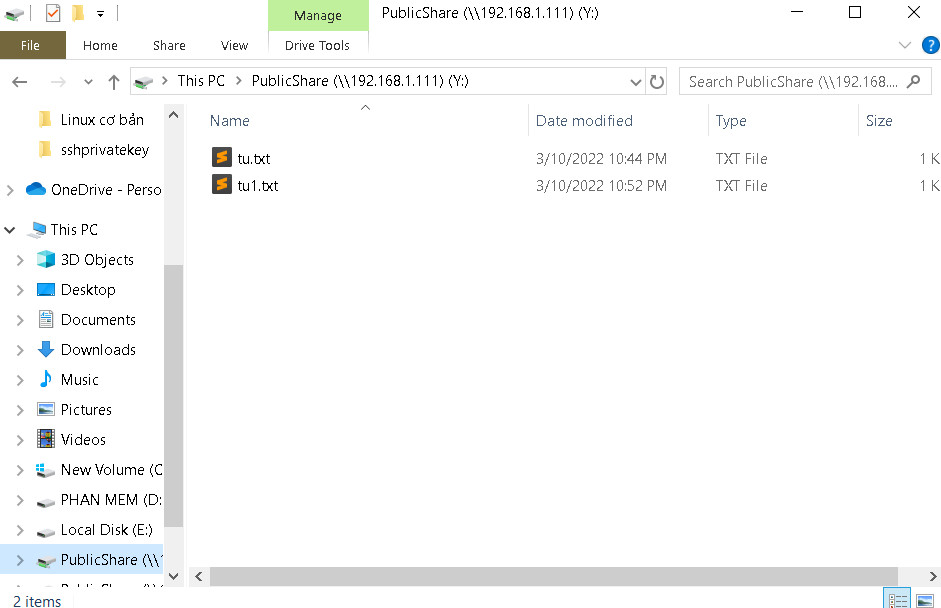
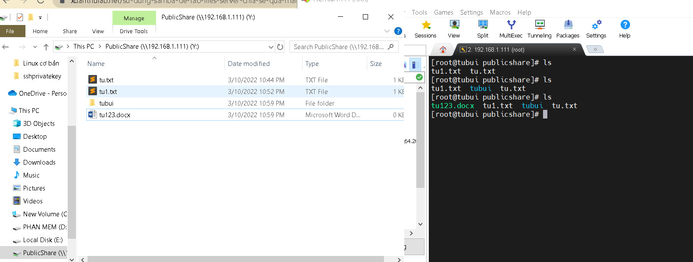

# Sử dụng Samba để tạo Files Server chia sẻ qua mạng bằng giao thức SMB
- Cài đặt Samba Server
```sh
yum install samba -y

systemctl enable smb.service
systemctl enable nmb.service
systemctl restart smb.service
systemctl restart nmb.service
```



- Chia sẻ một thư mục public
```sh
mv /etc/samba/smb.conf /etc/samba/smb.conf.bak
vi /etc/samba/smb.conf  
```

Nhập vào nội dung sau: 
```sh
[global]
workgroup = WORKGROUP
server string = My Samba Server
netbios name = centos
security = user
map to guest = bad user
dns proxy = no

[PublicShare]
path = /samba/publicshare
browsable = yes
writable = yes
guest ok = yes
read only = no
```
- Thoát và lưu file
- Tạo file chia sẻ và phân quyền cho file
```sh
mkdir -p /samba/publicshare/
chmod -R 0755 /samba/publicshare/
chown -R nobody:nobody /samba/publicshare/
```
- Sau khi thiết lập khởi động lại Samba
```sh
systemctl restart smb.service
systemctl restart nmb.service
```
- Kết nối từ Windows đến Samba Server



- Điền thông tin như hình (gồm địa chỉ IP và file public)



- Kết nối thành công





>> Như vật đã có thể truy cập file public share từ máy chạy CentOS qua mạng 

