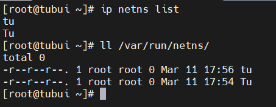
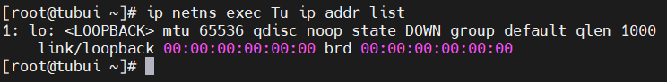
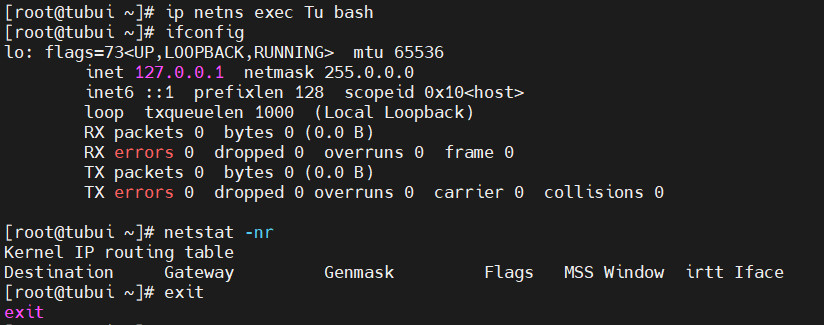
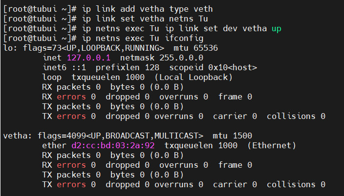

# Network Namespaces
- Network namespace là khái niệm cho phép cô lập môi trường mạng network trong một host. Namespace phân chia việc sử dụng các khái niệm liên quan tới network như devices, địa chỉ address, ports, định tuyến và các quy tắc tường lửa vào trong một không gian riêng biệt, chủ yếu là ảo hóa mạng trong một máy chạy một kernel duy nhất
- Các thiết bị mạng sử dụng nhiều hơn 1 bộ định tuyến ảo (Switch layer 3) có thể chạy trên cùng một thiết bị vật lý
- Trong không gian mạng ảo Linux, các Network Namespaces cho phép các giao diện mạng và bảng định tuyến hoạt động riêng biệt với nhau
## Các thao tác cơ bản trên Namespaces
- Tạo một `network namespace`:
```sh
ip netns add Tu
ip netns add tu
```

- Hiển thị danh sách các namespace. Mỗi khi namespace được tạo mới, có một file tương ứng có cùng tên với tên của namespace tạo ra trong thư mục `/var/run/netns`



- Mỗi Network namespace có giao diện loopback và bảng định tuyến (routing table) của riêng nó và tách biệt với các namespace khác



- Network Namespaces cung cấp thêm khả năng chạy các tiến trình với network namespace. Ví dụ chạy 1 session trên namespace Tu



- Xóa 1 namespace
```sh
ip netns delete Tu
```

## Thêm giao diện vào Network Namespace 
- Tạo giao diện ảo, đặt là `vethb`
```sh
ip link add vetha type veth
```

- Gắn `vethb` vào namespace Tu:
```sh
ip link add vetha type veth
ip link set vetha netns Tu
ip netns exec Tu ip link set dev vetha up
ip netns exec Tu ifconfig
```

