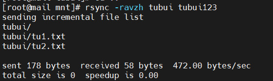

# Backup data (Sao lưu dữ liệu)
- Lệnh `rsync` được sử dụng để đồng bộ hóa cây thư mục, ngoài ra, `rsync` kiểm tra xem tập tin đã được sao chép chưa. Nếu tồn tại hoặc không có thay đổi về kích thước hay thời gian sửa đổi, `rsync` sẽ tránh một bản sao không cần thiết và tiết kiệm thời gian. `rsync` chỉ sao chép các phần của tệp đã thay đổi nên nó rất nhanh
- `rsync` hiệu quả khi đệ quy sao chép một cây thư mục qua mạng, vì nó chỉ truyền đi sự thay đổi trong thư mục
- Người ta thường đồng bộ hóa cây thư mục đích với gốc, sử dụng option `rsync -r` để đệ quy xuống cây thư mục sap chép tất cả các tệp và thư mục bên trong tệp được liệt kê dưới dạng nguồn
## Cài đặt `rsync`:
- Trên Red Hat/CenOS:
```sh
yum install rsync
```
- Trên Debian/Ubuntu:
```sh
apt-get install rsync
```
Ví dụ:

