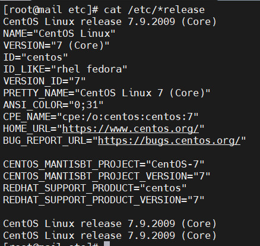
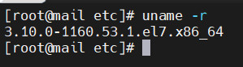
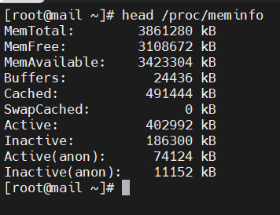
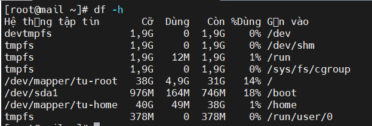
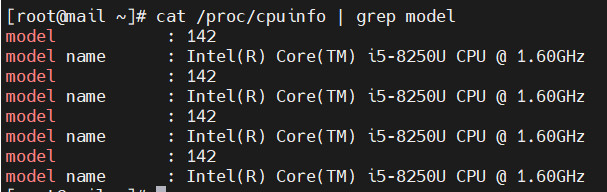
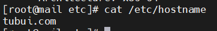
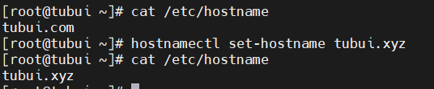

# System Info
- Xem thông tin hệ điều hành
```sh
cat /etc/*release
```



- Kernel version: 
```sh
uname -r
```



- Thông tin bộ nhớ: 
```sh
head /proc/meminfo
```



- File hệ thống 
```sh
df -h
```



- Đếm số lượng CPU: 
```sh
cat /proc/cpuinfo | grep model
```



- Tên máy chủ
```sh
cat /etc/hostname
```



- Đổi tên máy chủ
```sh
hostnamectl set-host name tubuixyz
```



- Hệ thống tập tin `proc` chứa các tập tin ảo mà chỉ tồn tại trong bộ nhớ. Một số tập tin quan trọng trong `/proc` bao gồm
```sh
/proc/cpuinfo
/proc/interrupts
/proc/meminfo
/proc/mounts
/proc/partitions
/proc/version
/proc/<process-id-#>
/proc/sys
```

> Hệ thống tập tin /proc rất hữu ích vì thông tin mà nó báo cáo chỉ được thu thập khi cần thiết và không bao giờ cần lưu trữ trên đĩa.