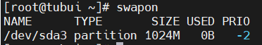
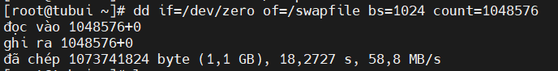
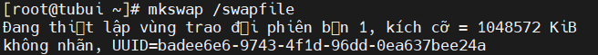
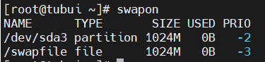
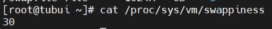

# Swap memory
## 1. Khái niệm
- Swap Memory được sử dụng khi hệ thống quyết định rằng nó cần thêm bộ nhớ RAM cho quá trình hoạt động và bộ nhớ RAM hiện tại không còn đủ để sử dụng. Nếu điều đó xảy ra, các tài nguyên và dữ liệu tạm thời không hoạt động trên bộ nhớ RAM sẽ được di chuyển để lưu trữ vào không gian Swap để giải phóng bộ nhớ RAM và sử dụng cho việc khác
- Swap sẽ làm nhiệm vụ duy trì tất cả các hoạt động bình thường dù tốc độ chậm hơn thay vì phải dừng cả hệ thống khi đầy bộ nhớ RAM
## 2. Khi nào cần Swap memory
- Tối ưu hóa hệ thống bộ nhớ: Hệ thống sẽ di chuyển các tài nguyên và dữ liệu hiện không sử dụng trong bộ nhớ RAM đến Swap, điều này giúp hệ thống phục vụ cho các mục đích khác tốt hơn
- Tránh các trường hợp không thể lường trước: Trong một số trường hợp không thể dự tính được bộ nhớ chương trình chuẩn bị chạy
- Linux swap có 2 dạng: Phân vùng và file: Để xem nó ở đâu dùng lệnh
```sh
swapon
```



## 3. Tạo file Swap
- Tạo Swap flie:
```sh
dd if=/dev/zero of=/swapfile bs=1024 count=1048576
```

> Trong đó `bs` là kích thước của Swap file, `count` là tốc độ



- Phân quyền cho `swapfile`. Chỉ có root user mới có quyền truy cập:
```sh
chmod 600 /swapfile
```

- Sử dụng `mkswap` để thiết lập file là file swap
```sh
mkswap /swapfile
```



- Khởi động swap file
```sh
swapon /swapfile
```

- Mở file `/etc/fstab` và thêm vào cuối dòng sau:
```sh
$ sudo echo '/swapfile swap swap defaults 0 0' | sudo tee -a /etc/fstab
```

## 4. Kiểm tra lại vùng Swap
```sh
swapon
```



## 5. Giá trị Swappiness
- Giá trị từ swappiness từ 0 - 100. Chỉ số này càng thấp thì máy linux sẽ tránh sử dụng swap file này, càng cao thì càng ưu tiên sử dụng. Ta có thê thay đổi giá trị này tại `/proc/sys/vm/swappiness`
```sh
cat /proc/sys/vm/swappiness
```



## 6. Xóa Swap file
- Để xóa File Swap, có thể deactive swap file:
```sh
swapoff -v /swapfile
```
- Xóa dòng khai báo swap tại file `/etc/fstab`
- Cuối cùng để xóa ta dùng lệnh `rm`
```sh
rm -rf /swapfile
```
## 7. Dung lượng cần thiết của bộ nhớ SWAP
- Nếu RAM ít hơn hoặc bằng 1Gb, thì nên sử dụng Swap có kích thước tối thiểu là bằng với lượng RAM
- Đối với RAM trên 1Gb, thì kích thước tối đa thường là gấp đôi lượng RAM. Nếu thiết lập kích thước của Swap quá lớn chính là đang lãng phí dung lượng ổ đĩa mặc dù Swap không được sử dụng
- Thời gian truy cập trên Swap sẽ chậm hơn so với trên RAM