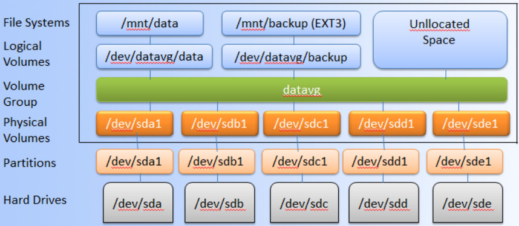
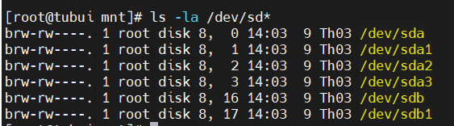

# Logical Volume Manager (LVM)
- LVM là một công cụ để quản lý phân vùng logic được tạo và phân bổ từ các ổ đĩa vật lý. Với LVM ta có thể dễ dàng tạo mới, thay đổi kích thước hoặc xóa bỏ phân vùng đã tạo.
- LVM được sử dụng cho các mục đích:
	+ Tạo 1 hoặc nhiều phân vùng logic hoặc phân vùng với toàn bộ đĩa cứng, cho phép thay đổi kích thước volume
	+ Quản lý Large hard Disk Farms bằng cách cho phép thêm và thay thế đĩa mà không bị ngừng hoạt động và gián đoạn dịch vụ
	+ Trên các hệ thống nhỏ (như máy tính để bàn), thay vì phải ước tính thời gian cài đặt, phân vùng, LVM cho phép các hệ thống tệp dễ dàng thay đổi kích thước khi cần
	+ Thực hiện sao lưu nhất quán bằng cách tạo snapshot nhanh các khối một cách vật lý
	+ Mã hóa nhiều phân vùng vật lý bằng một mật khẩu

Mô hình LVM

- LVM bao gồm
	+ Physical volumes: Là những đĩa cứng vật lý hoặc phân vùng trên nó. Ví dụ: `/dev/fileserver/share, /dev/fileserver/backup, /dev/fileserver/media`
	+ Volume groups: Là một nhóm bao gồm các Physical volumes. Có thể xem Volume group như 1 ổ đĩa ảo. Ví dụ: `fileserver`
	+ Logical volumes: Có thể xem như là các "phân vùng ảo" trên "ổ đĩa ảo". Có thể thêm, gỡ bỏ, thay đổi kích thước 1 cách nhanh chóng

- Thao tác trên LVM
Liệt kê các phân vùng ổ cứng trong hệ thống `# fdisk -l` hoặc `# ls -la /dev/sd*`
	+ Có 3 ổ cứng: sda, sdb, sdc
	+ sda: Ổ cứng cài đặt hệ điều hành
	+ sdb và sdc: Ổ để lưu trữ data

