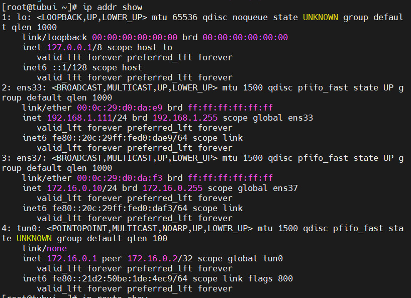
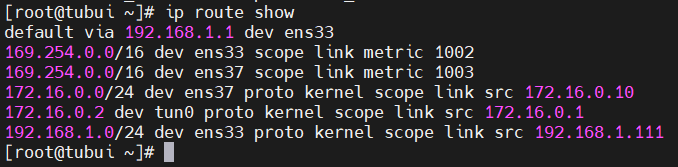
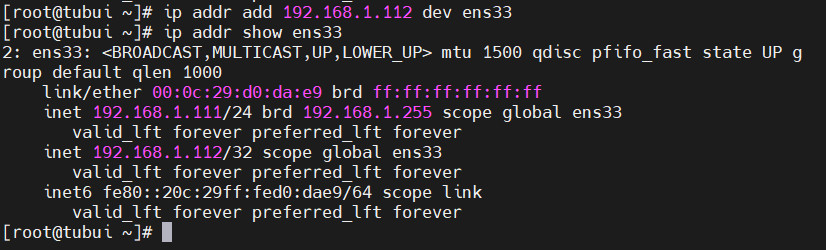
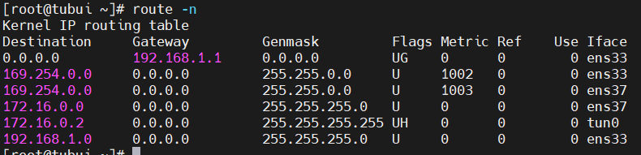
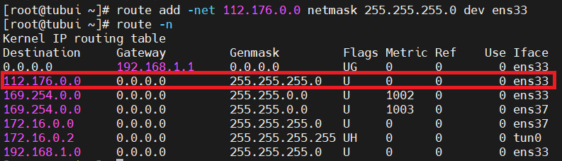
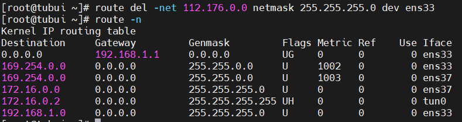

# Basic Network
## Network Interface
- Network Interface (Giao diện mạng) là kênh kết nối giữa thiết bị và mạng. Có thể có nhiều interface hoạt động cùng lúc, các interface có thể được kích hoạt (actived) hoặc không kích hoạt (de-actived)
- File cấu hình network ở những nơi khác nhau tùy vào mỗi nền tảng:
	+ Debian: `/etc/network/interfaces`
	+ CentOS: `/etc/sysconfig/Network-scripts`
	+ SUSE: `/etc/sysconfig/network`

## Lệnh ip
- Lệnh hiển thị thông tin trên từng Ethernet được kết nối
```sh
ip addr show
```



- Hiển thị bảng định tuyến
```sh
ip route show
```



- Gán IP cho một giao diện mạng
```sh
ip addr add 192.168.1.112 dev ens33
```



- Gỡ bỏ IP từ giao diện mạng
```sh
ip addr del 192.168.1.112/32 dev ens33
```

- Thêm một định tuyến mới
`# ip route add <dia_chi_IP> via <gateway>`

- Xóa định tuyến
`# ip route del default`

- Xóa định tuyến cần xóa
`# ip router del <dia_chi_IP> via <gateway>`

## Lệnh route
Lệnh route được sử dụng để xem hoặc thay đổi bảng định tuyến IP
- Hiển thị bảng định tuyến
```sh
route -n
```



- Thêm định tuyến
```sh
route add -net 112.176.0.0 netmask 255.255.255.0 dev ens33
```



- Xóa định tuyến
```sh
route del -net 112.176.0.0 netmask 255.255.255.0 dev ens33
```


