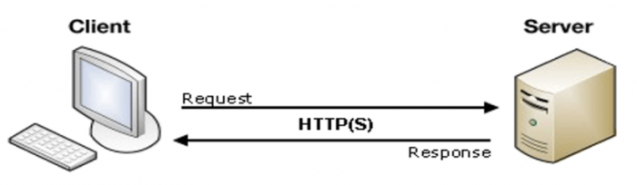
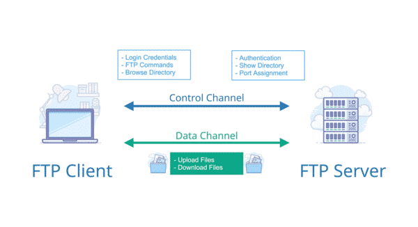

## 2.1 Giao thức tầng ứng dụng
### 2.1.1 Giao thức tầng ứng dụng
- Mô hình client/server: Giao thức ứng dụng mạng thường chia làm 2 phía, phía client và phía server. Phía client trong thiết bị này liên lạc với phía server trong thiết bị khác. Ví dụ trình duyệt web là phía client và web server là phía server của HTTP

- Truyền thông giữa các tiến trình: Ứng dụng gồm 2 tiến trình trên 2 thiết bị khác nhau và liên lạc với nhau qua mạng. Hai tiến trình liên lạc với nhau bằng cách gửi và nhận thông điệp qua socket của chúng. Socket có thể coi như "cửa" của tiến trình
- Địa chỉ tiến trình: Để gửi thông điệp qua tiến trình trên máy tính khác thì tiến trình gửi phải xác định được tiến trình nhận. Tiến trình được xác định qua hai phần: (1) tên hay địa chỉ của máy tính (2) định danh xác định tiến trình trên máy tính nhận
- Chương trình giao tiếp người dùng (user agent): User agent là giao diện giữa người dùng và ứng dụng mạng. Ví dụ trong web, user agent là chương trình duyệt web như Netscape Navigator hay Microsoft Internet Explorer. Trình duyệt cho phép người dùng xem trang web, duyệt trên web... Trình duyệt là tiến trình cung cấp giao diện cho người dùng, thay mặt người dùng nhận và gửi thông điệp qua socket, hiển thị thông điệp cho người dùng xem
### 2.1.2 Các yêu cầu của ứng dụng
Socket là giao diện giữa tiến trình ứng dụng và thực thể giao vận. Ứng dụng gửi thông điệp qua socket. Ở sau socket, thực thể giao vận có trách nhiệm chuyển thông điệp qua mạng máy tính tới socket của tiến trình nhận
- Mất mát dữ liệu (Data loss): Một số ứng dụng như thư điện tử, truyền file, truy cập từ xa, truyền các đối tượng Web và ứng dụng tài chính đòi hỏi dữ liệu phải được truyền chính xác và đầy dủ, tức là không được mất dữ liệu. Tuy nhiên một số ứng dụng khác như ứng dụng đa phương tiện (real-time audio/video...) chấp nhận mất mát dữ liệu (điều này có thể chấp nhận được trong giới hạn nào đó)
- Băng thông (Bandwidth): Để hoạt động hiệu quả, một số ứng dụng phải truyền dữ liệu với một tốc độ nhất định. Ví dụ ứng dụng gọi thoại qua Internet (Internet telephony) mã hóa âm thanh với tốc độ 32Kb/s, thì sau đó dữ liệu tạo ra phải được chuyển tới ứng dụng nhận với tốc độ trên, nếu không có đủ băng thông cần thiết thì ứng dụng cần phải mã hóa âm thanh với tốc độ khác hoặc phải kết thúc
- Thời gian (Timing): Những ứng dụng thời gian thực (real-time) mang tính chất tương tác, như Internet telephone yêu cầu những ràng buộc chặt chẽ về thời gian trong việc trao đổi dữ liệu. Ví dụ, những ứng dụng này đòi hỏi độ trễ (delay) từ tiến trình gửi đến tiến trình nhận cực thấp. Độ trễ lớn trong ứng dụng Internet telephony khiến cuộc đàm thoại bị đứt ngay giữa chừng
### 2.1.3 Dịch vụ của các giao thức giao vận Internet
Internet cung cấp hai giao thức giao vận cho tầng ứng dụng là : UDP và TCP
- TCP (Transmission Control Protocol): Đặc trưng của giao thức TCP là hướng kết nối và cung cấp dịch vụ truyền dữ liệu tin cậy 
	+ Dịch vụ hướng kết nối (Connection oriented): TCP client và TCP server sẽ trao đổi thông tin với nhau trước khi truyền dữ liệu gọi là quá trình "bắt tay". Sau quá trình này, xuất hiên đường kết nối TCP (TCP connection) giữa socket của 2 tiến trình. Đây là kết nối 2 chiều (song công -full duplex) vì cho phép hai tiến trình có thể đồng thời gửi và nhận thông điệp. Khi ứng dụng kết thúc việc gửi thông điệp nó sẽ đóng kết nối lại
	+ Dịch vụ giao vận tin cậy: Tiến trình gửi có thể sử dụng TCP để truyền dữ liệu chính xác đúng thứ tự, không bị lỗi hay trùng lặp, có cơ chế kiểm soát tắc nghẽn. TCP đảm bảo việc truyền dữ liệu một cách chính xác nhưng không đảm bảo về tốc độ truyền và độ trễ
- UDP (User Datagram Protocol): : UDP là giao thức phi kết nối, UDP không cung cấp dịch vụ truyền tin cậy, không đảm bảo thông điệp sẽ đến được bên nhận hơn nữa các thông điệp đến đích có thể không đúng thứ tự. UDP không có cơ chế kiểm soát tắc nghẽn, mặc dù không phải tất cả dữ liệu sẽ được tới đích nhưng phần lớn dữ liệu có thể tới được
### 2.1.4 Một số ứng dụng phổ biến
- Web, truyền file, thư điện tử, dịch vụ tên miền (DNS)
## 2.2 World wide Web (HTTP)
### 2.2.1 Tổng quan về HTTP
Hyper Text Tranfers Protocol (HTTP) - giao thức tầng ứng dụng của web, được triển khai trên cả web và server. Các tiến trình client và server trên các hệ thống đầu cuối khác nhau giao tiếp với nhau thông qua việc trao đổi các thông điệp http
- Trang Web (còn gọi là một tập tin): chứa các đối tượng (object). Đơn giản đối tượng chỉ là một file như HTML, file ảnh JPEG...
- Trình duyệt (Browser) - chương trình giao tiếp với người dùng của ứng dụng web, cho phép hiển thị trang web. 
### 2.2.2 Kết nối liên tục và không liên tục (persistent/nonpersistent)
HTTP hỗ trợ cả 2 cách kết nối là liên tục và không liên tục. HTTP 1.0 sử dụng kết nối không liên tục, HTTP 1.1(deufault) sử dụng kết nối liên tục
- Kết nối không liên tục (nonpersistent): Sau khi gửi đi một đối tượng thì server sẽ đóng kết nối TCP lại, kết nối không được sử dụng để lấy các đối tượng khác. Mỗi kết nối TCP chuyển duy nhất một thông điệp yêu cầu và một thông điệp trả lời. Nếu có nhiều yêu cầu thì cần thiết lập nhiều kết nối TCP. Khi kết nối mới được tạo ra phía client và server phải tạo ra vùng đệm TCP (buffer) cũng như lưu giữ các biến TCP, điều này làm gánh nặng cho server khi có nhiều client yêu cầu cùng một lúc
- Kết nối liên tục (persistent): Server không đóng liên kết TCP sau khi thông điệp được trả lời. Client có thể gửi các yêu cầu liên tiếp, khi nhận được yêu cầu thì server sẽ gửi các đối tượng liên tiếp trên cùng một kết nối TCP. HTTP sẽ đóng liên kết khi liên kết không được sử dụng trong một khoảng thời gian nào đó
### 2.2.3 Khuôn dạng thông điệp HTTP
- Thông điệp yêu cầu HTTP(HTTP request message): Thông điệp yêu cầu gồm 3 phần
	+ Dòng yêu cầu (request line): Có 3 trường gồm trường method (nhận một trong 3 giá trị GET, POST và HEAD), trường địa chỉ URL và trường phiên bản HTTP. Chứa yêu cầu/đối tượng yêu cầu/phiên bản của giao thức. Ví dụ: GET/somedir.page.html HTTP/1.1
	+ Tiêu đề (header lines): Chứa địa chỉ của máy tính có chứa đối tượng yêu cầu ví dụ: Host: www.dantri.com. Chứa yêu cầu kết nối liên tục hay không liên tục, ví dụ yêu cầu không liên tục: Connection: close, chứa trường user-agent xác định phần mềm trình duyệt của người sủ dụng, ví dụ: User-agent:Mozzila/4.0. Cuối cùng header còn chứa trường Accept-language ví dụ: Accept-language:Ff
	+ Phần thân (entity body): Trường này được sử dụng trong phương thức POST. HTTP client sử dụng phương thức POST khi người dùng điền vào một form - ví dụ muốn tìm kiếm qua Google. Nếu giá trị của trường method là POST thì phần entity body sẽ chứa nội dung mà người dùng điền vào form. Phương thức HEAD cũng tương tự như POST, thường người ta sử dụng phương thức HEAD để gõ lỗi
- Thông điệp trả lời HTTP(HTTP response message): Thông điệp trả lời cũng gồm 3 phần
	+ Trạng thái (status line): Dòng trạng thái có 3 trường: Phiên bản (version), mã trạng thái (status code), trạng thái thông điệp (phrase). Ví dụ HTTP/1.1 200 OK
	+ Tiêu đề (header lines): Chứa trường Connection, date (chứa thời gian khi server tạo ra thông điệp và gửi đi), server (chứa thông tin dịch vụ web server), last modified (thời gian cuối cùng đối tượng được cập nhật), Content length (độ dài của thông điệp được gửi), content type (kiểu định dạng thông điệp)
	+ Phần thân (entity body): chứa thông điệp được được yêu cầu
- Các mã trạng thái trong status code:
	+ 200 OK: Yêu cầu được đáp ứng và dữ liệu được yêu cầu nằm trong thông điệp
	+ 301 Moved permanetly: Cho biết đối tượng đã được chuyển và sẽ tự động chuyển hướng tới đối tượng tại địa chỉ URL mới
	+ 400 Bad request: Server không hiểu được yêu cầu từ client
	+ 404 Not found: Đối tượng không còn được lưu trên server
	+ 505 HTTP version not support: Server không hỗ trợ giao thức của client
### 2.2.4 Tương tác với người dùng và Hrver-server
HTTP có 2 cơ chế để phân biệt người dùng: Authentication và cookies
- Authentication (Xác thực): Nhiều server yêu cầu người dùng cung cấp tên (user) và mật khẩu (password) để có thể truy cập được vào tài nguyên trên máy chủ, yêu cầu này được gọi là xác thực. Theo cách này server có thể phân biệt người dùng khác nhau
- Cookie: Là kỹ thuật được sử dụng để ghi lại dấu vết của người truy cập, không cần xác thực bằng user và password, xác định user thông qua trường Set-cookies. Web server sử dụng cookies cho nhiều mục đích, ví dụ :
	+ Nếu server muốn kiểm chứng nhưng không muốn đòi hỏi người dùng đăng nhập qua tên và mật khẩu thì có thể sử dụng cookie cho mỗi lần người dùng truy cập vào server
	+ Server sử dụng cookie nếu muốn ghi nhớ hoạt động của người dùng, phục vụ cho quảng cáo
### 2.2.5 GET có điều kiện (Conditional GET)
Một thông điệp HTTP được gọi là có điều kiện nếu:
- Thông điệp sử dụng phương thức GET
- Thông điệp có trường If-modified-since trong tiêu đề
Thông điệp GET có điều kiện yêu cầu server chỉ gửi đối tượng cho client nếu như đối tượng đó bị thay đổi sau khoảng thời gian kể từ lần trình duyệt yêu cầu 1 đối tượng từ server cho đến hiện tại. Giá trị trường trạng thái là 304 (Not modified) báo cho đối tượng mà client lưu trong cache giống với đối tượng gốc tại server, do đó client có thể sử dụng lại đối tượng này
### 2.2.6 Web cache
Web cache (proxy server) là thực thể đáp ứng yêu cầu từ client. Máy tính làm nhiệm vụ web cache có ổ đĩa riêng lưu trữ bản sao đối tượng đã từng được yêu cầu. Có thể cấu hình trình duyệt sao cho tất cả các yêu cầu đều được gửi tới Webcache trước khi tới tới server thật chứa đối tượng yêu cầu

Webcache vừa là client vừa là server. Webcache đóng vai trờ server khi nhận yêu cầu và trả lời, đóng vai trò client khi gửi yêu cầu và nhận thông điệp trả lời

Webcache được sử dụng rộng rãi vì:
- Làm giảm thời gian client phải đợi 
- Giảm gánh nặng cho server
- Làm giảm tải mạng, giảm chi phí (Bằng cách giảm tải đường truyền ra mạng Internet)
- Mạng Internet với nhiều webcache giúp cho việc nhanh chóng phát tán thông tin

Cache liên hợp (Cooperative caching): Là sự kết hợp của nhiều webcache đặt tại vị trí khác nhau trên mạng nhằm nâng cao hiệu suất tổng thể. Mỗi lần đối tượng đi qua cache đều được sao chép lại trong cache

Ví dụ về hệ thống cache liên hợp: cache NLANR, cache cluster
- Cache NLANR lấy đối tượng từ cache khác bằng cách kết hợp sử dụng giao thức HTTP và ICP (Internet caching protocol - là giao thức ở tầng ứng dụng cho phép cache nhanh chóng xác định một cache khác hay không, nếu có thì nó sẽ dùng giao thức HTTP để lấy đối tượng về) 
- Cache cluster (cụm cache): Hash routing (tìm kiếm theo hàm băm) được đưa ra để giải quyết vấn đề khi yêu cầu cần không biết gửi đến cache nào trong cụm cache. Trình duyệt thực hiện phép "băm" trên địa chỉ URL, trình duyệt sẽ căn cứ vào kết quả để gửi yêu cầu đến một trong các cache trong cụm. Tìm kiếm theo hàm băm là cốt lõi của giao thức Cache Array Routing (CARP)
### 2.2.7 Web động
- Một trang web động không tồn tại dưới dạng 1 file cố định trên web server. Web động chỉ được tạo ra khi nhận được một yêu cầu cụ thể từ trình duyệt Web
- Việc triển khai web động được thực hiện ở phía server, server phải bổ sung thêm khả năng chạy một chương trình ứng dụng nào đó để tạo ra nội dung 1 trang web khi có yêu cầu từ trình duyệt. Mỗi một kiểu trả lời phải có một chương trình ứng dụng riêng. Do đó server phải có khả năng chuyển yêu cầu đến từ trình duyệt cho chương trình ứng dụng cụ thể
- Khi nhận được một yêu cầu, web server sẽ chạy một chương trình ứng dụng nào đó để tạo ra nội dung một văn bản, sau đó văn bản này được trả về cho trình duyệt
	+ Ưu điểm: khả năng hiển thị ngay lập tức thông tin hiện thời từ phía server. Những thông tin thay đổi thường xuyên như dự báo thời tiết... 
	+ Nhược điểm: Chi phí cài đặt cao và không linh hoạt khi phải hiển thị những thông tin thay đổi. Nếu mỗi lần thông tin thay đổi, trình duyệt phải cập nhật lại để lấy nội dung mới

- Web tích cực (active Web) là loại văn bản có chứa chương trình, chương trình này có khả năng tính toán và hiển thị thông tin. Khi trình duyệt yêu cầu, server sẽ gửi cho trình duyệt một văn bản có đính kèm chương trình. Trình duyệt sẽ chạy chương trình này tại máy cục bộ, chương trình có thể tương tác với người sử dụng, tự động tương tác với người sử dụng
	+ Ưu điểm: Có khả năng cập nhật thông tin liên tục do Web tích cực tương tác trực tiếp với server để cập nhật thông tin liên tục
	+ Nhược điểm: Chi phí xây dựng và khả năng an ninh hệ thống. Vì phải tải và thực thi một chương trình từ server, nên phải có khả năng đảm bảo chương trình này không làm gì có hại trên máy tính client

- Web tĩnh: Là một file HTML cụ thể nằm trên web server
	+ Ưu điểm: Đơn giản, tiện dụng và tin cậy. Trang web tĩnh có một định dạng cố định và bất biến, trình duyệt có thể hiện thị nhanh chóng một trang web tĩnh
	+ Nhược điểm: Thiếu linh hoạt. Khi phải thay đổi, cần phải chỉnh sửa lại mỗi trang web tĩnh, điều này không được làm tự động mà phải làm thủ công. Do đó trang web tĩnh không thích hợp khi cung cấp các thông tin thay đổi thường xuyên
### 2.2.8 Chuẩn CGI (Common Gateway Interface)
CGI là một trong những công nghệ sử dụng rộng rãi khi xây dựng web động. Chuẩn CGI quy định cách thức web server tương tác với chương trình ứng dụng 
### 2.2.9 Các kỹ thuật phía Server 
Một phương pháp giúp Web server tạo nội dung là các công nghệ phía server (sever side technology). Có khá nhiều công nghệ như vậy.
- ASP (Active Server Pages): Là công nghệ của Microsoft, có phần mở rộng là .asp
- PHP (Personal Home Pages): Công nghệ mã nguồn mở, phần mở rộng là php hoặc php3
- JSP (Java Server Pages): Dựa trên ngôn ngữ lập trình Java, có phần mở rộng là .jsp
Với những công nghệ trên, dễ dàng cài đặt và bảo trì cho một website lớn. Người phát triển chỉ cần gắn các đoạn mã (phía server) vào các trang HTML. Đoạn mã này được đưa cho trình biên dịch tương ứng để từ những câu lệnh này sinh ra các đoạn mã HTML và sau đó trang HTML được gửi về cho trình duyệt

## 2.3 Truyền file (FTP - File Transfer Protocol)
### 2.3.1 Khái niệm
FTP là giao thức truyền file giữa các máy tính, được đặc tả trong RFC 959
### 2.3.2 Hoạt động
Khi người dùng bắt đầu một phiên FTP

- Đầu tiên FTP ở client sẽ khởi tạo 1 kết nối TCP tới tiến trình FTP server thông qua port 21
- Phía client của giao thức FTP gửi thông tin về định danh người dùng và mật khẩu cũng như lệnh thay đổi thư mục qua kết nối này để server xác thực
- Sau khi đươc server xác định, người dùng mới có thể thực hiện việc trao đổi file
- Khi người dùng có một yêu cầu truyền file, FTP mở một kết nối TCP để truyền dữ liệu qua cổng 20. FTP truyền đúng 1 file qua kết nối này và sau khi truyền xong thì đóng kết nối lại. Nếu trong cùng 1 phiên người dùng có yêu cầu truyền file thì FTP sẽ mở một kết nối khác. Mỗi kết nối dữ liệu được tạo ra cho mỗi một yêu cầu truyền file (kết nối dữ liệu không liên tục)
### 2.3.3 Các lệnh FTP (FTP commands)
Lệnh "yêu cầu" của client đến server và "kết quả" từ server tới client được thông qua kết nối điều khiển (control conection) và được mã hóa bằng bảng mã ASCII 7 bit 

Một số lệnh thường gặp:
- USER username: Sử dụng để gửi thông tin định danh người dùng cho server
- PASS password: Dùng để gửi password cho server
- LIST: Dùng để yêu cầu server gửi một danh sách file trong thư mục hiện thời. Danh sách này được gửi thông qua một kết nối TCP
- RETR filename: Dùng để lấy một file từ thư mục hiện thời
- STOR filename: Dùng để tải một file vào thư mục hiện thời 

Ứng với mỗi lệnh của client là một câu trả lời của server (gồm 3 chữ số và có một thông báo kèm theo)
- 331 username OK, password requiered
- 125 connection already open; Transfer starting 
- 425 can't open data connection
- 452 error writting file