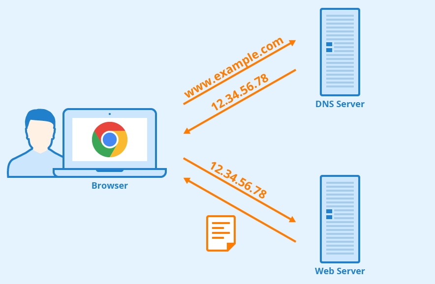
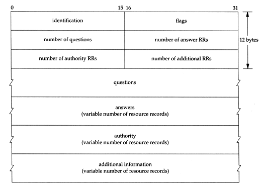

# 2.4 Thư tín điện tử (E-mail) trên Internet
- Cùng với web, thư điện tử là một trong những ứng dụng Internet thông dụng nhất. Thư điện tử nhanh, dễ gửi và chi phí thấp, hơn nữa nhưng thông điệp e-mail có thể chứa đựng các hyperlink, hình ảnh, âm thanh và video
- Hệ thống mail trên Internet gồm 3 thành phần chính: User agent, mail server và SMTP (Simple Mail Transfer Protocol)
- Máy chủ phục vu thư (Mail server) là thành phần cốt lõi trong hệ thống e-mail. Mỗi người có 1 hộp thư đặt tại mail server. 
- Thư được tạo ra tại user agent của người gửi, được gửi tới mail server của người gửi rồi mới tới mail server của người nhận và cuối cùng được chuyển vào hộp thư của người nhận
## 2.4.1 SMTP
- SMTP (Simple Mail Transfer Protocol) là giao thức gửi thư điện tử của tầng ứng dụng SMTP sử dụng dịch vụ truyền dữ liệu tin cậy TCP để truyền thư từ mail server của người gửi đến mail server của người nhận, được đặc tả trong RFC 821
- Giống các giao thức ở tầng ứng dụng, SMTP có 2 phía: phía client trên mail server của người gửi và phía server trên mail server của người nhận.
- SMTP chạy trên port 25
- Quá trình gửi/nhận thư: 
	+ User agent của A gửi thư tới mail server của A. Tại đây thư được đặt vào hàng đợi gửi thư
	+ SMTP client chạy trên mail server của A thấy thư trong hàng đợi. Nó tạo kết nối TCP tới SMTP server trên mail server của B
	+ SMTP client gửi thư của A qua kết nối TCP 
	+ Tại mail server của B, SMTP sever nhận thư của A và đặt thư vào mail box của B
	+ B sử dụng user agent của mình để đọc thư
## 2.4.2 So sánh SMTP với HTTP
- Giống: Đều là giao thức để gửi file giữa các máy tính, cả 2 giao thức 
	+ HTTP chuyển file hoặc đối tượng từ Web server tới web client
	+ SMTP chuyển file (thông điệp e-mail) giữa các mail server
- Khác: 
	+ HTTP là giao thức kiểu kéo (Pull protocol), client kéo thông tin từ server về, client đóng vai trò là phía nhận
	+ SMTP là giao thức kiểu đấy (Push protocol), client đẩy thông tin lên server, client đóng vai trò là phía gửi
## 2.4.3 Khuôn dạng thư và chuẩn MIME
- 5 nhóm dữ liệu chính
	+ Văn bản (Text)
	+ Ảnh (Image)
	+ Âm thanh (Audio)
	+ Video
	+ Kiểu ứng dụng (Application)
## 2.4.4 Giao thức truy nhập mail
Giao thức POP3 và IMAP

- POP3 (Office Protocol - Version 3) được đặc tả trong RFC 1939, là giao thức lấy thư cực kỳ đơn giản và có rất ít chức năng
	+ POP3 được khởi tạo khi user agent (client) tạo kết nối TCP tới mail server (server) qua cổng 110
	+ Phiên làm việc POP3 gồm 3 giai đoạn:
		+ Kiểm chứng: User agent sử dụng tên và mật khẩu để xác nhận người sử dụng 
		+ Tiến hành xử lý: User agent tiến hành lấy thư. Nó có thể đánh dấu thư để xóa hay hủy bỏ việc đánh dấu xóa
		+ Cập nhật: Xảy ra khi client ra lệnh quit để kết thúc phiên POP3. Tại thời điểm đó mail server xóa tất cả thư được đánh dấu
- IMAP (Internet Mail Access Protocol) được đặc tả trong RFC 2060, giống như POP3 nó cũng là giao thức lấy thư, có nhiều đặc tính phức tạp hơn POP3
	+ IMAP được thiết kế cho phép người dùng thao tác trên những hộp thư ở xa một cách dễ dàng 
	+ IMAP cho phép người dùng tạo ra những thư mục thư khác nhau trong mailbox. Người dùng có thể đặt thư vào trong thư mục hay dịch chuyển thư từ thư mục này đến những thư mục khác
	+ IMAP phức tạp hơn POP3 vì server IMAP phải duy trì hệ thống thư mục cho mọi người dùng
	+ Phiên làm việc IMAP gồm 3 giai đoạn:
		+ Giai đoạn thiết lập kết nối giữa (client agent) và IMAP server
		+ Giai đoạn server chấp nhận kết nối 
		+ Giai đoạn tương tác client/server: Server luôn ở 1 trong 4 trạng thái (nonauthenticated, authenticated, selected, logout)
# 2.5 Dịch vụ tên miền - DNS
- Hệ thống phân giải tên miền DNS (Domain Name System) là một hệ thống cho phép thiết lập tương ứng giữa địa chỉ IP và tên miền trên Internet
- DNS triển khai cơ sở dữ liệu phân tán trên Internet.
- DNS là một hệ thống giúp cho việc chuyển đổi các tên miền mà con người dễ ghi nhớ sang địa chỉ IP tương ứng của tên miền đó
## 2.5.1 Các dịch vụ của DNS
- DNS cung cấp một số dịch vụ
	+ Dịch vụ đặt bí danh cho máy tính (Host aliasing): Máy tính có tên phức tạp có thể có 1 hoặc nhiều bí danh (alias), tên bí danh thường dễ nhớ hơn tên đầy đủ. Một ứng dụng có thể yêu cầu DNS xác định tên đầy đủ cũng như địa chỉ IP của một tên bí danh
	+ Dịch vụ đặt bí danh cho mail server (Mail server aliasing): Ứng dụng có thể sử dụng DNS để xác định tên đầy đủ của một bí danh cũng như địa chỉ IP của máy tính đó. DNS cho phép mail server và webserver của các công ty có tên (bí danh) giống nhau.
	+ Phân tán tải (Load distribution): DNS thực hiện việc phân tán tải cho các server, đặc biệt là các web server "nhân bản" (replicated - là các server có nội dung giống hệ nhau)
## 2.5.2 Cơ chế hoạt động của DNS

- Client gửi thông điệp truy vấn đến DNS, trong thông điệp chứa tên máy chứa địa chỉ IP 
- Client nhận được thông điệp trả lời của DNS chứa địa chỉ IP cần xác định
- Để triển khai được dịch vụ xác định địa chỉ IP thì cần phải có nhiều máy chủ (nameserver) đặt khắp nơi trên thế giới và một giao thức ở tầng ứng dụng xác định cách thức trao đổi thông tin giữa các nameserver và giữa nameserver với máy tính

- Để triển khai DNS người ta có thể đưa ra một kiến trúc đơn giản bằng cách chỉ dùng 1 nameserver và nameserver đó chứa tất cả các ánh xạ tên và địa chỉ IP. Theo thiết kế này client chỉ cần gửi tất cả truy vấn tới nameserver duy nhất này và nameserver này sẽ trả lời mọi truy vấn. Mặc dù kiến trúc này đem lại tính đơn giản nhưng nó hoàn toàn không thích hợp cho Internet với số lượng lớn và ngày càng nhiều và nó sính ra một số vấn đề:
	+ Điểm hỏng duy nhất (A single point of failure): Nếu nameserver duy nhất ngừng hoạt động cũng có nghĩa toàn bộ Internet ngừng hoạt động
	+ Khối lượng công việc (Traffic volume): Một nameserver duy nhất phải xử lý tất cả các truy vấn DNS
	+ Cơ sở dữ liệu tập trung ở xa: (Distant centralized database): Nameserver duy nhất không thể gần tất cả các client, nếu ở nameserver đặt ở xa thì tất cả các truy vấn có thể bị tắc nghẽn. Hậu quả là các ứng dụng phải chịu độ trễ lớn
	+ Bảo trì (Maintenance): Nameserver phải ghi nhớ tất cả thông tin về tất cả các máy tính trên Internet. Khi đó cơ sở dữ liệu sẽ cực kỳ lớn và nameserver phải cập nhật thường xuyên thông tin cho mọi máy tính mới

> Vì thế cơ sở dữ liệu tập trung trên một nameserver duy nhất không phù hợp khi quy mô hệ thống lớn

- Để giải quyết vấn đề trên DNS triển khai cơ sở dữ liệu phân tán trên Internet. DNS sử dụng nhiều nameserver tổ chức phân cấp và phân tán trên toàn cầu. Không có nameserver nào chứa tất cả tên và địa chỉ IP các máy tính trên Internet, những thông tin này được phân tán trên nhiều nameserver. Có ba loại nameserver:
	+ Local nameserver: Thường gần với client, có thể là cơ quản hoặc tổ chức, nó có thể ở trên cùng mạng LAN với máy tính client
	+ Root nameserver: Trên thế giới có khoảng 13 root nameserver. Khi các local nameserver không thể trả lời truy vấn của một máy tính thì local nameserver sẽ đóng vai trò client DNS và gửi câu hỏi truy vấn tới một trong số các root nameserver. Nếu root nameserver có thông tin truy vấn được hỏi, nó sẽ gửi một thông điệp DNS hồi âm tới local nameserver và sau đó thông tin này được local name server gửi trả lời cho máy tính yêu cầu 
	+ Authoriative nameserver: Mỗi máy tính phải đăng ký tới một Authoriative nameserver. Tức là Authoriative luôn lưu trữ bản ghi DNS cho phép xác định địa chỉ IP của máy tính từ tên
## 2.5.3 Bản ghi DNS
- Nameserver là nơi lưu trữ các bản ghi tài nguyên (resource record) cho các ánh xạ tên máy/địa chỉ IP. Mỗi thông điệp trả lời DNS chứa một hay nhiều bản ghi tài nguyên.
- Bản ghi tài nguyên gồm 4 trường: Name, Value, Type, TTL
	+ TTL là thời gian tồn tại của bản ghi tài nguyên, dùng để xác định thời điểm có thể xóa bản ghi tài nguyên khỏi bộ nhớ lưu trữ
	+ Ý nghĩa của các trường name, value phụ thuộc vào trường Type
	+ Trường Type có thể là một trong các giá trị sau: A, CNAME, MX, TXT, NS, PTR

### A record
- A record (Address record) là một record quan trọng dùng để ánh xạ từ một domain thành địa chỉ IP cho phép có thể truy cập website. Đây là chức năng cốt lõi của DNS. A record có giá trị Name là tên máy, Value là địa chỉ IP của máy. Ví dụ `tubui.com  A  192.168.1.89`
### CNAME record
- CNAME record (Canonical Name): Cho phép tên miền có nhiều bí danh khác nhau, khi truy cập các bí danh sẽ cũng về một địa chỉ tên miền. Để sử dụng bản ghi CNAME cần khai báo bản ghi A trước. Ví dụ `www  CNAME  tubui.com`, `tubui.com  A  192.168.1.89`. Khi một yêu cầu đến địa chỉ www.tubui.com thì DNS sẽ tìm đến tubui thông qua bản ghi CNAME, một truy vấn DNS mới sẽ tiếp tục tìm đến địa chỉ IP  192.168.1.89 thông qua bản ghi A
### MX record
- MX record: Bản ghi MX có tác dụng xác định, chuyển thư đến domain hoặc subdomain đích. Bản ghi MX có dạng 
	`tubui.com  MX  10  mail_1.tubui.com` 
	`tubui.com  MX  20  mail_2.tubui.com`
Trong đó giá trị 10 ,20 là giá trị ưu tiên, giá trị càng nhỏ thì độ ưu tiên càng lớn
### TXT record
- TXT record (Text): Được sử dụng để cung cấp khả năng liên kết văn bản tùy ý với máy chủ. Chủ yếu dùng trong mục đích xác thực máy chủ với tên miền
### NS record
- NS record (Name server): Mỗi nameserver cho zone sẽ có một NS record chứa địa chỉ IP của DNS cùng với các thông tin về domain đó. Ví dụ:
`
tubui.com IN NS ns1.zonedns.com
tubui.com IN NS ns2.zonedns.com
`
### PTR record
- PTR record (Pointer): Hệ thống tên miền thông thường cho phép chuyển đổi từ tên miền sang địa chỉ IP. Trong thực tế, một số dịch vụ Internet đòi hỏi hệ thống máy chủ DNS phải có chức năng chuyển đổi từ địa chỉ IP sang tên miền. Tên miền ngược thường được sử dụng trong một số trường hợp xác thực email gửi đi
Ngoài những lại bản ghi trên vẫn còn các loại bản ghi khác như SOA record, AAAA record, SRV record, DKIM record, SPF record
## 2.5.4 Thông điệp DNS
Có hai loại thông điệp DNS: Thông điệp yêu cầu và thông điệp trả lời.

- Ý nghĩa các trường trong thông điệp như sau:
	+ 12 byte đầu tiên là phần tiêu đề. Phần tiêu đề gồm các trường
		+ Trường đầu tiên là một định danh gồm 16 bit cho mỗi thông điệp yêu cầu, 16 bit định danh này được ghi lại vào thông điệp trả lời cho phép client xác định được đấy là câu trả lời cho thông điệp yêu cầu nào. 
		+ Có nhiều cờ trong trường cờ ứng với 1 bit: 
			+ Cờ truy vấn (query/reply flag) xác định thông điệp là yêu cầu (0) hay là trả lời (1)
			+ Cờ authoriative được đặt trong thông điệp trả lời khi nameserver là authoriative nameserver của tên máy tính cần xác định địa chỉ IP
			+ Cờ mong muốn đệ quy (recursive-desired query) được đặt khi client (máy tính hay name server) mong muốn nameserver thực hiện truy vấn đệ quy khi nó không có bản ghi đó
			+ Cờ chấp nhận đệ quy (recursion-available flag) được đặt trong thông điệp trả lời nếu nameserver đó hỗ trợ đệ quy 
	+ Trong phần tiêu đề cũng có 4 trường số lượng, các trường này xác định số lượng các bản ghi trong 4 phần dữ liệu sau phần tiêu đề:
		+ Phần câu hỏi (Question session): chứa thông tin về câu hỏi được tạo ra bao gồm trường "tên" chứa tên đang được hỏi và trường "kiểu" xác định kiểu câu hỏi
		+ Trong thông điệp trả lời từ server name, phần trả lời (answer section) chứa các bản ghi tài nguyên cho tên được yêu cầu trước đó. Chú ý rằng mỗi bản ghi tài nguyên có 4 trường: Type (A, NS, CNAME, MX...), Name, Value, TTL. Thông điệp trả lời có thể có nhiều bản ghi tài nguyên vì tên máy tính có thể ứng với nhiều địa chỉ IP
		+ Mục thẩm quyền (authority section): Chứa các bản ghi của authoriative server
		+ Mục phụ trợ (Addtional section): Chưa các bản ghi "hữu ích" khác
