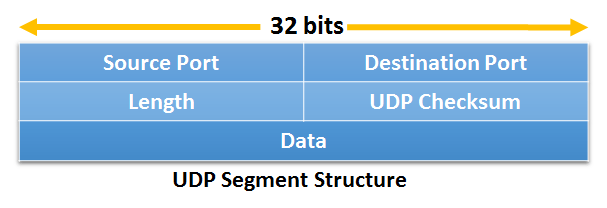
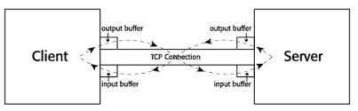
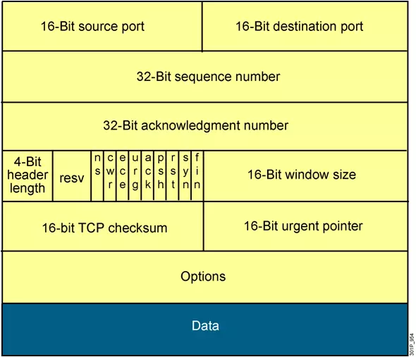
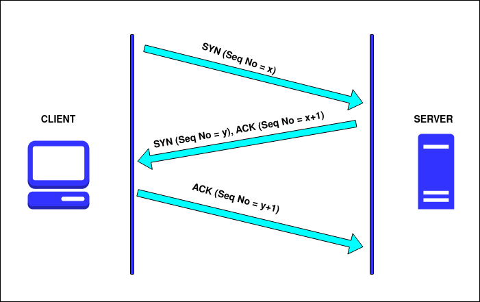

# 3.1 Dịch vụ và nguyên tắc của tầng giao vận
- Tầng giao vận là tầng trung tâm trong kiến trúc phân tầng với nhiệm vụ cung cấp dịch vụ truyền thông giữa các tiến trình ứng dụng chạy trên các máy tính khác nhau. Tầng giao vận của Internet có 2 giao thức quan trọng là TCP và UDP
- Giao thức tầng giao vận cung cấp một kênh truyền logic (ảo) giữa các tiến trình ứng dụng chạy trên máy tính khác nhau. Các tiến trình sẽ sử dụng đường truyền ảo này để trao đổi thông điệp.
## 3.1.1 Quá trình tầng giao vận chuyển tiếp gói tin 
- Ở phía gửi, thực thể giao vận chèn thông điệp mà nó nhận được từ tiến trình ứng dụng vào các 4-PDU (Protocol Data Unit). Công việc được thực hiện bằng cách chia thông điệp thành nhiều đoạn nhỏ, bổ sung vào đầu đoạn tiêu đề của tầng giao vận để tạo ra gói dữ liệu của tầng giao vận (4 -PDU). Sau đó tầng giao vận truyền gói dữ liệu (4-PDU) xuống tầng mạng, tại đây gói này được đặt trong gói dữ liệu của tầng mạng (3-PDU). 
- Ở phía nhận, tầng giao vận nhận gói dữ liệu từ tầng mạng, loại bỏ phần tiêu đề của gói tin 4-PDU, ghép chúng lại thành một thông điệp hoàn chỉnh và chuyển cho ứng dụng nhận.
## 3.1.2 Quan hệ giữa tầng giao vận và tầng mạng 
- Tầng giao vận nằm trên tầng mạng. Nếu giao thức tầng giao vận cung cấp đường truyền logic giữa tiến trình chạy trên máy tính khác nhau thì giao thức tầng mạng cung cấp đường truyền giữa các máy tính
- Tại thiết bị đầu cuối, giao thức giao vận chuyển dữ liệu từ tiến trình ứng dụng xuống tầng mạng và ngược lại nhưng không biết thông điệp được truyền đi như thế nào trong tầng mạng
## 3.1.3 Tổng quan về tầng giao vận trong Internet
- Trong mạng Internet hay mạng TCP/IP có 2 giao thức quan trọng ở tầng giao vận là TCP (Transmission Control Protocol) và UDP (User Datagram Protocol)
	+ TCP là giao thức hướng kết nối, cung cấp dịch vụ tin cậy 
	+ UDP là giao thức phi kết nối, cung cấp dịch vụ không tin cậy

> Người viết ứng dụng phải lựa chọn một trong hai giao thức này cho ứng dụng của mình
- Nhiệm vụ chính của UDP và TCP là mở rộng dịch vụ IP - truyền dữ liệu giữa hai thiết bị đầu cuối thành dịch vụ truyền dữ liệu giữa hai tiến trình chạy trên thiết bị đầu cuối. Việc mở rộng từ truyền dữ liệu giữa các máy tính (host to host) đến truyền dữ liệu giữa các tiến trình (process to process) được gọi là quá trình dồn kênh (multiplex) và phân kênh (demultiplex)
# 3.2 Dịch vụ dồn kênh, phân kênh
- Mỗi segment của tầng giao vận có trường xác định tiến trình nhận dữ liệu. Tầng giao vận bên nhận sẽ sử dụng trường này để xác định rõ tiến trình nhận và gửi dữ liệu trong segment tới tiến trình đó. Công việc chuyển dữ liệu trong segment tới đúng tiến trình ứng dụng được gọi là phân kênh
- Tại thiết bị gửi, tầng giao vận nhận dữ liệu từ nhiều tiến trình ứng dụng khác nhau, tạo segment chứa dữ liệu cùng với một số thông tin tiêu đề và cuối cùng chuyển segment xuống tầng mạng. Quá trình này được gọi là dồn kênh
# 3.3 UDP - Giao thức phi kết nối
- UDP được đặc tả trong RFC 768 là giao thức giao vận đơn giản. Bên cạnh chức năng dồn kênh/phân kênh, UDP có cơ chế phát hiện lỗi đơn giản
- UDP được gọi là giao thức phi kết nối vì nó không đòi hỏi bên gửi và bên nhận phải liên kết trước khi trao đổi dữ liệu
- Nhiều ứng dụng sử dụng UDP mà không phải là TCP vì những lý do sau đây:
	+ Không có giai đoạn thiết lập kết nối: UDP sẽ không phải chịu thời gian để thiết lập đường truyền
	+ Không duy trì trạng thái kết nối: TCP ghi nhớ trạng thái kết nối đến hệ thống đầu cuối, trạng thái kết nối gồm vùng đệm (buffer) của bên nhận và bên gửi, các tham số kiểm soát tắc nghẽn, số tuần tự và số biên nhận. UDP không phải lưu những thông tin này. Do đó nếu phía server sử dụng UDP thì có khả năng phục vụ đồng thơi nhiều client hơn.
	+ Tiêu đề gói tin nhỏ: Tiêu đề của TCP segment là 20 byte trong khi UDP chỉ có 8 byte
	+ Không kiểm soát tốc độ gửi: Tốc độ truyền dữ liệu của UDP chỉ bị giới hạn bởi tốc sinh dữ liệu của ứng dụng, khả năng của máy tính nguồn (CPU, tốc độ truy cập mạng...) Khi mạng bị tắc nghẽn, một phần dữ liệu có thể bị mất do tràn vùng đệm ở router. Tốc độ nhận có thể bị giới hạn do tắc nghẽn ngay cả khi tốc độ gửi không bị giới hạn
- UDP thường được các ứng dụng đa phương tiện như điện thoại Internet, hội thảo từ xa, các ứng dụng thời gian thực... Các ứng dụng như vậy chấp nhận mất mát, lỗi trên một phần dữ liệu (điều này có thể chấp nhận được trong một giới hạn nào đó)
## 3.3.1 Cấu trúc UDP segment

Cấu trúc UDP segment được đặc tả trong RFC 768 được minh họa trong hình dưới

- Tiêu đề UDP có 4 trường, độ lớn mỗi trường là 2 byte. 
	+ Số hiệu cổng (Source port và Dest port) cho phép thiết bị gửi chuyển dữ liệu tới đúng tiến trình chạy trên thiết bị nhận (chức năng phân kênh)
	+ Trường Checksum được bên nhận sử dụng để kiểm tra trong segment có lỗi hay không.
	+ Trường độ dài (Length) cho biết độ dài (tính theo byte) của toàn bộ gói dữ liệu UDP segment kể cả phần tiêu đề
## 3.3.2 UDP checksum
- UDP checksum được dùng để phát hiện lỗi
- Checksum có thể được tính bằng cách: Tính giá trị bù một của tổng các từ 16 bit trong segment, giá trị nhận được được đặt vào trường checksum trong gói dữ liệu UDP segment
# 3.4 Các nguyên tắc truyền dữ liệu tin cậy
Dịch vụ truyền dữ liệu tin cậy không chỉ nằm ở tầng giao vận mà còn có thể nằm ở tầng liên kết dữ liệu hay ứng dụng. Có thể nói truyền dữ liệu tin cậy là một trong những vấn đề quan trọng của mạng
## 3.4.1 Xây dựng giao thức truyền dữ liệu tin cậy 
- Giao thức truyền tin dựa trên cơ chế truyền lại ARQ (Automatic Repeat reQuest). Các giao thức ARQ cần phải có 3 khả năng sau để xử lý trường hợp có dữ liệu lỗi:
	+ Phát hiện lỗi (error detection): Là cơ chế cho phép bên nhận phát hiện được khi nào trong gói dữ liệu có bit bị lỗi
	+ Phản hồi từ phía nhận: (receiver feedback): Cách duy nhất để phía gửi biết được kết quả là phía nhận gửi thông tin phản hồi thông báo tình trạng nhận cho phía gửi. Báo nhận đúng (ACK) và báo nhận sai (NAK). Gói dữ liệu phản hồi chỉ cần sử dụng 1 bit, ví dụ giá trị 0 ứng với ACK và giá trị 1 ứng với NAK
	+ Truyền lại (retransmision): Gói dữ liệu bị lỗi sẽ được bên gửi truyền lại. 
- Trong giao thức rdt 3.0, sau khi phát một gói dữ liệu, thiết bị phải dừng phát để chờ nhận phản hồi từ thiết bị nhận số liệu (chờ ACK/NAK). Nếu kết quả phản hồi là ACK bên phát được quyền phát tiếp. Nếu là NAK bên phát gửi lại gói dữ liệu 
## 3.4.2 Giao thức truyền dữ liệu tin cậy liên tục (Pipeline)
- Kỹ thuật đường ống (pipeline), kỹ thuật này cho phép gửi đồng thời nhiều gói dữ liệu mà không cần phải đợi ACK (Có thể hình dung các gói dữ liệu nối tiếp nhau trên đường truyền từ phía gửi đến phía nhận giống như nước chảy trên một đường ống). Kỹ thuật này làm tăng hiệu suất của giao thức nhiều lần, tuy nhiên nó đòi hỏi các yêu cầu:
	+ Khoảng số thứ tự phải tăng: Bởi vì mỗi gói dữ liệu truyền đi phải có một số thứ tự duy nhất
	+ Phía gửi và phía nhận phải có bộ đệm (buffer) cho nhiều gói dữ liệu. Ít nhất phía gửi có vùng đệm cho các gói dữ liệu đã được truyền đi nhưng chưa được nhận. Phía nhận cũng có thể cần vùng đệm cho các gói dữ liệu đã nhận đúng

- Yêu cầu về khoảng số thứ tự cần thiết cũng như về vùng đệm phụ thuộc vào cách giao thức xử lý việc mất dữ liệu, dữ liệu bị lỗi, bị trễ. Có 2 giao thức chủ yếu truyền dữ liệu tin cậy liên tục là: Quay lại N (Go-back-N) và lặp lại có lựa chọn (SelectiveRepeat)
# 3.5 TCP - Giao thức hướng kết nối
- TCP là một giao thức giao vận của Internet với tính hướng kết nối và tin cậy. Để có thể cung cấp dịch vụ truyền dữ liệu tin cậy, TCP phải áp dụng nhiều nguyên lý như: Cơ chế phát hiện lỗi, truyền lại, biên nhận tích lũy, timer, trường tiêu đề cho số thứ tự và số biên nhận
- TCP được đặc tả trong các khuyến nghị RFC 793, RFC 1122, RFC 1323, RFC 2018, RFC 2581
## 3.5.1 Kết nối TCP
- Chức năng dồn kênh/phân kênh và phát hiện lỗi của TCP giống UDP. Tuy nhiên TCP và UDP có nhiều điểm khác biệt. Điểm khác nhau cơ bản nhất là UDP phi kết nối còn TCP thì hướng kết nối
- TCP hướng kết nối vì trước khi tiến trình ứng dụng có thể bắt đầu gửi dữ liệu tới tiến trình khác, hai tiến trình này phải "bắt tay" với nhau, nghĩa là chúng phải gửi một số gói segment đặc biệt để xác định các tham số đảm bảo cho quá trình truyền dữ liệu
- Kết nối TCP cung cấp đường truyền dữ liệu hai hướng (song công - full duplex). Dữ liệu có thể đồng thời truyền đi từ tiến trình gửi đến tiến trình nhận và ngược lại
- Kết nối TCP luôn thuộc kiểu điểm-điểm(point-to-point) giữa một bên gửi và một bên nhận
- Thiết lập kết nối TCP: 
	+ Đầu tiên tiến trình ứng dụng client yêu cầu thiết lập đường kết nối TCP tới tiến trình nào đó trên server
	+ Sau đó thực thể giao vận trong máy client thiết lập kết nối TCP tới thực thể TCP trên server. Đầu tiên client sẽ gửi một gói tin TCP đặc biệt, server trả lời bằng một gói tin TCP đặc biệt thứ hai và cuối cùng client trả lời bằng một gói tin TCP đặc biệt thứ ba. Ba gói dữ liệu này được trao đổi giữa 2 máy trước khi kết nối, thủ tục thiết lập kết nối này còn được gọi là giai đoạn bắt tay 3 bước (three way handshake)
- Sau khi thiết lập đường truyền TCP, hai tiến trình ứng dụng có thể trao đổi dữ liệu với nhau. Tiến trình client sẽ đẩy luồng dữ liệu qua socket. Khi qua socket, tiến trính sẽ không kiểm soát được dữ liệu mà chính TCP chạy trên máy client sẽ chịu trách nhiệm kiểm soát. 
	+ Ở phía gửi: TCP đẩy dữ liệu vào bộ đệm gửi (send buffer). Sau đó TCP sẽ lấy và gửi dần dữ liệu trong bộ đệm gửi. 
	+ Ở phía nhận: TCP sẽ đặt dữ liệu vào bộ đệm nhận (receiver buffer) của kết nối TCP. Ứng dụng sẽ đọc dòng dữ liệu từ bộ đệm

>> Mỗi kết nối đều có bộ đệm gửi và bộ đệm nhận

## 3.5.2 Cấu trúc TCP Segment
- TCP segment bao gồm các trường tiêu đề và trường dữ liệu. Trường dữ liệu chứa một phần dữ liệu ứng dụng. Khi TCP gửi một file lớn, nó phải chia file thành các đoạn có kích thước MMS(Maximun segment size - lượng dữ liệu lớn nhất có thể đặt trong một segment)
- Tương tự UDP, tiêu đề TCP bao gồm trường số hiệu cổng nguồn, số hiệu cổng đích để thực hiện dịch vụ dồn/phân kênh. Tuy nhiên tiêu đề của TCP segment còn có các trường sau:
	+ Trường số thứ tự (sequence number): 32 bit và trường số biên nhận (acknowledge number) 32 bit đươc bên gửi và bên nhận sử dụng trong việc cung cấp dịch vụ truyền dữ liệu tin cậy
	+ Trường độ lớn cửa sộ (window size): 16 bit được để kiểm soát lưu lượng. Đấy chính là số lượng dữ liệu tối đa (tính theo byte) mà bên nhận có thể chấp nhận được
	+ Trường độ dài tiêu đề (length field): 4 bit xác định độ dài của tiêu đề TCP theo đơn vị là các từ 32 bit. Tiêu đề TCP có thể có độ dài thay đổi phụ trường option (Nếu trường option rỗng, thì chiều dài của tiêu đề TCP là 20 byte)
	+ Trường option: Là tùy chọn, có thể thay đổi tùy ý. Trường này được sử dụng khi bên gửi, bên nhận có thể thương lượng về giá trị MMS hoặc 
	+ Trường cờ (flag): gồm 6 bit. Bit ACK được sử dụng để chỉ ra rằng giá trị đặt trong trường biên nhận là đúng. Các bit RST, SYN và FIN được sử dụng trong việc thiết lập hay đóng kết nối. Khi bit PSH được bật, thì đây là dấu hiệu để yêu cầu bên nhận phải chuyển dữ liệu lên tầng trên ngay lập tức. Cuối cùng, bit URG được dùng để báo hiệu dữ liệu trong segment được thực thể tầng trên phía gửi tạo ra là "khẩn cấp"

- Cấu trúc gói dữ liệu TCP

## 3.5.3 Số thứ tự và số biên nhận
- Trường số thứ tự và số biên nhận là 2 trường quan trọng trong tiêu đề TCP segment:
	+ Trường số thứ tự: TCP xem dữ liệu là dòng các byte không có cấu trúc nhưng có thứ tự và TCP sẽ đánh số thứ tự cho từng byte của dòng dữ liệu này. Mỗi segment có một số thứ tự, là số thứ tự của byte đầu tiên của segment.
	+ Trường số biên nhận phức tạp hơn trường số thứ tự: Số biên nhận mà máy A đặt trong segment của nó sẽ là số thứ tự của byte tiếp theo mà máy A đang chờ máy B gửi tới
## 3.5.4 Truyền dữ liệu tin cậy
- TCP tạo ra đường truyền dữ liệu tin cậy trên dịch vụ không tin cậy của IP. Dịch vụ truyền dữ liệu tin cậy của TCP đảm bảo dòng dữ liệu tới tiến trình nhận không có lỗi, liên tục, không trùng lặp dữ liệu, đúng thứ tự. Có nghĩa là dòng byte nhận giống hệt với dòng byte gửi đi
	+ Tại phía gửi TCP lấy dữ liệu của tầng ứng dụng, đóng gói dữ liệu trong các segment và gửi segment đi
	+ Ngay sau khi chuyển segment cho IP, TCP khởi động (timer) cho segment đó. Thời gian đợi hết (timeout) sẽ gây ra ngắt tại A. TCP phản ứng với timeout bằng cách truyền lại segment gây ra ngắt
	+ TCP nhận được một segment biên nhận (ACK) từ bên gửi. Ở đây TCP phía gửi phải quyết định đó là ACK lần đầu được gửi (tức là biên nhận cho một segment đã gửi nhưng chưa được biên nhận) hay chỉ là ACK trùng lặp (biên nhận là một gói tin đã từng được biên nhận). Trong trường hợp thứ nhất thì bên gửi sẽ biết được rằng tất cả các byte có số thứ tự không vượt quá giá trị biên nhận được gửi thành công. Trong trường hợp thứ 2 TCP thực hiện cơ chế truyền lại nhanh (fast retransmit), gửi lại segment bị cho là mất trước khi timer của segment đó hết hạn
## 3.5.5 Kiểm soát lưu lượng
- TCP cung cấp dịch vụ kiểm soát lưu lượng (flow control): Để tránh hiện tượng bên gửi làm tràn bộ đệm bên nhận. Kiểm soát lưu lượng là quá trình làm tương thích giữa tốc độ gửi và tốc độ nhận
## 3.5.6 Quản lý kết nối TCP
- TCP client khởi tạo kết nối tới TCP server qua những bước sau:
	+ Bước 1: Đầu tiên phía TCP client gửi một segment đặc biệt tới TCP server. Segment đặc biệt này không chứa dữ liệu của tầng ứng dụng nhưng tại SYN (một bit thuộc trường cờ (flag)) trong phần tiêu đề được đặt giá trị. Vì thế segment đặc biệt này hay được gọi là SYN segment. Segment này được đặt trong IP datagram để gửi tới server
	+ Bước 2: Khi IP datagram chứa TCP segment đến server thì server lấy SYN segment ra khỏi datagram, phân phối bộ đệm và các biến TCP phục vụ kết nối đồng thời gửi đi một segment đặc biệt thông báo chấp nhận kết nối từ client. Segment này cũng không chứa dữ liệu của tầng ứng dụng nhưng nó chưa 3 thông tin quan trọng trong phần tiêu đề 
		+ Bit SYN sẽ được thiết lập giá trị bằng 1
		+ Trường biên nhận trong tiêu đề nhận giá trị client_isn+1
		+ Server chọn số thứ tự bắt đầu của mình (server_isn) và đặt giá trị này vào trường số thứ tự trong tiêu đề của segment
	+ Bước 3: Khi server chấp nhận kết nối. Client gửi segment thứ 3 biên nhận cho segment chấp nhận kết nối từ server (bằng cách đặt giá trị server_isn+1 vào trường số biên nhận trong tiêu đề của TCP segment).

>> Sau khi thực hiện xong ba bước này thì client và server có thể trao đổi các segment chứa dữ liệu. Như vậy, để thiết lập được kết nối hai máy phải trao đổi 3 segment. Vì thế thủ tục này được xem là quá trình bắt tay ba bước (three way handshake)

## Đóng kết nối TCP
- Cả 2 tiến trình tham gia kết nối TCP đều có thể đóng kết nối. Khi kết nối đóng thì các tài nguyên phục vụ kết nối (bộ đệm và các biến) trong máy được giải phóng, Ví dụ client đóng kết nối khi đó:
	+ TCP client gửi một FIN segment (vì cờ FIN trong segment được đặt giá trị là 1) tới tiến trình server
	+ Khi server nhận được FIN segment, nó sẽ gửi lại cho client một segment ACK biên nhận segment FIN của client. Kế tiếp server gửi lại một segment kết thúc FIN (có cờ FIN được đặt giá trị là 1)
	+ Cuối cùng client gửi segment ACK biên nhận segment FIN của server. Tại thời điểm này thì tất cả tài nguyên trên 2 máy đều được giải phóng
# 3.6 Kiểm soát tắc nghẽn trong TCP
- Cơ chế kiểm soát tắc nghẽn của TCP bổ sung thêm 2 biến:
	+ Congestion window (CongWin - cửa số tắc nghẽn): Biểu thị sỗ lượng dữ liệu tối đa mà người gửi có thể gửi qua kết nối
	+ Threshold (ngưỡng)
- Khi cửa sổ tắc nghẽn chưa vượt qua ngưỡng, cửa sổ sẽ tăng theo hàm mũ
- Khi cửa sổ tắc nghẽn vượt qua ngưỡng, cửa sổ sẽ tăng tuyến tính.
- Khi timeout, giá trị ngưỡng bằng một nửa giá trị cửa sổ tắc nghẽn hiện thời và cửa sổ tắc nghẽn nhận giá trị 1.
