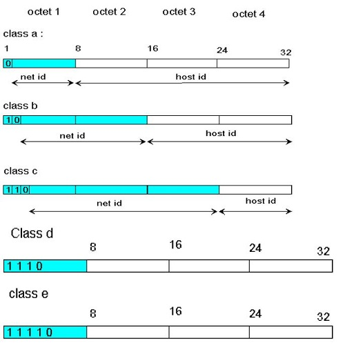
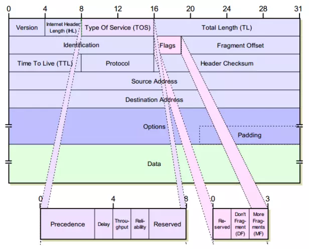
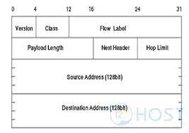

# 4.1 Các mô hình dịch vụ của tầng mạng 
- Vai trò của tầng mạng là chuyển gói tin từ máy tính gửi đến máy tính nhận. Vì thế tầng mạng có 3 chức năng quan trọng sau đây:
	+ Xác định đường đi (Path determination): Tầng mạng phải xác định các router trung gian hay tuyến đường (path) mà gói tin được truyền từ nơi gửi đến nơi nhận. Thuật toán xác định tuyến đường như vậy gọi là "thuật toán định tuyến" (routing algorithm)
	+ Chuyển mạch (Switching): Khi gói tin đến đầu vào, router phải quyết định gửi gói tin đến đầu ra thích hợp
	+ Thiết lập đường truyền (Call setup): Thiết lập kết nối trước khi truyền
## 4.1.1 Mô hình dịch vụ mạng
### Chuyển mạch gói (datagram) và chuyển mạch ảo (virtual circuit):
- Chuyển mạch ảo:
	+ Thiết lập mạch ảo: Phía gửi thông báo địa chỉ nhận với tầng mạng, yêu cầu tầng mạng thiết lập VC. Tầng mạng xác định tuyến đường giữa bên gửi và bên nhận 
	+ Truyền dữ liệu: Sau khi thiết lập, dữ liệu có thể được chuyển trong VC
	+ Giải phóng mạch ảo: Giai đoạn này bắt đầu từ phía gửi hoặc phía nhận, báo cho tầng mạng yêu cầu đóng VC. Tầng mạng sẽ thông báo cho thiết bị đầu cuối bên kia cũng như các thiết bị chuyển mạch VC để cập nhật lại bảng định tuyến, giải phóng tài nguyên
- Chuyển mạch gói:
	+ Khi gửi gói tin, thiết bị đầu cuối đặt vào gói tin địa chỉ nhận và sau đó chuyển gói tin vào mạng
	+ Thiết bị trung chuyển sẽ định tuyến gói tin đến đích bằng cách xác định địa chỉ đích, tìm kiếm tren bảng định tuyến và chuyển tiếp gói tin theo hướng đến đích
	+ Vì bảng định tuyến cập nhật liên tục nên các gói tin được gửi từ thiết bị đầu cuối này đến thiết bị đầu cuối khác có thể đi theo nhiều tuyến đường khác nhau và đến đích không theo thứ tự 
# 4.2 Các nguyên lý định tuyến
- Để truyền gói dữ liệu từ máy tính gửi đến máy tính nhận, tầng mạng phải quyết định đường đi hoặc các router mà gói dữ liệu phải đi qua. Đây là công việc của các giao thức định tuyến ở tầng mạng
## 4.2.1 Thuật toán định tuyến Link state
- Thuật toán link state phổ biến nhất là thuật toán Dijkstra, xác định đường đi có giá thấp nhất từ một nút nguồn đến tất cả các nút khác trên mạng 
- Thuật toán link state gồm có bước khởi tạo cho vòng lặp. Số các bước bằng tổng số các nút trên mạng. Khi kết thúc, thuật toán sẽ xác định được đường đi ngắn nhất từ nút nguồn đến tất cả các nút khác trên mạng 
## 4.2.2 Thuật toán Distance vector
- Nếu thuật toán LS sử dụng thông tin về toàn bộ trạng thái mạng thì thuật toán Distance vector (DV) là thuật toán lặp, không đồng bộ và phân tán. Thuật toán được xem là phân tán vì mỗi nút nhận thông tin từ những nút hàng xóm có đường kết nối trực tiếp, thực hiện các bước tính toán và phân tán kết quả tính toán tới tất cả các nút hàng xóm 
# 4.3 Định tuyến phân cấp
- Mô hình mạng với các router giống nhau thực hiện thuật định tuyến đơn giản với 2 lý do quan trọng sau:
	+ Phạm vi (scale): Khi số lượng các router lớn, khối lượng thông tin phải tính toán, lưu trữ và trao đổi giữa các bảng định tuyến trên mỗi router cũng trở lên cực lớn
	+ Quản trị (Adminstrative automomy): Một tổ chức phải giữ khả năng quản trị và kiểm soát mạng máy tính của mình nhưng vẫn có khả năng kết nối với các mạng bên ngoài

>> Cả 2 vấn đề này đều được giải quyết bằng cách nhóm các router thành các vùng hay miền tự trị (Autonomous System - AS)
# 4.4 Internet protocol
- IP là 1 phần quan trọng trong kiến trúc tầng mạng của Internet
- Tầng mạng của internet sử dụng dịch vụ chuyển mạch gói (datagram). Tại máy gửi, khi nhận 1 segment từ tầng giao vận, tầng mạng đặt segment trong gói dữ liệu IP (IP datagram) với các trường địa chỉ gửi, địa chỉ nhận... và gửi datagram này tới router đầu tiên trên đường tới đích 
- Tầng mạng trong kieur chuyển mạch gói có 3 thành phần:
	+ Giao thức mạng: Xác định địa chỉ tầng mạng, ý nghĩa các trường trong datagram (là gói dữ liệu - PDU của tầng mạng). Giao thức mạng trong Internet gọi là giao thức IP
	+ Bộ phận xác định đường đi: Xác định tuyến đường của datagram trên đường đi tới đích
	+ Chức năng báo lỗi và khả năng trả lời một số yêu cầu về thông tin của mạng:
## 4.4.1 Địa chỉ IPv4
### Cấu trúc địa chỉ IPv4
- Địa chỉ IP có độ dài 32 bit (4 byte), chia thành 4 cụm 8 bit (gọi là các octet). Các octet được biểu diễn dưới dạng thập phân và được ngăn cách nhau bằng dấu chấm
- Không gian địa chỉ có khoảng 4 tỉ địa chỉ 
- Mỗi giao diện ghép nối máy tính hay router trên Internet phải có 1 địa chỉ IP xác định duy nhất (phụ thuộc vào mạng mà nó kết nối vào)

- Việc đặt địa chỉ IP phải tuân thủ theo các quy tắc sau:
	+ Các bit phần mạng không được phép đồng thời bằng 0
- Nếu các bit phần host đồng thời bằng 0, ta có một địa chỉ mạng 
### Các lớp địa chỉ mạng 

- Lớp A
	+ Định dạng: Net.Host.Host.Host
	+ Bit đầu tiên phải là bit 0. Dạng nhị phân của octet này là 0xxxxxxx
	+ Lớp A có 2^7 - 2 = 126 mạng từ 1.0.0.0 đến 126.0.0.0
- Lớp B
	+ Định dạng: Net.Net.Host.Host
	+ Hai bit đầu tiên của byte đầu tiên phải là 10. Dạng nhị phân của octet này là 10xxxxxx
	+ Lớp B có 2^14 mạng khác nhau từ 128.0.0.0 đến 191.255.0.0
- Lớp C
	+ Định dạng: Net.Net.Net.Host
	+ 3 bit đầu tiên của byte đầu tiên phải là 110. Dạng nhị phân của octet này là 110xxxxx
	+ Lớp C có 2^22 mạng khác nhau từ 192.0.0.0 đén 223.255.255.0
- Lớp D:
	+ Lớp D được sử dụng làm các địa chỉ multicast và dải địa chỉ lớp D từ 224.0.0.0 -> 239.255.255.255. Lấy ví dụ như Ví dụ: 224.0.0.5 dùng cho OSPF; 224.0.0.9 dùng cho RIPv2.
- Lớp E:
	+ Lớp E gồm các giải số từ 240.0.0.0 trở đi và được sử dụng cho mục đích dự phòng.

>> Hạn chế của ipv4: Việc thiếu hụt không gian địa chỉ cũng là 1 trong những hạn chế rất lớn của Ipv4. Do IPv4 chỉ sử dụng 32 bit nên không gian địa chỉ của IPv4 là 2^32 địa chỉ (khoảng 4 tỉ). Sự bùng nộ của Internet trong thời điểm hiện tại khiến cho tài nguyên IPv4 cạn kiết. Vì thế để khắc phục những hạn chế của IPv4 người ta đưa ra IPv6 với chiều dài 128 bit gấp 4 lần IPv4 do đó không gian và tài nguyên của IPv6 lớn hơn rất nhiều IPv4
### Gán địa chỉ cho mỗi giao diện
- Cấu hình bằng tay: Địa chỉ IP được người quản trị hệ thống cấu hình vào máy tính (thường trong file cấu hình)
- Giao thức định địa chỉ động (DHCP - Dynamic host configuartion protocol): Khi DHCP server trọng mạng nhận yêu cầu DHCP từ một máy khách, nó sẽ gán một địa chỉ IP cho khách yêu cầu
## 4.4.2 Khuôn dạng gói dữ liệu IP

- Các trường trong gói dữ liệu IPv4:
	+ Phiên bản (version): Trường 4 bit này xác định phiên bản giao thức của gói dữ liệu
	+ Độ dài tiêu đề (Header length): Xác định vị trí bắt đầu của dữ liệu thực sự trong gói dữ liệu IP 
	+ Kiểu dịch vụ (Type of service - TOS): Giúp phân biệt các kiểu khác nhau của gói dữ liệu IP để từ đó có thể xử lý theo những cách khác nhau
	+ Độ dài gói dữ liệu (datagram length): Tổng độ dài của gói dữ liệu IP (cả phần tiêu đề lẫn phần dữ liệu) tính theo byte. Độ dài trường này là 16 bit
	+ Định danh, cờ và vị trí phân đoạn (Identifier, Flags, Fragmention Offset): 3 trường này được sử dụng khi phân mảnh gói tin IP
	+ Thời gian tồn tại (TTL - Time to live): Được sử dụng để đảm bảo gói dữ liệu không bị lưu chuyển mãi mãi trong mạng 
	+ Giao thức (Protocol): Trường này được sử dụng khi gói dữ liệu IP đến được máy tính đích
	+ Checksum của tiêu đề (Header checksum): Trường checksum trong tiêu đề giúp router phát hiện lỗi trong tiêu đề gói dữ liệu IP được gửi đến 
	+ Địa chỉ IP nguồn và đích: Độ dài 2 trường này đề là 32 bit
	+ Lựa chọn (Option): Các trường này cho phép mở rộng tiêu đề IP
	+ Dữ liệu: Thông thường trường dữ liệu của gói tin IP là gói dữ liệu của tầng giao vận (TCP hay UDP segment). Tuy nhiên, trường dữ liệu có thể là các kiểu dữ liệu khác, ví dụ thông điệp ICMP
## 4.4.3 Giao thức kiểm soát lỗi ICMP (Inter Control Message Protocol)
- ICMP được các máy tính đầu cuối, router và các cổng (gateway) sử dụng để trao đổi thông tin tầng mạng với nhau
- ICMP được sử dụng chủ yếu cho việc báo lỗi
# 4.5 Định tuyến trên Internet
## 4.5.1 Định tuyến trong một miền (Intra - AS routing) (Định tuyến nội miền)
- Giao thức định tuyến Intra-AS được sử dụng để cấu hình và duy trì bảng định tuyến trong tất cả các router thuộc cùng một miền. Những giao thức định tuyến kiểu này được gọi là giao thức định tuyến nội miền (Interior gateway protocol). Trên Internet có 3 giao thức định tuyến nội miền được sử dụng rộng rãi là RIP (Routing Information Protocol), OSPF (Open Shortest Path First) và EIGRP (Cisco's propriety Enhanced Interior Gateway Routing Protocol)
	+ RIP (Routing Information Protocol): Là một trong những giao thức định tuyến đầu tiên. RIP có một số đặc điểm sau
		+ Định tuyến nội miền
		+ Đo khoảng cách bằng chặng
		+ Truyền thông tin không tin cậy
		+ Gửi quảng bá (broadcast) và multicast
		+ Thuật toán distance vector
		+ Các máy tính có thể thụ động nhận thông tin từ các router
	+ OSPF (Open Shortest Path First): OSPF có những đặc điểm sau
		+ Định tuyến nội miền
		+ Hỗ trợ phân mạng CIDR 
		+ Trao đổi thông tin đã được kiểm chứng
		+ Hỗ trợ phân cấp trong miền
		+ Sử dụng thuật toán Link state
		+ Hỗ trợ phân cấp trong miền
## 4.5.2 Định tuyến giữa các miền (Inter-AS-routing) (Định tuyến liên miền)
- Giao thức BGP (Border Gateway Protocol) được sử dụng trong định tuyến liên miền (Định tuyến giữa các miền được quản trị độc lập với nhau). GBP có những đặc điểm sau:
	+ Định tuyến liên miền
	+ Hỗ trợ việc thiết lập chính sách (policy)
	+ Truyền thông tin cậy
# 4.6 Cấu tạo của thiết bị định tuyến (Router)
- Router gồm 4 thành phần chính:
	+ Cổng vào (Input port)
	+ Kết cấu chuyển (Switching fabric)
	+ Cổng ra (Output port)
	+ Bộ xử lý (Routing Processor)
# 4.7 IPv6 
- IPv6 (Internet Protocol Version 6) là phiên bản mới nhất của Giao thức Internet (IP), Giao thức truyền thông cung cấp một hệ thống định vị cho các máy tính trên mạng và định tuyến lưu lượng trên Internet. IPv6 được nghiên cứu và ra đời để giải quyết vấn đề cạn kiệt địa chỉ IPv4.
## 4.7.1 Cấu trúc IPv6
- Địa chỉ IPv6 có chiều dài 128 bit, biểu diễn dưới dạng hexa phân cách bởi dấu :
- Ví dụ: 2001:0DC8::1005:2F43:0BCD:FFFF
## 4.7.2 Định dạng gói tin IPv6

- Khuôn dạng gói dữ liệu IPv6

- Mở rộng khả năng đánh địa chỉ: IPv6 tăng kích thước địa chỉ IP từ 32 bit lên 128 bit. Nó đảm bảo không bị thiếu địa chỉ IP
- Tiêu đề có độ dài cố định 40 byte. Tổng độ dài tiêu đề cố định cho phép xử lý các gói dữ liệu IPv6 nhanh hơn 
- Gắn nhãn luồng (flow label) và độ ưu tiên (priority)
- Một số trường trong gói dữ liệu IPv6
	+ Phiên bản (version): Trường 4 bit này xác định phiên bản IP của gói dữ liệu
	+ Traffic class: Trường 8 bit này giống trường TOS trong IPv4
	+ Nhãn luồng (Flow label): Trường 20 bit này xác định một luồng chứa gói dữ liệu
	+ Độ lớn dữ liệu (Payload length): Độ lớn (tính theo byte) của phần dữ liệu không tính tiêu đề 
	+ Next header: Trường này xác định giao thức ở tầng phía trên sẽ nhận dữ liệu (ví dụ TCP hoặc UDP). Trường này giống trường protocol của IPv4
	+ Hop limit: Giá trị của trường này giảm đi 1 khi qua mỗi router. Nếu giá trị bằng 0, gói dữ liệu bị loại bỏ 
	+ Địa chỉ nguồn và địa chỉ đích (Source an destination address): Khuôn dạng 128 bit địa chỉ IPv6 được đặc tả trong RFC 2373
	+ Dữ liệu (data): Khi gói tin IPv6 tới đích, các tiêu đề sẽ bị loại bỏ và chuẩn dữ liệu này sẽ được chuyển đến thực thể ở tầng phía trên 
	+ Phân mảnh và hợp nhất gói tin: IPv6 không cho phép phân mảnh và hợp nhất gói tin tại các router trung gian
	+ Checksum
## 4.7.3 Chuyển đổi IPv4 sang IPv6
- Ví dụ ta có dải địa chỉ IPv4: 192.168.100.89, để chuyển địa chỉ IPv4 sang IPv6 ta có thể làm theo cách sau:
	+ 192:16 = 12 dư 0
	+ 168:16 = 10 dư 8
	+ 100:16 = 6 dư 4
	+ 89:16 = 5 dư 9
- So sánh với giá trị HEX ta có:
	+ A = 10
	+ B = 11
	+ C = 12
	+ D = 13
	+ E = 14
	+ F = 15

>> Dựa vào kết quả trên, ghép kết quả và số dư lại ta sẽ được địa chỉ IP là ::C0A8:6459
- Ngoài ra có thể chia địa chỉ IP 
# 4.8 Cơ chế dịch chuyển địa chỉ (NAT)
## 4.8.1 Khái niệm
- NAT (Network address translation) là một kỹ thuật chuyển đổi từ địa chỉ IPv4 private sang địa chỉ IPv4 public và ngược lại
- NAT được thực hiện trên router biên hoặc các thiết bị tường lửa
- Nó làm thay đổi cấu trúc header của gói tin IP
## 4.8.2 Địa chỉ IP public và private
- Địa chỉ IP private: sử dụng cho mạng nội bộ. Các địa chỉ IP private gồm:
	+ 10.0.0.0 -> 10.255.255.255
	+ 172.16.0.0 -> 172.31.255.255
	+ 192.168.0.0 -> 192.168.255.255
- Địa chỉ IP public: Là duy nhất, quảng bá ra ngoài Internet. Các địa chỉ IP public là các địa chỉ còn lại
## 4.8.3 Ưu và nhược điểm của NAT
- Ưu điểm:
	+ Tiết kiệm không gian địa chỉ IPv4
	+ Tăng cường tính bảo mật (Chỉ cho phép truy cập từ trong ra ngoài)
- Nhược điểm: Làm tăng tải trên Router
## 4.8.4 Các kỹ thuật NAT 
- Dynamic NAT: Đuợc dùng để ánh xạ một địa chỉ IP này sang một địa chỉ khác một cách tự động, thông thường là ánh xạ từ một địa chỉ cục bộ sang một địa chỉ được đăng ký. Bất kỳ một địa chỉ IP nào nằm trong dải địa chỉ IP public đã định trước đều có thể được gán một thiết bị trong mạng
- NAT overload: Là kỹ thuật sử dụng nhiều địa chỉ IP private ra ngoài sử dụng 1 IP public, nó đc ứng dụng trong trg hợp kết nối người dùng ra ngoài internet
- NAT static: Là 1 kỹ thuật ánh xạ 1:1 1 địa chỉ IP private ra ngoài bằng 1 địa chỉ public theo 1 giao thức và 1 port cố định. Ứng dụng trong trường hợp cho phép NAT các máy chủ ra ngoài Internet