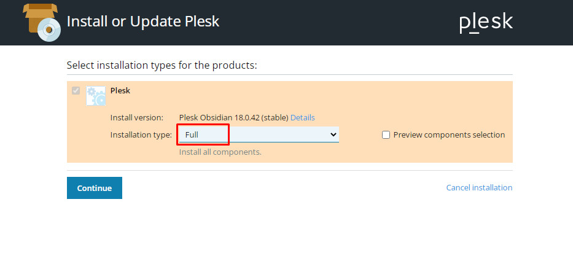
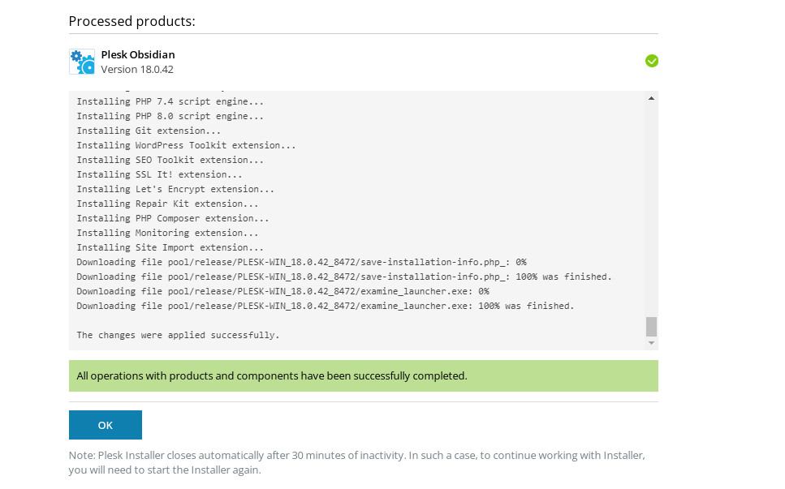
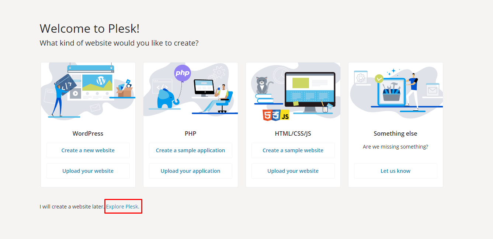

# Cài đặt Plesk trên Windows
- Chọn link download trên Windows tại trang chủ https://www.plesk.com/
- Quá trình cài đặt diễn ra thông qua giao diện Browser tại http://localhost:8447/. Để khởi động quá trình cài đặt, hệ thống cài đặt tự động yêu cầu đăng nhập Username & Password của Windows

- Sau khi đăng nhập, chọn Install or Upgrade Product để tiến hành cài đặt

- Chọn gói cài đặt mong muốn
	+ Typical: gói cài đặt chuẩn

	+ Full: Gói cài đặt đầy đủ chức năng

	+ Custom: Gói cài đặt tùy chọn

	+ Sau khi chọn gói cài đặt mong muốn, click Continue để tiếp tục quá trình

- Chi tiết các dịch vụ cài đặt, phụ thuộc vào từng gói cài đặt phía trên. Nhấn `Continue` để tiếp tục quá trình cài đặt

- Tiếp tục quá trình cài đặt 
	+ Base packages of Plesk: Thay đổi đường dẫn thư mục cài đặt
	+ Plesk: Tạo mới Password cho User Admin để quản lý

- Sau khi tiếp tục quá trình cài đặt. Hệ thống thông báo quá trình cài đặt bắt đầu diễn ra, quá trình cài đặt sẽ thực thi tùy theo kết nối nhanh hay chậm của Network Server

- Khi quá trình cài đặt hoàn tất, hệ thống sẽ thông báo như bên dưới. Sau đó tiến hành Restart hệ thống

- Các bước tiếp theo là các bước tùy chỉnh cấu hình cho Plesk Panel. Có thể kết nối từ Client bên ngoài hoặc trực tiếp tại Server theo đường dẫn sau:
	+ Client: http://<địa_chỉ_IP Server>:8880/login_up.php3
	+ Server: http://localhost:8880/login_up.php3

- Thông tin đăng nhập
	+ Username: admin
	+ Password: Password được khởi tạo trong quá trình cài đặt

