# Cài đặt Microsoft SQL 2019 và SQL Server Management Studio

- Truy cập https://www.microsoft.com/en-us/sql-server/sql-server-downloads và tiến hành download

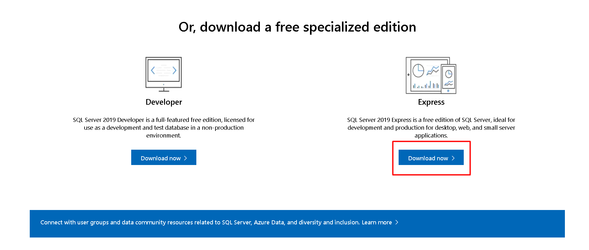

- Sau khi download và cài đặt ta tiếp tục download SQL Server Managerment Studio (SMSS) tại https://docs.microsoft.com/en-us/sql/ssms/download-sql-server-management-studio-ssms?view=sql-server-ver15

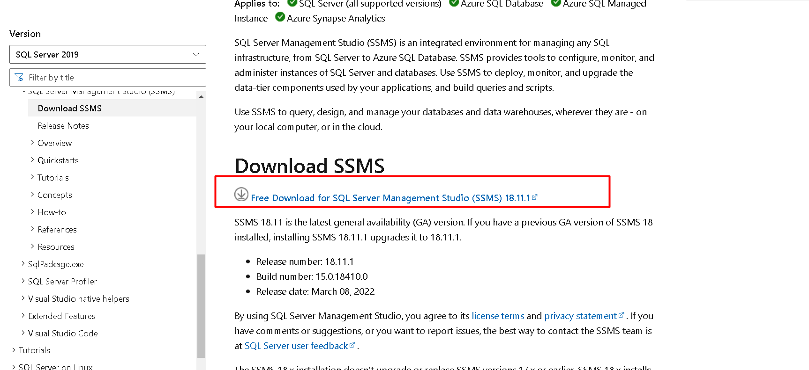

- Sau khi tải xuống và cài đặt xong SMSS ta khởi chạy SMSS 

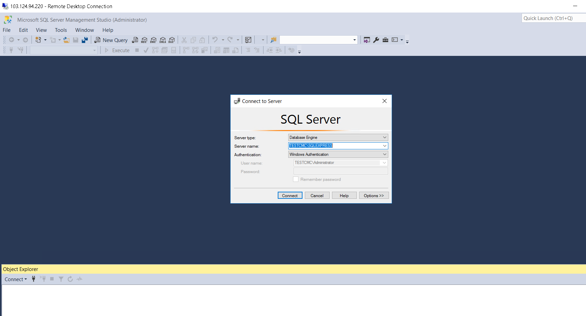

- Mở rộng tab `Security` -> `Logins` -> click vào `sa` và đặt mật khẩu

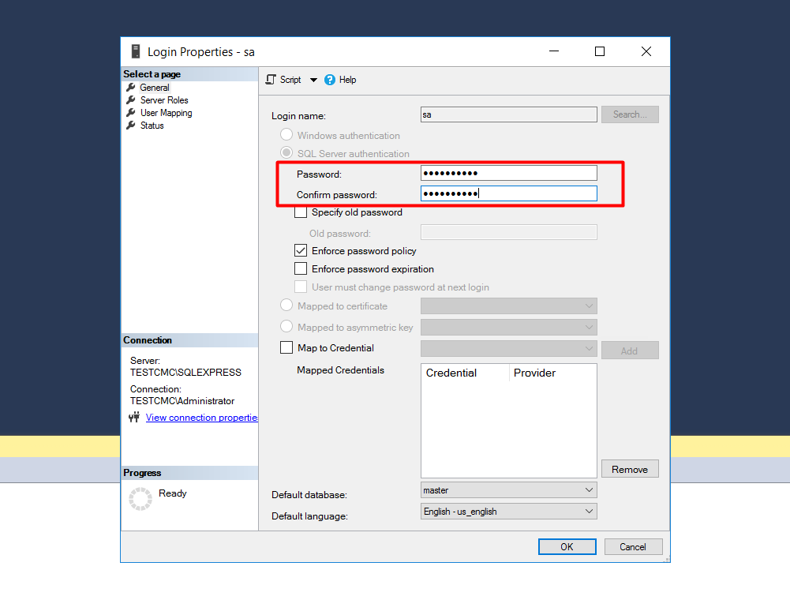

- Tại `Status` áp dụng cấu hình như sau
	+ Permission to connect to database engine: `Grant`
	+ Login: `Enabled`

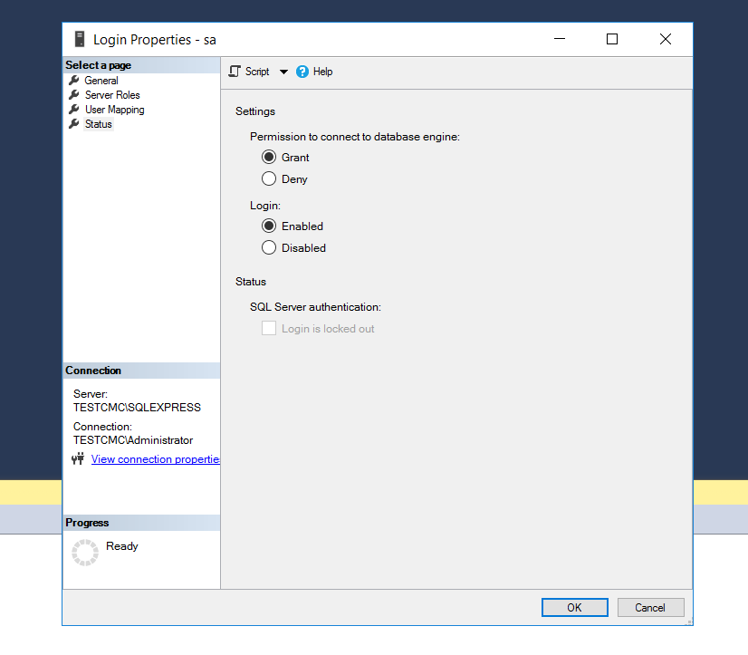

- Trong SQL Server Management Studio, nhấp chuột phải vào tên máy chủ cơ sở dữ liệu -> Chọn `Properties` -> `Security` -> chọn `SQL Server and Windows Authentication mode` và click `OK`

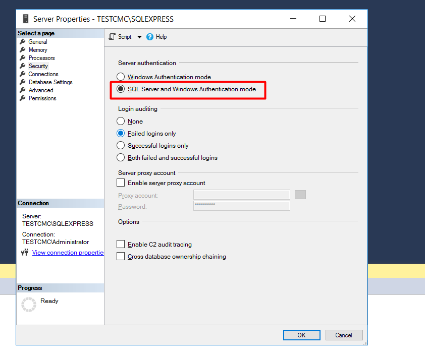

- Khởi chạy `SQL Server Configuration Manager` -> Mở rộng phần `SQL Server Network Configuration`, chọn database server và bật các tùy chọn sau:
	+ Named Pipes: Enabled
	+ TCP/IP: Enabled

	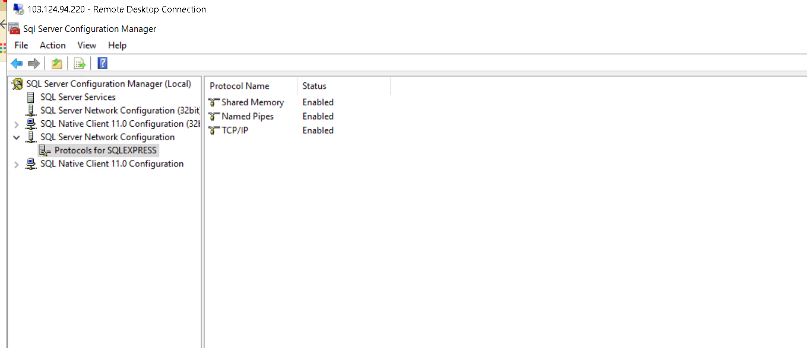
	
	+ Mở TCP Dynamic Ports trên cổng 1433 để kích hoạt từ xa tới máy chủ MSSQL

- Restart `SQL Server Service`

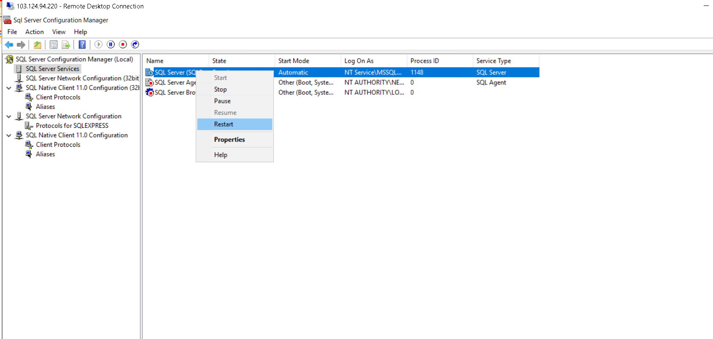

- Đăng nhập vào `Plesk`
- Đi tới `Tool & Settings` -> `Database Servers` và click vào `Add Database Server`

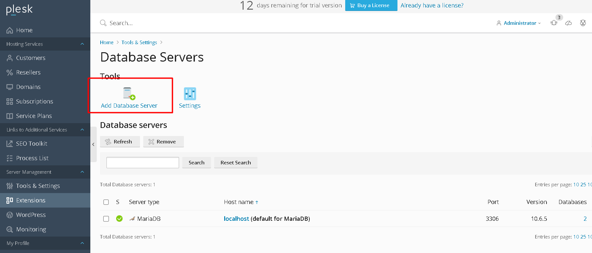

- Thiết lập thông tin như hình dưới và click `OK`

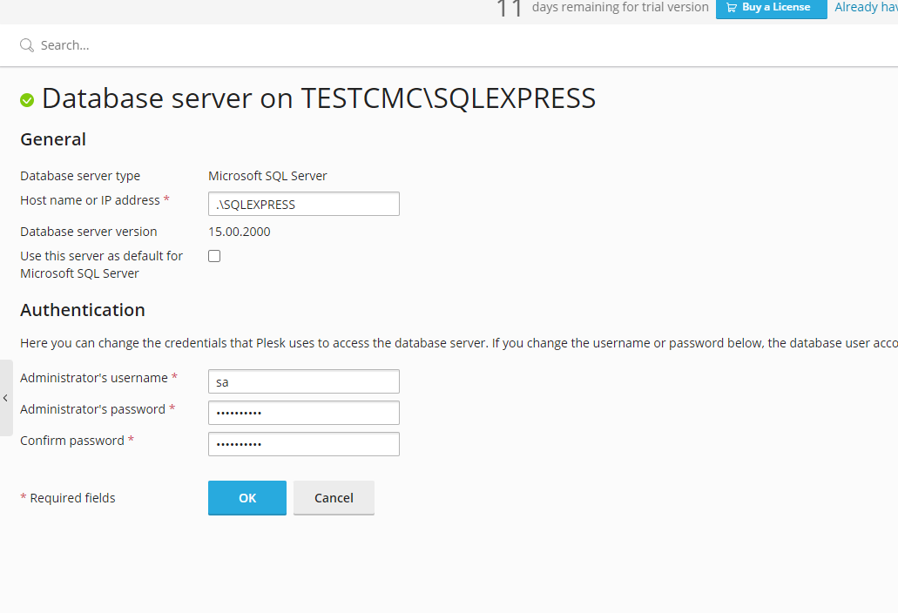

- Đăng nhập vào SQL server

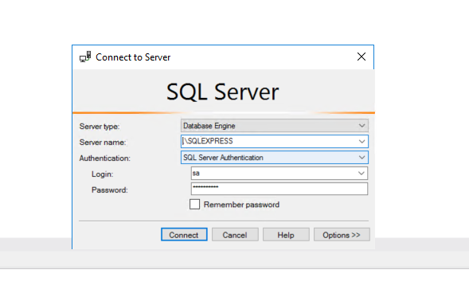

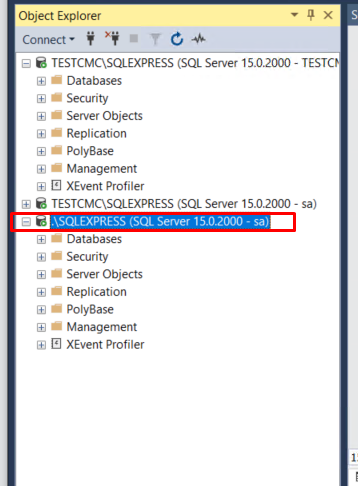

- Tạo database với MSSQL

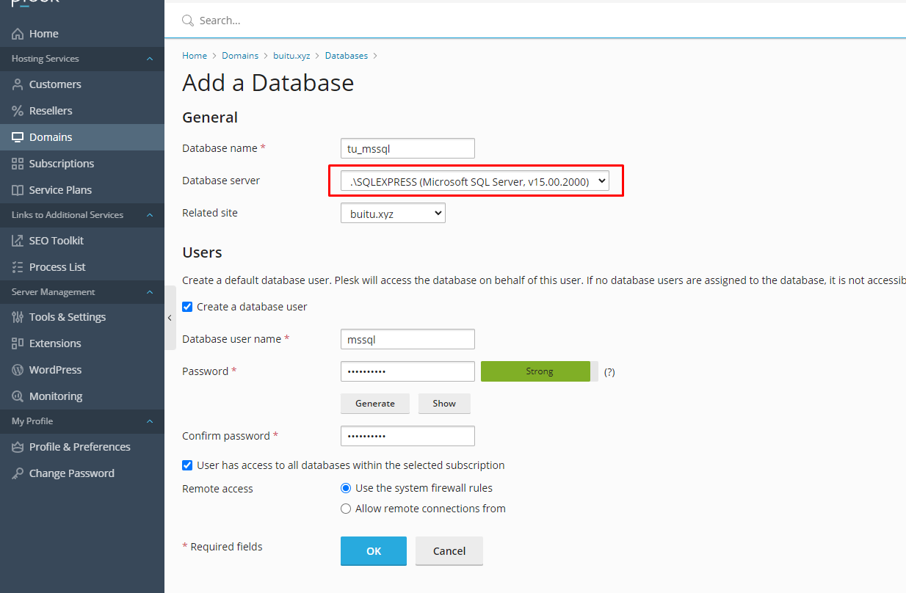

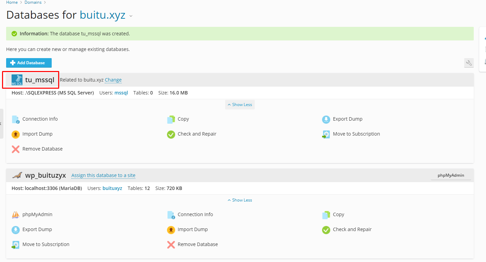
